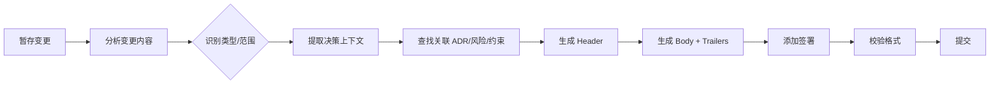

# Commit Protocol 提交协议技能

- **技能版本**：v1.1.0　**发布日期**：2026-08-18

> 版权声明：`../../../references/COPYRIGHT.md`　Token 标准：`../../../references/token_standard.md`　编排器：`../../SKILL.md`

---

## 1. 触发规则

### 1.1 触发场景
- 团队需要统一提交讯息格式与决策上下文记录
- 需要在提交中保存架构决策、风险接受、技术债注记
- CI/CD 需要解析提交讯息进行自动化（版本号、变更日志、部署触发）
- 代码审查要求提交包含决策理由与测试证据
- 发布流程需要规范化发布提交与标签

### 1.2 触发词
| 关键字 | 映射操作 | 说明 |
|--------|----------|------|
| `commit` / `提交` / `commit message` | 生成/校验提交讯息 | 根据变更内容自动生成符合协议的提交讯息 |
| `trailer` / `git trailer` | 添加/解析 trailers | 为提交添加决策/风险/约束等结构化元数据 |
| `signoff` / `签署` | 生成签署块 | 为提交添加审查者签署与决策确认 |
| `branch` / `分支命名` | 生成/校验分支名 | 根据任务类型生成规范化分支名 |
| `release commit` / `发布提交` | 生成发布提交 | 版本号升级、变更日志、标签创建 |

### 1.3 核心协议元素
```yaml
commit_structure:
  header: "<type>(<scope>): <subject>"          # Conventional Commits
  body: "动机/背景/决策理由/影响分析"              # 决策上下文
  trailers:                                      # 结构化元数据
    - "Constraint: <active constraint>"
    - "Rejected: <alternative> | <reason>"
    - "Directive: <forward-looking instruction>"
    - "Confidence: high|medium|low"
    - "Scope-risk: narrow|moderate|broad"
    - "Not-tested: <known gap>"
    - "Risk-Accepted: <RA-ID>"
    - "ADR: <ADR-ID>"
    - "Fixes: <issue-ref>"
    - "Related: <PR/commit-ref>"
  footer:
    signoff: "Signed-off-by: <name> <email>"     # 签署
    co-authors: "Co-authored-by: <name> <email>" # 协作
```

---

## 2. 流程

### 2.1 提交讯息生成流程


### 2.2 自动化生成逻辑
```python
def generate_commit_message(staged_changes: List[Change], context: CommitContext) -> str:
    # 1. 类型推断
    commit_type = infer_type(staged_changes)
    scope = infer_scope(staged_changes)
    
    # 3. 主题行
    subject = generate_subject(staged_changes, max_len=72)
    
    # 4. Body: 决策上下文
    body = build_body(context)
    
    # 5. Trailers: 结构化元数据
    trailers = build_trailers(context)
    
    # 6. 签署
    signoff = f"Signed-off-by: {context.author}"
    
    return f"{commit_type}({scope}): {subject}\n\n{body}\n\n{trailers}\n\n{signoff}"
```

### 2.3 Trailers 自动提取
```python
def extract_trailers_from_context(context: CommitContext) -> List[str]:
    trailers = []
    
    # 约束
    if context.active_constraints:
        for c in context.active_constraints:
            trailers.append(f"Constraint: {c}")
    
    # 拒绝的替代方案
    if context.rejected_alternatives:
        for alt, reason in context.rejected_alternatives:
            trailers.append(f"Rejected: {alt} | {reason}")
    
    # 前瞻指令
    if context.directives:
        for d in context.directives:
            trailers.append(f"Directive: {d}")
    
    # 信心度/风险范围
    if context.confidence:
        trailers.append(f"Confidence: {context.confidence}")
    if context.scope_risk:
        trailers.append(f"Scope-risk: {context.scope_risk}")
    
    # 未测试项
    if context.not_tested:
        trailers.append(f"Not-tested: {context.not_tested}")
    
    # 风险接受
    for ra in context.risk_acceptances:
        trailers.append(f"Risk-Accepted: {ra}")
    
    # ADR 关联
    for adr in context.related_adrs:
        trailers.append(f"ADR: {adr}")
    
    return trailers
```

---

## 3. 输出规范

### 3.1 类型规范
| Type | 用途 | 示例 |
|------|------|------|
| `feat` | 新功能 | `feat(auth): add OAuth2 login` |
| `fix` | 修复 Bug | `fix(api): handle null response` |
| `refactor` | 重构 | `refactor(db): extract repository` |
| `perf` | 性能优化 | `perf(cache): add Redis layer` |
| `docs` | 文档更新 | `docs(readme): add install guide` |
| `style` | 代码风格 | `style: format with ruff` |
| `test` | 测试相关 | `test(auth): add OAuth2 tests` |
| `chore` | 杂项/构建/依赖 | `chore(deps): upgrade lodash` |
| `revert` | 回滚 | `revert: feat(auth): add OAuth2` |
| `security` | 安全修复 | `security(auth): fix JWT validation` |
| `ci` | CI/CD | `ci: add validation workflow` |

### 3.2 Scope 规范
| 范围 | 含义 |
|------|------|
| `auth`/`api`/`db`/`ui`/`core` | 功能模块 |
| `deps`/`build`/`ci`/`release` | 基础设施 |
| `security`/`perf`/`test`/`docs` | 横切关注点 |

### 3.3 Subject 规则
- 必须以动词开头（小写）
- 不超过 72 字符
- 不以句号结尾
- 使用祈使语气："add" 而非 "added" 或 "adds"

### 3.4 Trailers 完整列表
| Trailer | 用途 | 示例 |
|---------|------|------|
| `Constraint` | 活跃约束塑造决策 | `Constraint: Single-table < 100M rows` |
| `Rejected` | 被拒替代方案及理由 | `Rejected: MongoDB | 事务支持不足` |
| `Directive` | 前瞻指令/警告 | `Directive: Migrate to async IO in Q3` |
| `Confidence` | 决策信心度 | `Confidence: high` |
| `Scope-risk` | 变更风险范围 | `Scope-risk: moderate` |
| `Not-tested` | 已知验证缺口 | `Not-tested: E2E checkout flow` |
| `Risk-Accepted` | 风险接受单引用 | `Risk-Accepted: RA-20260808-001` |
| `ADR` | 架构决策记录引用 | `ADR: ADR-003` |
| `Fixes` | 修复的 Issue | `Fixes: #1234` |
| `Related` | 关联 PR/提交 | `Related: #5678` |
| `Breaking` | 破坏性变更 | `Breaking: API v1 removed` |

---

## 4. 边界

### 4.1 适用边界
- ✅ 所有项目代码提交
- ✅ PR/MR 提交讯息规范
- ✅ 发布分支/标签提交
- ✅ 自动化脚本生成的提交

### 4.2 不适用边界
- ❌ 仅本地实验性提交（可用 `wip` 前缀）
- ❌ 仅格式化/重排的提交（可用 `style` 类型简化）

### 4.3 资源限制
- Header ≤ 72 字符
- Body 行宽 ≤ 72 字符
- Trailers 每行一个，Key: Value 格式

---

## 5. 明细外置

| 明细文件 | 说明 |
|----------|------|
| `domain/conventional-commits.md` | Conventional Commits 完整规范、类型/范围/主题规则 |
| `domain/git-trailers.md` | Git Trailers 完整规范、自动提取/解析/验证 |
| `domain/signoff-protocol.md` | 签署协议：Signed-off-by/Co-authored-by/审查签署 |
| `domain/branch-naming.md` | 分支命名规范：类型/任务/描述/长度 |
| `domain/release-commits.md` | 发布提交：版本号/变更日志/标签/回滚 |
| `domain/commit-automation.md` | 自动化：Git hooks/CI 集成/讯息生成/校验 |

---

## 闭环执行系统

### 1. 任务入口
- 输入：用户要求编写/校验/规范化提交信息、签署协议、分支与 PR 命名、发布提交（commit message / conventional commits / git trailers）；
- 前置：已识别当前分支用途与提交内容（功能/修复/重构/发布），明确 Git trailers 需保存的决策上下文；
- 不适用：仅讨论提交约定概念、未绑定具体仓库与提交时不直接执行。

### 2. 执行状态
| 状态 | 进入条件 | 退出条件 | 处理方式 |
|------|---------|---------|---------|
| 待启动 | 用户指令命中触发词 | 用户确认/系统启动 | 解析提交范围与类型，选择规范（conventional commits/自定义） |
| 执行中 | 提交信息已开始生成 | 提交信息或协议产出 | 按 §2 流程组装 type/scope/subject/trailers |
| 校验中 | 提交信息完成 | 格式校验通过/失败 | 运行 `domain/commit-automation.md` 校验规则与 CI 门禁 |
| 阻塞 | 决策上下文缺失 | 补充信息/人工提供 | 暂停并记录缺什么 trailers/上下文 |
| 完成 | 校验通过 | 进入提交/交接 | 产出标准提交信息，更新交接断点 |
| 回退 | 格式不符/门禁未过 | 回到稳定版本 | 按规则修正后重试，保留审计 |

### 3. 执行动作层
- 执行步骤 1：确认提交类型与影响范围，匹配 type/scope 词表；
- 执行步骤 2：组装 subject（祈使句+≤72 字符）+ body（为什么/怎么做）+ Git trailers（决策上下文）；
- 执行步骤 3：运行 hook/CI 校验（`commit-automation`），通过后提交；
- 所需工具/脚本：`domain/commit-automation.md`、`domain/signoff-protocol.md`、Git hooks/CI；
- 输入输出约束：提交信息本体留提交记录；决策上下文经 Git trailers 落入仓库历史，禁止明文敏感信息（iron_rules §3）。

### 4. 验收门禁
- 必须产出物：符合规范的提交信息（type(scope): subject + body + trailers）；
- 通过条件：格式校验通过 + 触发词/类型语义正确 + 决策上下文完整 + 无敏感信息；
- 失败条件：类型缺失、subject 超长、trailers 语法错误、CI 门禁拦截、敏感信息泄漏；
- 审核对象：代码评审者、维护者与 CI 流水线。

### 5. 失败处理
- 失败类型：格式不符合、trailers 语法错误、CI hook 拦截、分支/PR 命名违规；
- 恢复策略：按 `domain/branch-naming.md`/`domain/conventional-commits.md` 修正后重新生成；
- 回滚方案：amend 修订未推送提交或提交修正 commit；
- 重试策略：修正后重跑校验，禁止绕过 hook；
- 是否需要人工确认：签署协议（sign-off）与安全相关提交必须人工确认。

### 6. 产出与交接
- 产出物列表：规范提交信息、版本变更日志、发布提交（prepared commit）；
- 保存路径：Git 提交记录、`domain/*.md` 生成的模板、GitHub release 描述；
- 交接对象：代码评审者、CI/CD、发布负责人；
- 下一步动作：通过校验 → 提交 → PR 创建或发布流程；
- 归档条件：提交已合并/发布，变更日志已更新。

### 7. 审计记录
- 执行时间：提交开始与完成时间；
- 关键参数：type/scope、trailers 内容、分支/PR 名称；
- 关键决策：类型判定、签署与否、是否 amend；
- 结果证据：git log、trailers 留痕、CI 通过记录；
- 失败原因：格式错误/门禁拦截在 CI 日志或交接断点留痕。

---

**文档版本**：v1.1.0　**最后更新**：2026-08-18（繁体转简体 + 新增闭环执行系统章节，技能库本体评审修复）
**知识产权所有**：段波（验证邮箱：duanbo.douglas@163.com）