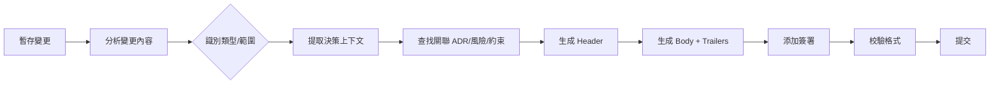

# Commit Protocol 提交協議技能

> 版權聲明：`../../references/COPYRIGHT.md`　Token 標準：`../../references/token_standard.md`　編排器：`../SKILL.md`

---

## 1. 觸發規則

### 1.1 觸發場景
- 團隊需要統一提交訊息格式與決策上下文記錄
- 需要在提交中保存架構決策、風險接受、技術債註記
- CI/CD 需要解析提交訊息進行自動化（版本號、變更日誌、部署觸發）
- 代碼審查要求提交包含決策理由與測試證據
- 發布流程需要規範化發布提交與標籤

### 1.2 觸發詞
| 關鍵字 | 映射操作 | 說明 |
|--------|----------|------|
| `commit` / `提交` / `commit message` | 生成/校驗提交訊息 | 根據變更內容自動生成符合協議的提交訊息 |
| `trailer` / `git trailer` | 添加/解析 trailers | 為提交添加決策/風險/約束等結構化元數據 |
| `signoff` / `簽署` | 生成簽署塊 | 為提交添加審查者簽署與決策確認 |
| `branch` / `分支命名` | 生成/校驗分支名 | 根據任務類型生成規範化分支名 |
| `release commit` / `發布提交` | 生成發布提交 | 版本號升級、變更日誌、標籤創建 |

### 1.3 核心協議元素
```yaml
commit_structure:
  header: "<type>(<scope>): <subject>"          # Conventional Commits
  body: "動機/背景/決策理由/影響分析"              # 決策上下文
  trailers:                                      # 結構化元數據
    - "Constraint: <active constraint>"
    - "Rejected: <alternative> | <reason>"
    - "Directive: <forward-looking instruction>"
    - "Confidence: high|medium|low"
    - "Scope-risk: narrow|moderate|broad"
    - "Not-tested: <known gap>"
    - "Risk-Accepted: <RA-ID>"
    - "ADR: <ADR-ID>"
    - "Fixes: <issue-ref>"
    - "Related: <PR/commit-ref>"
  footer:
    signoff: "Signed-off-by: <name> <email>"     # 簽署
    co-authors: "Co-authored-by: <name> <email>" # 協作
```

---

## 2. 流程

### 2.1 提交訊息生成流程


### 2.2 自動化生成邏輯
```python
def generate_commit_message(staged_changes: List[Change], context: CommitContext) -> str:
    # 1. 類型推斷
    commit_type = infer_type(staged_changes)
    scope = infer_scope(staged_changes)
    
    # 3. 主題行
    subject = generate_subject(staged_changes, max_len=72)
    
    # 4. Body: 決策上下文
    body = build_body(context)
    
    # 5. Trailers: 結構化元數據
    trailers = build_trailers(context)
    
    # 6. 簽署
    signoff = f"Signed-off-by: {context.author}"
    
    return f"{commit_type}({scope}): {subject}\n\n{body}\n\n{trailers}\n\n{signoff}"
```

### 2.3 Trailers 自動提取
```python
def extract_trailers_from_context(context: CommitContext) -> List[str]:
    trailers = []
    
    # 約束
    if context.active_constraints:
        for c in context.active_constraints:
            trailers.append(f"Constraint: {c}")
    
    # 拒絕的替代方案
    if context.rejected_alternatives:
        for alt, reason in context.rejected_alternatives:
            trailers.append(f"Rejected: {alt} | {reason}")
    
    # 前瞻指令
    if context.directives:
        for d in context.directives:
            trailers.append(f"Directive: {d}")
    
    # 信心度/風險範圍
    if context.confidence:
        trailers.append(f"Confidence: {context.confidence}")
    if context.scope_risk:
        trailers.append(f"Scope-risk: {context.scope_risk}")
    
    # 未測試項
    if context.not_tested:
        trailers.append(f"Not-tested: {context.not_tested}")
    
    # 風險接受
    for ra in context.risk_acceptances:
        trailers.append(f"Risk-Accepted: {ra}")
    
    # ADR 關聯
    for adr in context.related_adrs:
        trailers.append(f"ADR: {adr}")
    
    return trailers
```

---

## 3. 輸出規範

### 3.1 類型規範
| Type | 用途 | 示例 |
|------|------|------|
| `feat` | 新功能 | `feat(auth): add OAuth2 login` |
| `fix` | 修復 Bug | `fix(api): handle null response` |
| `refactor` | 重構 | `refactor(db): extract repository` |
| `perf` | 性能優化 | `perf(cache): add Redis layer` |
| `docs` | 文檔更新 | `docs(readme): add install guide` |
| `style` | 代碼風格 | `style: format with ruff` |
| `test` | 測試相關 | `test(auth): add OAuth2 tests` |
| `chore` | 雜項/構建/依賴 | `chore(deps): upgrade lodash` |
| `revert` | 回滾 | `revert: feat(auth): add OAuth2` |
| `security` | 安全修復 | `security(auth): fix JWT validation` |
| `ci` | CI/CD | `ci: add validation workflow` |

### 3.2 Scope 規範
| 範圍 | 含義 |
|------|------|
| `auth`/`api`/`db`/`ui`/`core` | 功能模塊 |
| `deps`/`build`/`ci`/`release` | 基礎設施 |
| `security`/`perf`/`test`/`docs` | 橫切關注點 |

### 3.3 Subject 規則
- 必須以動詞開頭（小寫）
- 不超過 72 字符
- 不以句號結尾
- 使用祈使語氣："add" 而非 "added" 或 "adds"

### 3.4 Trailers 完整列表
| Trailer | 用途 | 示例 |
|---------|------|------|
| `Constraint` | 活躍約束塑造決策 | `Constraint: Single-table < 100M rows` |
| `Rejected` | 被拒替代方案及理由 | `Rejected: MongoDB | 事務支持不足` |
| `Directive` | 前瞻指令/警告 | `Directive: Migrate to async IO in Q3` |
| `Confidence` | 決策信心度 | `Confidence: high` |
| `Scope-risk` | 變更風險範圍 | `Scope-risk: moderate` |
| `Not-tested` | 已知驗證缺口 | `Not-tested: E2E checkout flow` |
| `Risk-Accepted` | 風險接受單引用 | `Risk-Accepted: RA-20260808-001` |
| `ADR` | 架構決策記錄引用 | `ADR: ADR-003` |
| `Fixes` | 修復的 Issue | `Fixes: #1234` |
| `Related` | 關聯 PR/提交 | `Related: #5678` |
| `Breaking` | 破壞性變更 | `Breaking: API v1 removed` |

---

## 4. 邊界

### 4.1 適用邊界
- ✅ 所有項目代碼提交
- ✅ PR/MR 提交訊息規範
- ✅ 發布分支/標籤提交
- ✅ 自動化腳本生成的提交

### 4.2 不適用邊界
- ❌ 僅本地實驗性提交（可用 `wip` 前綴）
- ❌ 僅格式化/重排的提交（可用 `style` 類型簡化）

### 4.3 資源限制
- Header ≤ 72 字符
- Body 行寬 ≤ 72 字符
- Trailers 每行一個，Key: Value 格式

---

## 5. 明細外置

| 明細文件 | 說明 |
|----------|------|
| `domain/conventional-commits.md` | Conventional Commits 完整規範、類型/範圍/主題規則 |
| `domain/git-trailers.md` | Git Trailers 完整規範、自動提取/解析/驗證 |
| `domain/signoff-protocol.md` | 簽署協議：Signed-off-by/Co-authored-by/審查簽署 |
| `domain/branch-naming.md` | 分支命名規範：類型/任務/描述/長度 |
| `domain/release-commits.md` | 發布提交：版本號/變更日誌/標籤/回滾 |
| `domain/commit-automation.md` | 自動化：Git hooks/CI 集成/訊息生成/校驗 |

---

**文檔版本**: v1.0.0  **最後更新**: 2026-08-08
**知識產權所有**: 段波（驗證郵箱: duanbo.douglas@163.com）