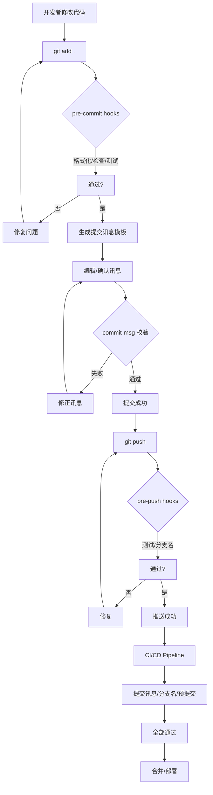

# 提交自动化：Git hooks / CI 集成 / 讯息生成 / 校验

> 编排器：`../SKILL.md`

---

## 1. Git Hooks 自动化

### 1.1 Hook 类型与用途
| Hook | 触发时机 | 用途 |
|------|----------|------|
| `pre-commit` | `git commit` 前 | 代码格式化、静态检查、测试、敏感信息扫描 |
| `prepare-commit-msg` | 生成提交讯息前 | 自动填充模板、提取 Ticket ID |
| `commit-msg` | 提交讯息生成后 | 校验格式、Trailers 完整性、DCO |
| `post-commit` | 提交完成后 | 通知、记录、触发 CI |
| `pre-push` | `git push` 前 | 运行测试、检查分支名、阻止推送到保护分支 |
| `pre-rebase` | `git rebase` 前 | 防止重写已推送历史 |

---

## 2. Pre-commit Hook 配置

### 2.1 pre-commit 框架 (推荐)
```yaml
# .pre-commit-config.yaml
repos:
  # 通用格式化
  - repo: https://github.com/pre-commit/pre-commit-hooks
    rev: v4.6.0
    hooks:
      - id: trailing-whitespace
      - id: end-of-file-fixer
      - id: check-yaml
      - id: check-toml
      - id: check-json
      - id: check-merge-conflict
      - id: detect-private-key
      - id: detect-aws-credentials
      - id: forbid-new-submodules

  # Python: ruff (格式化+静态检查)
  - repo: https://github.com/astral-sh/ruff-pre-commit
    rev: v0.5.0
    hooks:
      - id: ruff
        args: [--fix, --exit-non-zero-on-fix]
      - id: ruff-format

  # Python: mypy 类型检查
  - repo: https://github.com/pre-commit/mirrors-mypy
    rev: v1.11.0
    hooks:
      - id: mypy
        additional_dependencies: [types-requests, types-pyyaml]

  # 通用: 秘钥扫描
  - repo: https://github.com/trufflesecurity/trufflehog
    rev: v3.75.0
    hooks:
      - id: trufflehog
        args: [--fail, --no-verification]

  # Shell: shellcheck
  - repo: https://github.com/shellcheck-py/shellcheck-py
    rev: v0.9.0
    hooks:
      - id: shellcheck

  # Go: golangci-lint
  - repo: https://github.com/golangci/golangci-lint
    rev: v1.59.0
    hooks:
      - id: golangci-lint

  # 通用: 正则检查 (如禁止 console.log)
  - repo: local
    hooks:
      - id: no-console-log
        name: No console.log in production code
        entry: grep -r "console\.log" --include="*.ts" --include="*.js" src/
        language: system
        types: [file]
        exclude: test|spec
```

### 2.2 安装与运行
```bash
# 安装
pip install pre-commit
pre-commit install
pre-commit install --hook-type commit-msg
pre-commit install --hook-type pre-push

# 手动运行
pre-commit run --all-files

# 更新 hooks
pre-commit autoupdate
```

---

## 3. Commit-msg Hook 自动化

### 3.1 自动填充模板
```bash
#!/bin/bash
# .git/hooks/prepare-commit-msg
# 自动填充提交讯息模板

MSG_FILE=$1
SOURCE=$2  # message | template | merge | squash | commit

# 仅在非 merge/squash 且无现有讯息时填充
if [[ "$SOURCE" != "message" && "$SOURCE" != "merge" && "$SOURCE" != "squash" ]]; then
    # 尝试从分支名提取 Ticket ID
    BRANCH=$(git symbolic-ref --short HEAD 2>/dev/null || echo "")
    TICKET=""
    if [[ $BRANCH =~ ^(feat|fix|hotfix|refactor|perf|docs|test|chore)/([A-Z]+-[0-9]+) ]]; then
        TICKET="${BASH_REMATCH[2]}"
    fi
    
    # 生成模板
    cat > "$MSG_FILE" <<EOF
${TYPE:-feat}(${SCOPE:-core}): ${SUBJECT:-}

## Motivation


## Decision


## Impact


## Testing


Constraint: 
Rejected: 
Directive: 
Confidence: 
Scope-risk: 
Not-tested: 
Risk-Accepted: 
ADR: 
Fixes: ${TICKET:+#$TICKET}
Related: 
Breaking: 

Signed-off-by: $(git config user.name) <$(git config user.email)>
EOF
fi
```

### 3.2 提取 Ticket ID
```bash
#!/bin/bash
# 从分支名/提交讯息提取 Ticket ID
# 格式: type/TICKET-ID-description 或 type/TICKET-ID

extract_ticket() {
    local branch=$(git symbolic-ref --short HEAD 2>/dev/null)
    if [[ $branch =~ ^(feat|fix|hotfix|refactor|perf|docs|test|chore)/([A-Z]+-[0-9]+) ]]; then
        echo "${BASH_REMATCH[2]}"
    elif [[ $branch =~ (issue-|#)([0-9]+) ]]; then
        echo "${BASH_REMATCH[2]}"
    fi
}
```

---

## 4. Commit-msg 校验

### 4.1 完整校验脚本
```bash
#!/bin/bash
# .git/hooks/commit-msg
# 完整提交讯息校验

MSG_FILE=$1
ERRORS=()

# 1. 读取讯息
MSG=$(cat "$MSG_FILE")

# 2. 解析 Header
HEADER=$(echo "$MSG" | head -1)
if ! [[ $HEADER =~ ^(feat|fix|refactor|perf|docs|style|test|chore|revert|security|ci|build|config)(\([a-z0-9-]+\))?: .{1,72}$ ]]; then
    ERRORS+=("Invalid header format. Expected: type(scope): subject (≤72 chars)")
fi

# 3. 解析 Trailers
TRAILERS=()
IN_TRAILER=false
while IFS= read -r line; do
    if [[ -z "$line" ]]; then
        IN_TRAILER=true
        continue
    fi
    if [[ $IN_TRAILER == true ]]; then
        if [[ $line =~ ^([A-Z][A-Za-z0-9-]*):\s*(.+)$ ]]; then
            TRAILERS["${BASH_REMATCH[1]}"]+="${BASH_REMATCH[2]} "
        fi
    fi
done <<< "$MSG"

# 4. 强制 Signed-off-by
if [[ -z "${TRAILERS[Signed-off-by]}" ]]; then
    ERRORS+=("Missing required trailer: Signed-off-by")
fi

# 5. Confidence 值域
if [[ -n "${TRAILERS[Confidence]}" ]]; then
    for v in ${TRAILERS[Confidence]}; do
        [[ "$v" =~ ^(high|medium|low)$ ]] || ERRORS+=("Invalid Confidence: $v")
    done
fi

# 6. Scope-risk 值域
if [[ -n "${TRAILERS[Scope-risk]}" ]]; then
    for v in ${TRAILERS[Scope-risk]}; do
        [[ "$v" =~ ^(narrow|moderate|broad)$ ]] || ERRORS+=("Invalid Scope-risk: $v")
    done
fi

# 7. Risk-Accepted 格式
if [[ -n "${TRAILERS[Risk-Accepted]}" ]]; then
    for v in ${TRAILERS[Risk-Accepted]}; do
        [[ $v =~ ^RA-[0-9]{8}-[0-9]{3}$ ]] || ERRORS+=("Invalid Risk-Accepted: $v")
    done
fi

# 8. ADR 格式
if [[ -n "${TRAILERS[ADR]}" ]]; then
    for v in ${TRAILERS[ADR]}; do
        [[ $v =~ ^ADR-[0-9]{3,}$ ]] || ERRORS+=("Invalid ADR: $v")
    done
fi

# 输出错误
if [[ ${#ERRORS[@]} -gt 0 ]]; then
    echo "❌ Commit message validation failed:" >&2
    for err in "${ERRORS[@]}"; do
        echo "  - $err" >&2
    done
    exit 1
fi

exit 0
```

---

## 5. Pre-push Hook

### 5.1 分支保护与测试
```bash
#!/bin/bash
# .git/hooks/pre-push
# 推送前检查

REMOTE=$1
URL=$2

while read LOCAL_REF LOCAL_SHA REMOTE_REF REMOTE_SHA; do
    # 1. 防止强推到保护分支
    if [[ $REMOTE_REF == "refs/heads/main" || $REMOTE_REF == "refs/heads/develop" ]]; then
        if [[ $LOCAL_SHA == "0000000000000000000000000000000000000000" ]]; then
            echo "❌ Deleting protected branch not allowed"
            exit 1
        fi
        # 检查是否强推 (非 fast-forward)
        if git merge-base --is-ancestor $REMOTE_SHA $LOCAL_SHA 2>/dev/null; then
            : # fast-forward, OK
        else
            echo "❌ Force push to protected branch not allowed"
            echo "Use PR/MR for changes to protected branches"
            exit 1
        fi
    fi
    
    # 2. 分支名校验
    BRANCH=$(echo $LOCAL_REF | sed 's|refs/heads/||')
    if ! [[ $BRANCH =~ ^(feat|fix|hotfix|refactor|perf|docs|test|chore|release|exp)/[A-Z]+-[0-9]+-[a-z0-9-]+$|^release/v[0-9]+\.[0-9]+\.[0-9]+$ ]]; then
        echo "❌ Invalid branch name: $BRANCH"
        echo "Expected: <type>/<TASK-ID>-<description>"
        exit 1
    fi
    
    # 3. 运行测试 (仅推送到 main/develop 时)
    if [[ $REMOTE_REF == "refs/heads/main" || $REMOTE_REF == "refs/heads/develop" ]]; then
        echo "🧪 Running pre-push tests..."
        if ! ./run-tests.sh; then
            echo "❌ Tests failed, push aborted"
            exit 1
        fi
    fi
done

exit 0
```

---

## 6. CI/CD 集成

### 6.1 GitHub Actions 完整流程
```yaml
# .github/workflows/validate.yml
name: Validate
on: [pull_request, push]

jobs:
  commit-lint:
    name: Commit Message Lint
    runs-on: ubuntu-latest
    if: github.event_name == 'pull_request'
    steps:
      - uses: actions/checkout@v4
        with:
          fetch-depth: 0
      - name: Lint commit messages
        run: |
          # 检查 PR 中所有提交
          commits=$(git log --format="%H" ${{ github.event.pull_request.base.sha }}..HEAD)
          for sha in $commits; do
            msg=$(git log -1 --format="%B" $sha)
            # 这里调用 commit-msg 校验逻辑
            python3 tools/lint-commit.py "$msg" || exit 1
          done

  pre-commit:
    name: Pre-commit Hooks
    runs-on: ubuntu-latest
    steps:
      - uses: actions/checkout@v4
      - uses: actions/setup-python@v5
        with: { python-version: '3.11' }
      - name: Install pre-commit
        run: pip install pre-commit
      - name: Run pre-commit
        run: pre-commit run --all-files

  branch-name:
    name: Branch Name Check
    runs-on: ubuntu-latest
    if: github.event_name == 'pull_request'
    steps:
      - name: Check branch name
        run: |
          BRANCH="${GITHUB_HEAD_REF}"
          PATTERN='^(feat|fix|hotfix|refactor|perf|docs|test|chore|release|exp)/[A-Z]+-[0-9]+-[a-z0-9-]+$|^release/v[0-9]+\.[0-9]+\.[0-9]+$'
          if [[ ! $BRANCH =~ $PATTERN ]]; then
            echo "❌ Invalid branch: $BRANCH"
            exit 1
          fi

  validate:
    name: Validate
    needs: [commit-lint, pre-commit, branch-name]
    runs-on: ubuntu-latest
    steps:
      - run: echo "✅ All validations passed"
```

---

## 7. 自动化提交讯息生成

### 7.1 智能生成脚本
```python
#!/usr/bin/env python3
# generate-commit-msg.py
import subprocess, sys, re, json
from pathlib import Path

def get_staged_changes():
    """获取暂存区变更摘要"""
    result = subprocess.run(
        ["git", "diff", "--cached", "--stat"],
        capture_output=True, text=True
    )
    return result.stdout.strip()

def get_diff_summary():
    """获取详细 diff"""
    result = subprocess.run(
        ["git", "diff", "--cached"],
        capture_output=True, text=True
    )
    return result.stdout

def infer_type_summary(diff: str) -> tuple:
    """从 diff 推断类型和范围"""
    # 统计文件类型
    files = re.findall(r'^\+\+\+\s+b/(.+)$', diff, re.MULTILINE)
    
    # 关键词匹配
    keywords = {
        'feat': ['add', 'implement', 'create', 'new', 'introduce'],
        'fix': ['fix', 'resolve', 'correct', 'handle', 'patch'],
        'refactor': ['refactor', 'restructure', 'simplify', 'extract', 'move'],
        'perf': ['optimize', 'improve', 'speed', 'cache', 'benchmark'],
        'docs': ['doc', 'readme', 'comment', 'readme'],
        'test': ['test', 'spec', 'mock', 'assert'],
        'chore': ['chore', 'deps', 'dependency', 'config', 'build', 'ci'],
        'security': ['security', 'vuln', 'cve', 'secret', 'auth', 'encrypt'],
        'perf': ['performance', 'latency', 'throughput', 'memory'],
    }
    
    diff_lower = diff.lower()
    scores = {k: sum(1 for kw in v if kw in diff_lower) for k, v in keywords.items()}
    best_type = max(scores, key=scores.get) if max(scores.values()) > 0 else 'chore'
    
    # 推断 scope
    scopes = set()
    for f in files:
        parts = f.split('/')
        if len(parts) > 1:
            scopes.add(parts[0])
        elif parts:
            scopes.add(parts[0].split('.')[0])
    
    scope = ','.join(sorted(scopes))[:20] if scopes else 'core'
    return best_type, scope

def generate_subject(diff: str, max_len: int = 72) -> str:
    """生成主题行"""
    # 提取关键动作
    added = re.findall(r'^\+.*', diff, re.MULTILINE)
    removed = re.findall(r'^\-.*', diff, re.MULTILINE)
    
    # 简化生成
    actions = []
    for line in added[:3]:
        line = line[1:].strip()
        if line and not line.startswith('#'):
            actions.append(line[:50])
    
    subject = '; '.join(actions) if actions else "update"
    return subject[:max_len]

def main():
    diff = get_diff_summary()
    if not diff.strip():
        print("No staged changes")
        sys.exit(1)
    
    commit_type, scope = infer_type_summary(diff)
    subject = generate_subject(diff)
    
    # 从分支名获取 Ticket
    branch = subprocess.run(["git", "symbolic-ref", "--short", "HEAD"], 
                           capture_output=True, text=True).stdout.strip()
    ticket = ""
    if re.match(r'(feat|fix|hotfix|refactor|perf|docs|test|chore)/([A-Z]+-\d+)', branch):
        ticket = re.match(r'[^/]+/([A-Z]+-\d+)', branch).group(1)
    
    # 生成完整提交讯息
    template = f"""{commit_type}({scope}): {subject}

## Motivation


## Decision


## Impact


## Testing


Constraint: 
Rejected: 
Directive: 
Confidence: 
Scope-risk: 
Not-tested: 
Risk-Accepted: 
ADR: 
Fixes: {f"#{ticket}" if ticket else ""}
Related: 
Breaking: 

Signed-off-by: $(git config user.name) <$(git config user.email)>
"""
    print(template)

if __name__ == '__main__':
    main()
```

### 7.2 使用方式
```bash
# 1. 暂存变更
git add .

# 2. 生成提交讯息
python3 tools/generate-commit-msg.py > .git/COMMIT_MSG

# 3. 编辑/确认后提交
git commit -F .git/COMMIT_MSG

# 或一键生成并编辑
git commit -v  # 使用编辑器，模板自动填充
```

---

## 8. 完整自动化流程图



---

**文档版本**: v1.0.0  **最后更新**: 2026-08-08