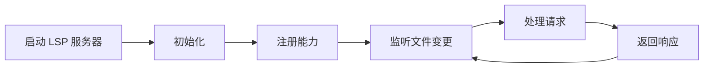

# LSP/AST Integration LSP/AST 集成技能

- **技能版本**：v1.1.0　**发布日期**：2026-08-18

> 版权声明：`../../../references/COPYRIGHT.md`　Token 标准：`../../../references/token_standard.md`　编排器：`../../SKILL.md`

---

## 1. 触发规则

### 1.1 触发场景
- 需要代码智能导航：跳转定义、查找引用、查看文档、类型提示
- 需要代码重构：重命名、提取方法/类、内联、移动、签名变更
- 需要代码查询：模式匹配、依赖分析、影响分析、架构检查
- 需要代码生成：样板代码、测试生成、迁移脚本、API 客户端
- 需要代码分析：复杂度、重复、异味、依赖图、调用链

### 1.2 触发词
| 关键字 | 映射操作 | 说明 |
|--------|----------|------|
| `goto` / `跳转` / `定义` | LSP 导航 | 跳转到定义/声明/实现/类型定义 |
| `references` / `引用` / `查找引用` | LSP 引用 | 查找所有引用位置 |
| `hover` / `悬停` / `文档` | LSP 悬停 | 显示类型/文档/签名信息 |
| `rename` / `重命名` | LSP 重构 | 安全重命名符号 |
| `refactor` / `重构` / `提取` | 重构引擎 | 提取方法/类/变量/内联/移动 |
| `ast` / `抽象语法树` / `查询` | AST 查询 | 模式匹配/依赖分析/影响分析 |
| `generate` / `生成` / `样板` | 代码生成 | 样板/测试/迁移/API 客户端 |
| `diagnostics` / `诊断` / `错误` | LSP 诊断 | 实时错误/警告/提示 |

### 1.3 能力矩阵
| 能力 | LSP | AST | 适用语言 |
|------|-----|-----|----------|
| 跳转定义 | ✅ | ✅ | 所有 LSP 支持语言 |
| 查找引用 | ✅ | ✅ | 所有 LSP 支持语言 |
| 悬停/文档 | ✅ | ❌ | 所有 LSP 支持语言 |
| 重命名 | ✅ | ✅ | 所有 LSP 支持语言 |
| 代码补全 | ✅ | ❌ | 所有 LSP 支持语言 |
| 模式匹配 | ❌ | ✅ | 所有可解析语言 |
| 依赖分析 | ❌ | ✅ | 所有可解析语言 |
| 影响分析 | ❌ | ✅ | 所有可解析语言 |
| 代码生成 | ❌ | ✅ | 所有可解析语言 |
| 结构化编辑 | ❌ | ✅ | 所有可解析语言 |

---

## 2. 流程

### 2.1 LSP 客户端生命周期


### 2.2 AST 解析流程


### 2.3 核心操作

#### 2.3.1 LSP 导航
```python
class LSPClient:
    def __init__(self, language: str, project_root: str):
        self.server = self._start_server(language)
        self.capabilities = self._initialize(project_root)
    
    def goto_definition(self, file: str, line: int, col: int) -> Location:
        """跳转到定义"""
        return self._request('textDocument/definition', {
            'textDocument': {'uri': file_to_uri(file)},
            'position': {'line': line, 'character': col}
        })
    
    def find_references(self, file: str, line: int, col: int, include_decl: bool = True) -> List[Location]:
        """查找所有引用"""
        return self._request('textDocument/references', {
            'textDocument': {'uri': file_to_uri(file)},
            'position': {'line': line, 'character': col},
            'context': {'includeDeclaration': include_decl}
        })
    
    def hover(self, file: str, line: int, col: int) -> HoverInfo:
        """悬停信息：类型、文档、签名"""
        return self._request('textDocument/hover', {
            'textDocument': {'uri': file_to_uri(file)},
            'position': {'line': line, 'character': col}
        })
    
    def rename(self, file: str, line: int, col: int, new_name: str) -> WorkspaceEdit:
        """安全重命名"""
        return self._request('textDocument/rename', {
            'textDocument': {'uri': file_to_uri(file)},
            'position': {'line': line, 'character': col},
            'newName': new_name
        })
```

#### 2.3.2 AST 查询与重构
```python
class ASTEngine:
    def __init__(self, language: str):
        self.parser = self._get_parser(language)  # tree-sitter / ANTLR / 内建
    
    def parse(self, code: str, file_path: str = "") -> AST:
        """解析代码生成 AST"""
        tree = self.parser.parse(bytes(code, 'utf-8'))
        return AST(tree, file_path)
    
    def query(self, ast: AST, pattern: str) -> List[Match]:
        """模式匹配查询"""
        # 支援: tree-sitter query / XPath / CSS 选择器 / 自定义 DSL
        return ast.query(pattern)
    
    def find_pattern(self, ast: AST, pattern: ASTPattern) -> List[Node]:
        """结构化模式匹配"""
        # 如: 函数调用、类定义、导入语句、特定模式
        pass
    
    def refactor(self, ast: AST, operation: RefactorOp) -> RefactorResult:
        """重构操作"""
        # extract_method, extract_class, inline, move, rename, change_signature
        pass
    
    def generate(self, ast: AST, template: Template) -> str:
        """代码生成"""
        # 基于模板和 AST 上下文生成代码
        pass
```

---

## 3. 输出规范

### 3.1 LSP 响应格式
```json
{
  "id": 1,
  "result": [
    {
      "uri": "file:///project/src/auth/user.ts",
      "range": {
        "start": {"line": 10, "character": 5},
        "end": {"line": 10, "character": 15}
      }
    }
  ]
}
```

### 3.2 AST 查询结果
```json
{
  "matches": [
    {
      "node_type": "function_declaration",
      "file": "src/auth/user.ts",
      "range": {"start": {"line": 10, "col": 5}, "end": {"line": 25, "col": 1}},
      "captures": {
        "name": "authenticate",
        "params": ["credentials", "context"],
        "return_type": "Promise<User>"
      }
    }
  ],
  "summary": {"total": 1, "files": 1}
}
```

### 3.3 重构结果
```json
{
  "operation": "extract_method",
  "success": true,
  "changes": [
    {
      "file": "src/auth/user.ts",
      "old_range": {"start": {"line": 10, "col": 5}, "end": {"line": 25, "col": 1}},
      "new_code": "async authenticate(creds, ctx) { ... }",
      "new_method": {
        "name": "validateCredentials",
        "params": ["creds"],
        "body": "...",
        "line": 30
      }
    }
  ],
  "preview": true
}
```

---

## 4. 边界

### 4.1 适用边界
- ✅ 所有支援 LSP 的语言 (TypeScript, Python, Go, Rust, Java, C#, ...)
- ✅ 所有可解析语言的 AST 操作 (tree-sitter 支援 40+ 语言)
- ✅ 大型代码库的增量解析与索引
- ✅ CI/CD 集成的自动化分析/重构

### 4.2 不适用边界
- ❌ 无法解析的语言/DSL/配置文件
- ❌ 极大文件 (>10MB) 的实时分析 (需分块)
- ❌ 高度动态/元编程语言的静态分析 (需运行时辅助)

### 4.3 资源限制
- LSP 服务器内存：建议 < 2GB
- AST 索引内存：建议 < 1GB
- 并发查询：建议 ≤ 10
- 索引构建时间：增量 < 1s，全量 < 60s

---

## 5. 明细外置

| 明细文件 | 说明 |
|----------|------|
| `domain/lsp-client.md` | LSP 客户端：启动/能力/请求/响应/诊断/工作区 |
| `domain/ast-engine.md` | AST 引擎：解析器/查询语言/模式匹配/符号表 |
| `domain/refactoring-engine.md` | 重构引擎：提取/内联/移动/重命名/签名变更 |
| `domain/code-generation.md` | 代码生成：模板/上下文感知/类型感知/测试生成 |
| `domain/dependency-analysis.md` | 依赖分析：导入图/调用链/影响分析/循环检测 |
| `domain/lsp-ast-integration.md` | LSP+AST 联合：混合导航/语义感知重构/类型感知生成 |

---

---

## 闭环执行系统

### 1. 任务入口
- 输入：用户要求代码智能导航/重构/查询/分析/生成（LSP/AST、符号解析、引用查找、定义跳转、重命名）；
- 前置：已确认目标语言与项目内语言服务器可用；需查询/重构的符号/文件已知；
- 不适用：无语言服务器支持的语言、无法解析的代码段、仅泛泛讨论代码架构概念时。

### 2. 执行状态
| 状态 | 进入条件 | 退出条件 | 处理方式 |
|------|---------|---------|---------|
| 待启动 | 用户触发代码智能请求 | 用户确认/系统启动 | 确认语言/文件/符号，初始化 LSP 客户端 |
| 执行中 | 查询/导航/重构执行 | 结果产出/失败 | 按 `domain/lsp-client.md` 发请求，解析 AST |
| 校验中 | 结果产出 | 校验通过/失败 | 校验符号定位准确、AST 查询命中、重构无损 |
| 阻塞 | 语言服务器/索引缺失 | 引导安装/人工处理 | 暂停并记录缺失依赖 |
| 完成 | 结果验证 | 进入交接 | 输出导航结果/重构差异/生成代码 |
| 回退 | 重构破坏语义 | 回到原代码 | 撤销变更/恢复备份，保留审计 |

### 3. 执行动作层
- 执行步骤 1：初始化 LSP 客户端，`textDocument/definition|references|symbol` 请求；
- 执行步骤 2：AST 解析与查询（`domain/ast-engine.md`），依赖分析（`domain/dependency-analysis.md`）；
- 执行步骤 3：重构/生成（`domain/refactoring-engine.md`/`domain/code-generation.md`），校验语义等价；
- 所需工具/脚本：`domain/lsp-client.md`、`domain/ast-engine.md`、`domain/dependency-analysis.md`、`domain/refactoring-engine.md`、`domain/code-generation.md`；
- 输入输出约束：请求 JSON 遵 §3.1 LSP 格式；重构结果先 diff 后应用；生成代码须通过语义校验。

### 4. 验收门禁
- 必须产出物：定位/引用/查询结果 或 重构 diff 或 生成代码；
- 通过条件：符号定位准确 + AST 命中无误 + 重构保持语义等价 + 依赖不破坏；
- 失败条件：语言服务器错误、AST 解析失败、重构引入语法/引用错误、未走 diff 直接改文件；
- 审核对象：代码评审者与质量门禁。

### 5. 失败处理
- 失败类型：LSP 初始化失败、索引过期、AST 解析失败、重构冲突；
- 恢复策略：重启语言服务器/重建索引/回退改动后重试；
- 回滚方案：用重构前 diff 恢复，保留审计；
- 重试策略：依赖满足且索引刷新后重试；
- 是否需要人工确认：跨文件/全局重命名、破坏性重构需人工确认。

### 6. 产出与交接
- 产出物列表：导航结果、引用清单、重构 diff、生成代码片段；
- 保存路径：查询结果即时返回；重构 diff/生成代码经 `domain/*` 模板落盘待评审；
- 交接对象：开发角色、代码评审者；
- 下一步动作：导航/查询回填上下文，重构/生成进入评审与测试；
- 归档条件：重构已合并、生成代码已验证。

### 7. 审计记录
- 执行时间：查询/重构执行时间；
- 关键参数：language、符号、查询类型、重构范围（文件数/行数）；
- 关键决策：重构策略选择、是否批量替换、语义等价判定；
- 结果证据：LSP 响应、AST 查询输出、重构 diff；
- 失败原因：解析失败/重构异常在台账或断点留痕。

---

**文档版本**：v1.1.0　**最后更新**：2026-08-18（繁体转简体 + 新增闭环执行系统章节，技能库本体评审修复）

**知识产权所有**：段波（验证邮箱：duanbo.douglas@163.com）