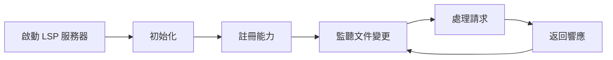

# LSP/AST Integration LSP/AST 集成技能

> 版權聲明：`../../references/COPYRIGHT.md`　Token 標準：`../../references/token_standard.md`　編排器：`../SKILL.md`

---

## 1. 觸發規則

### 1.1 觸發場景
- 需要代碼智能導航：跳轉定義、查找引用、查看文檔、類型提示
- 需要代碼重構：重命名、提取方法/類、內聯、移動、簽名變更
- 需要代碼查詢：模式匹配、依賴分析、影響分析、架構檢查
- 需要代碼生成：樣板代碼、測試生成、遷移腳本、API 客戶端
- 需要代碼分析：複雜度、重複、異味、依賴圖、調用鏈

### 1.2 觸發詞
| 關鍵字 | 映射操作 | 說明 |
|--------|----------|------|
| `goto` / `跳轉` / `定義` | LSP 導航 | 跳轉到定義/聲明/實現/類型定義 |
| `references` / `引用` / `查找引用` | LSP 引用 | 查找所有引用位置 |
| `hover` / `懸停` / `文檔` | LSP 懸停 | 顯示類型/文檔/簽名信息 |
| `rename` / `重命名` | LSP 重構 | 安全重命名符號 |
| `refactor` / `重構` / `提取` | 重構引擎 | 提取方法/類/變量/內聯/移動 |
| `ast` / `抽象語法樹` / `查詢` | AST 查詢 | 模式匹配/依賴分析/影響分析 |
| `generate` / `生成` / `樣板` | 代碼生成 | 樣板/測試/遷移/API 客戶端 |
| `diagnostics` / `診斷` / `錯誤` | LSP 診斷 | 實時錯誤/警告/提示 |

### 1.3 能力矩陣
| 能力 | LSP | AST | 適用語言 |
|------|-----|-----|----------|
| 跳轉定義 | ✅ | ✅ | 所有 LSP 支持語言 |
| 查找引用 | ✅ | ✅ | 所有 LSP 支持語言 |
| 懸停/文檔 | ✅ | ❌ | 所有 LSP 支持語言 |
| 重命名 | ✅ | ✅ | 所有 LSP 支持語言 |
| 代碼補全 | ✅ | ❌ | 所有 LSP 支持語言 |
| 模式匹配 | ❌ | ✅ | 所有可解析語言 |
| 依賴分析 | ❌ | ✅ | 所有可解析語言 |
| 影響分析 | ❌ | ✅ | 所有可解析語言 |
| 代碼生成 | ❌ | ✅ | 所有可解析語言 |
| 結構化編輯 | ❌ | ✅ | 所有可解析語言 |

---

## 2. 流程

### 2.1 LSP 客戶端生命週期


### 2.2 AST 解析流程


### 2.3 核心操作

#### 2.3.1 LSP 導航
```python
class LSPClient:
    def __init__(self, language: str, project_root: str):
        self.server = self._start_server(language)
        self.capabilities = self._initialize(project_root)
    
    def goto_definition(self, file: str, line: int, col: int) -> Location:
        """跳轉到定義"""
        return self._request('textDocument/definition', {
            'textDocument': {'uri': file_to_uri(file)},
            'position': {'line': line, 'character': col}
        })
    
    def find_references(self, file: str, line: int, col: int, include_decl: bool = True) -> List[Location]:
        """查找所有引用"""
        return self._request('textDocument/references', {
            'textDocument': {'uri': file_to_uri(file)},
            'position': {'line': line, 'character': col},
            'context': {'includeDeclaration': include_decl}
        })
    
    def hover(self, file: str, line: int, col: int) -> HoverInfo:
        """懸停信息：類型、文檔、簽名"""
        return self._request('textDocument/hover', {
            'textDocument': {'uri': file_to_uri(file)},
            'position': {'line': line, 'character': col}
        })
    
    def rename(self, file: str, line: int, col: int, new_name: str) -> WorkspaceEdit:
        """安全重命名"""
        return self._request('textDocument/rename', {
            'textDocument': {'uri': file_to_uri(file)},
            'position': {'line': line, 'character': col},
            'newName': new_name
        })
```

#### 2.3.2 AST 查詢與重構
```python
class ASTEngine:
    def __init__(self, language: str):
        self.parser = self._get_parser(language)  # tree-sitter / ANTLR / 內建
    
    def parse(self, code: str, file_path: str = "") -> AST:
        """解析代碼生成 AST"""
        tree = self.parser.parse(bytes(code, 'utf-8'))
        return AST(tree, file_path)
    
    def query(self, ast: AST, pattern: str) -> List[Match]:
        """模式匹配查詢"""
        # 支援: tree-sitter query / XPath / CSS 選擇器 / 自定義 DSL
        return ast.query(pattern)
    
    def find_pattern(self, ast: AST, pattern: ASTPattern) -> List[Node]:
        """結構化模式匹配"""
        # 如: 函數調用、類定義、導入語句、特定模式
        pass
    
    def refactor(self, ast: AST, operation: RefactorOp) -> RefactorResult:
        """重構操作"""
        # extract_method, extract_class, inline, move, rename, change_signature
        pass
    
    def generate(self, ast: AST, template: Template) -> str:
        """代碼生成"""
        # 基於模板和 AST 上下文生成代碼
        pass
```

---

## 3. 輸出規範

### 3.1 LSP 響應格式
```json
{
  "id": 1,
  "result": [
    {
      "uri": "file:///project/src/auth/user.ts",
      "range": {
        "start": {"line": 10, "character": 5},
        "end": {"line": 10, "character": 15}
      }
    }
  ]
}
```

### 3.2 AST 查詢結果
```json
{
  "matches": [
    {
      "node_type": "function_declaration",
      "file": "src/auth/user.ts",
      "range": {"start": {"line": 10, "col": 5}, "end": {"line": 25, "col": 1}},
      "captures": {
        "name": "authenticate",
        "params": ["credentials", "context"],
        "return_type": "Promise<User>"
      }
    }
  ],
  "summary": {"total": 1, "files": 1}
}
```

### 3.3 重構結果
```json
{
  "operation": "extract_method",
  "success": true,
  "changes": [
    {
      "file": "src/auth/user.ts",
      "old_range": {"start": {"line": 10, "col": 5}, "end": {"line": 25, "col": 1}},
      "new_code": "async authenticate(creds, ctx) { ... }",
      "new_method": {
        "name": "validateCredentials",
        "params": ["creds"],
        "body": "...",
        "line": 30
      }
    }
  ],
  "preview": true
}
```

---

## 4. 邊界

### 4.1 適用邊界
- ✅ 所有支援 LSP 的語言 (TypeScript, Python, Go, Rust, Java, C#, ...)
- ✅ 所有可解析語言的 AST 操作 (tree-sitter 支援 40+ 語言)
- ✅ 大型代碼庫的增量解析與索引
- ✅ CI/CD 集成的自動化分析/重構

### 4.2 不適用邊界
- ❌ 無法解析的語言/DSL/配置文件
- ❌ 極大文件 (>10MB) 的實時分析 (需分塊)
- ❌ 高度動態/元編程語言的靜態分析 (需運行時輔助)

### 4.3 資源限制
- LSP 服務器內存：建議 < 2GB
- AST 索引內存：建議 < 1GB
- 並發查詢：建議 ≤ 10
- 索引構建時間：增量 < 1s，全量 < 60s

---

## 5. 明細外置

| 明細文件 | 說明 |
|----------|------|
| `domain/lsp-client.md` | LSP 客戶端：啟動/能力/請求/響應/診斷/工作區 |
| `domain/ast-engine.md` | AST 引擎：解析器/查詢語言/模式匹配/符號表 |
| `domain/refactoring-engine.md` | 重構引擎：提取/內聯/移動/重命名/簽名變更 |
| `domain/code-generation.md` | 代碼生成：模板/上下文感知/類型感知/測試生成 |
| `domain/dependency-analysis.md` | 依賴分析：導入圖/調用鏈/影響分析/循環檢測 |
| `domain/lsp-ast-integration.md` | LSP+AST 聯合：混合導航/語義感知重構/類型感知生成 |

---

**文檔版本**: v1.0.0  **最後更新**: 2026-08-08
**知識產權所有**: 段波（驗證郵箱: duanbo.douglas@163.com）