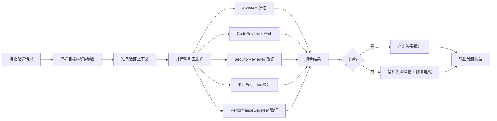

# Multi-Perspective Validation 多视角验证

- **技能版本**：v1.1.0　**发布日期**：2026-08-18

> 版权声明：`../../../references/COPYRIGHT.md`　Token 标准：`../../../references/token_standard.md`　编排器：`../../SKILL.md`

---

## 1. 触发规则

### 1.1 触发场景
- PR/MR 提交前的质量门禁
- 架构设计文档评审
- 关键模块重构前的风险评估
- 发布前的全维度验证
- 安全合规审查

### 1.2 触发词
| 关键字 | 映射模式 | 说明 |
|--------|----------|------|
| `validate` / `验证` | 通用入口 | 指定目标与视角，启动多视角并行验证 |
| `review` / `审查` / `code review` | 代码审查模式 | CodeReviewer + Architect + SecurityReviewer |
| `audit` / `审计` / `security audit` | 安全审计模式 | SecurityReviewer + Architect + Compliance |
| `quality gate` / `质量门禁` | 发布门禁 | 五视角全开 + 签署门禁 |
| `architecture review` / `架构评审` | 架构评审 | Architect + SecurityReviewer + PerformanceEngineer |

### 1.3 视角定义（档位见 `../../../references/model_selection.md` §3-4）
| 视角 | 角色 | 聚焦维度 | 档位 | 产出 |
|------|------|----------|------|------|
| **架构一致性** | Architect | 设计符合性、接口契约、数据模型、边界划分 | S2(强模型) | PASS/FAIL + 违规列表 |
| **代码质量** | CodeReviewer | 风格/复杂度/测试覆盖/文档/重复/异味 | S1/S2 | PASS/FAIL + 具体建议 |
| **安全合规** | SecurityReviewer | 威胁建模、漏洞扫描、认证授权、数据流、合规 | S2(强模型) | PASS/FAIL + CVE/风险清单 |
| **测试完备性** | TestEngineer | 单元/集成/契约/E2E 覆盖、断言质量、测试策略 | S1 | PASS/FAIL + 缺口报告 |
| **性能基准** | PerformanceEngineer | 延迟/吞吐/资源/并发/扩展性/回归 | S1/S2 | PASS/FAIL + 基准报告 |

---

## 2. 流程

### 2.1 验证流水线


### 2.2 验证上下文准备
```python
@dataclass
class ValidationContext:
    target: ValidationTarget          # 代码/架构/文档/配置
    scope: str                        # files/paths/modules
    perspectives: List[Perspective]   # 指定或全部
    baseline: Optional[str]           # 对比基线 (git ref)
    config: ValidationConfig          # 阈值/规则/排除
    metadata: Dict                    # PR号/提交者/关联Issue
```

### 2.3 并行验证执行
```python
async def run_validation(ctx: ValidationContext) -> ValidationReport:
    # 1. 并行启动视角
    tasks = {
        "architect": run_architect_validation(ctx),
        "code_reviewer": run_code_reviewer_validation(ctx),
        "security": run_security_validation(ctx),
        "test_engineer": run_test_validation(ctx),
        "performance": run_performance_validation(ctx),
    }
    
    # 2. 并行等待 (超时保护)
    results = await asyncio.gather(*tasks.values(), return_exceptions=True)
    
    # 3. 聚合
    return aggregate_results(ctx, results)
```

### 2.4 聚合与决策
```python
def aggregate_results(ctx, raw_results) -> ValidationReport:
    perspective_results = {}
    all_passed = True
    
    for name, result in raw_results.items():
        if isinstance(result, Exception):
            perspective_results[name] = PerspectiveResult(
                status="ERROR", error=str(result)
            )
            all_passed = False
        else:
            perspective_results[name] = result
            if result.status != "PASS":
                all_passed = False
    
    # 决策逻辑
    if all_passed:
        decision = "SIGNED_OFF"
    elif any(r.status == "ERROR" for r in perspective_results.values()):
        decision = "BLOCKED_ERROR"
    else:
        decision = "CHANGES_REQUESTED"
    
    return ValidationReport(
        context=ctx,
        decision=decision,
        perspectives=perspective_results,
        summary=generate_summary(perspective_results),
        signed_off=all_passed,
        timestamp=now()
    )
```

---

## 3. 输出规范

### 3.1 视角结果格式
```json
{
  "perspective": "architect",
  "status": "PASS",
  "checks": [
    {"id": "ARCH-001", "name": "接口契约一致性", "status": "PASS", "evidence": "OpenAPI spec matches impl"},
    {"id": "ARCH-002", "name": "数据模型完整性", "status": "FAIL", "evidence": "User.entity missing updated_at", "severity": "high"}
  ],
  "summary": "核心架构符合设计，1项高严重性违规需修复",
  "confidence": "high",
  "tokens_used": 1200
}
```

### 3.2 综合验证报告
```markdown
# 多视角验证报告

**目标**: PR #1234 - 用户服务重构
**决策**: ✅ SIGNED_OFF
**时间**: 2026-08-08T14:30:00Z

## 视角结果
| 视角 | 状态 | 通过/总检查 | 关键发现 |
|------|------|-------------|----------|
| 架构一致性 | ✅ PASS | 12/12 | 接口契约完全一致 |
| 代码质量 | ✅ PASS | 18/18 | 复杂度均<15，覆盖85% |
| 安全合规 | ✅ PASS | 15/15 | 0 high/critical 漏洞 |
| 测试完备性 | ⚠️ CHANGES_REQUESTED | 14/16 | 缺少 E2E 测试 2 条 |
| 性能基准 | ✅ PASS | 8/8 | P99 延迟 45ms < 200ms |

## 决策
✅ **SIGNED_OFF** - 所有视角通过或可接受风险
- TestEngineer 发现的 E2E 缺口属于已知风险，已在 Issue #456 跟踪
- 其余视角无阻塞性问题

## 签署
- Architect (S2/强模型): ✅ PASS
- CodeReviewer (S1/S2): ✅ PASS  
- SecurityReviewer (S2/强模型): ✅ PASS
- TestEngineer (S1): ⚠️ CHANGES_REQUESTED
- PerformanceEngineer (S1/S2): ✅ PASS
```

### 3.3 CSV 导出格式
```csv
perspective,check_id,check_name,status,severity,evidence,confidence
architect,ARCH-001,接口契约一致性,PASS,,OpenAPI spec matches impl,high
architect,ARCH-002,数据模型完整性,FAIL,high,User.entity missing updated_at,high
code_reviewer,CR-001,圈复杂度,PASS,,max complexity 12,high
security,SEC-001,静态扫描,PASS,,bandit 0 high,high
test_engineer,TE-001,E2E覆盖,FAIL,medium,missing 2 E2E tests,medium
performance,PERF-001,P99延迟,PASS,,45ms < 200ms,high
```

---

## 4. 边界

### 4.1 适用边界
- ✅ PR/架构文档/配置的发布前验证
- ✅ 关键路径代码的强制质量门禁
- ✅ 合规要求项目的自动化审计

### 4.2 不适用边界
- ❌ 探索性/实验性代码 (用单一视角轻量验证)
- ❌ 极小改动 (单文件 <50 行，直接 CodeReviewer 轻量)
- ❌ 无自动化验证能力的领域 (需人工专家)

### 4.3 资源限制
- 并行视角：最多 5 个并行
- 单视角超时：10 分钟
- 总超时：15 分钟
- Token 预算：单视角 ≤ 3000，总计 ≤ 12000

---

## 5. 明细外置

| 明细文件 | 说明 |
|----------|------|
| `domain/architect-validation.md` | 架构验证：契约/模型/边界/决策追溯/ADR 一致性 |
| `domain/code-reviewer-validation.md` | 代码质量验证：风格/复杂度/覆盖/异味/最佳实践 |
| `domain/security-validation.md` | 安全验证：威胁建模/扫描/认证授权/数据流/合规 |
| `domain/test-validation.md` | 测试验证：覆盖/策略/断言/契约/E2E/测试金字塔 |
| `domain/performance-validation.md` | 性能验证：基准/负载/压力/并发/资源/回归 |
| `domain/aggregation-decision.md` | 聚合决策：规则/签署/异议处理/风险接受/报告模板 |

---

---

## 闭环执行系统

### 1. 任务入口
- 输入：用户要求多视角验证/代码审查/架构评审/安全审查/质量门禁（`validate`/`review`/`audit`/`quality gate`）；
- 前置：已确定验证目标（代码/架构/文档/配置）与视角组合，必要时设定 git 基线；
- 不适用：探索性/实验性代码、极小改动（<50 行）、无自动化验证能力的领域不强制全视角。

### 2. 执行状态
| 状态 | 进入条件 | 退出条件 | 处理方式 |
|------|---------|---------|---------|
| 待启动 | 用户触发验证请求 | 用户确认/系统启动 | 解析目标/视角/基线，装配验证上下文 |
| 执行中 | 并行五视角启动 | 各视角结果返回/失败 | 按 §2.3 并行执行（超时保护） |
| 校验中 | 结果汇总 | 聚合通过/失败 | 按 §2.4 聚合决策（SIGNED_OFF/CHANGES_REQUESTED/BLOCKED） |
| 阻塞 | 视角异常/数据缺失 | 补数据/人工介入 | 记录异常视角，非关键可继续 |
| 完成 | 聚合决策 | 进入交接 | 产出验证报告，更新断点 |
| 回退 | 验证失败 | 回到稳定基线 | 触发修复循环，保留审计 |

### 3. 执行动作层
- 执行步骤 1：准备验证上下文（target/scope/perspectives/baseline）；
- 执行步骤 2：并行运行 Architect/CodeReviewer/Security/Test/Performance 视角（§2.3）；
- 执行步骤 3：聚合决策并产出验证报告（§3.2），进一步按视角明细补查；
- 所需工具/脚本：`domain/*-validation.md` 五视角明细、`domain/aggregation-decision.md` 聚合规则；
- 输入输出约束：报告产出 CSV（UTF-8 BOM，token_standard §3）；单视角 ≤3000 token，总计 ≤12000。

### 4. 验收门禁
- 必须产出物：五视角结果 + 综合验证报告（含决策与签署）；
- 通过条件：全视角 PASS → SIGNED_OFF；有 FAIL/缺口 → CHANGES_REQUESTED 并给修复建议；
- 失败条件：视角异常（ERROR）、数据缺失、未附证据、报告未产出；
- 审核对象：总控角色与项目负责人。

### 5. 失败处理
- 失败类型：视角超时、工具不可用、基线缺失、聚合异常；
- 恢复策略：重跑失败视角/降级视角/补基线后重试；
- 回滚方案：保留上次验证报告，修复后重验；
- 重试策略：仅在前置条件满足时重试，不改通过标准；
- 是否需要人工确认：高严重性安全漏洞、风险接受决策需人工确认。

### 6. 产出与交接
- 产出物列表：视角结果 JSON、综合验证报告、修复建议清单；
- 保存路径：`评审报告_<对象>_<版本>_<视角>.csv`、交接断点区；
- 交接对象：修复责任角色（开发/测试/部署）、总控角色；
- 下一步动作：CHANGES_REQUESTED → 修复 → 重验；SIGNED_OFF → 提交/发布；
- 归档条件：报告落盘、签署完成、审计记录齐全。

### 7. 审计记录
- 执行时间：验证开始与结束时间；
- 关键参数：目标、视角集、基线、各视角 token 用量；
- 关键决策：决策（SIGNED_OFF/CHANGES_REQUESTED）、风险接受、修复指派；
- 结果证据：视角结果、报告 CSV、签署记录；
- 失败原因：视角/聚合失败在台账或断点留痕。

---

**文档版本**：v1.1.0　**最后更新**：2026-08-18（繁体转简体 + 新增闭环执行系统章节，技能库本体评审修复）

**知识产权所有**：段波（验证邮箱：duanbo.douglas@163.com）