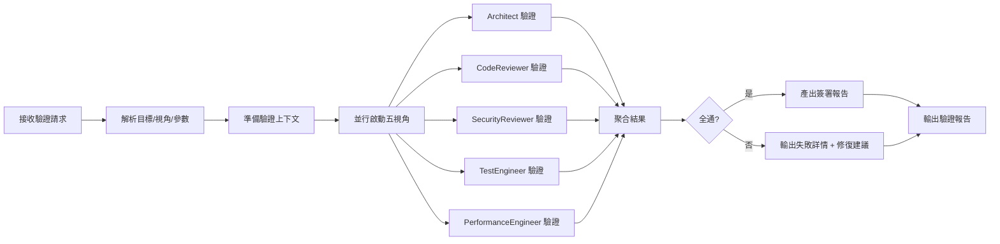

# Multi-Perspective Validation 多視角驗證

> 版權聲明：`../../references/COPYRIGHT.md`　Token 標準：`../../references/token_standard.md`　編排器：`../SKILL.md`

---

## 1. 觸發規則

### 1.1 觸發場景
- PR/MR 提交前的質量門禁
- 架構設計文檔評審
- 關鍵模塊重構前的風險評估
- 發布前的全維度驗證
- 安全合規審查

### 1.2 觸發詞
| 關鍵字 | 映射模式 | 說明 |
|--------|----------|------|
| `validate` / `驗證` | 通用入口 | 指定目標與視角，啟動多視角並行驗證 |
| `review` / `審查` / `code review` | 代碼審查模式 | CodeReviewer + Architect + SecurityReviewer |
| `audit` / `審計` / `security audit` | 安全審計模式 | SecurityReviewer + Architect + Compliance |
| `quality gate` / `質量門禁` | 發布門禁 | 五視角全開 + 簽署門禁 |
| `architecture review` / `架構評審` | 架構評審 | Architect + SecurityReviewer + PerformanceEngineer |

### 1.3 視角定義
| 視角 | 角色 | 聚焦維度 | 模型 | 產出 |
|------|------|----------|------|------|
| **架構一致性** | Architect (Opus) | 設計符合性、接口契約、數據模型、邊界劃分 | Opus | PASS/FAIL + 違規列表 |
| **代碼質量** | CodeReviewer (Opus) | 風格/複雜度/測試覆蓋/文檔/重複/異味 | Opus | PASS/FAIL + 具體建議 |
| **安全合規** | SecurityReviewer (Sonnet) | 威脅建模、漏洞掃描、認證授權、數據流、合規 | Sonnet | PASS/FAIL + CVE/風險清單 |
| **測試完備性** | TestEngineer (Sonnet) | 單元/集成/契約/E2E 覆蓋、斷言質量、測試策略 | Sonnet | PASS/FAIL + 缺口報告 |
| **性能基準** | PerformanceEngineer (Sonnet) | 延遲/吞吐/資源/併發/擴展性/回歸 | Sonnet | PASS/FAIL + 基準報告 |

---

## 2. 流程

### 2.1 驗證流水線


### 2.2 驗證上下文準備
```python
@dataclass
class ValidationContext:
    target: ValidationTarget          # 代碼/架構/文檔/配置
    scope: str                        # files/paths/modules
    perspectives: List[Perspective]   # 指定或全部
    baseline: Optional[str]           # 對比基線 (git ref)
    config: ValidationConfig          # 閾值/規則/排除
    metadata: Dict                    # PR號/提交者/關聯Issue
```

### 2.3 並行驗證執行
```python
async def run_validation(ctx: ValidationContext) -> ValidationReport:
    # 1. 並行啟動視角
    tasks = {
        "architect": run_architect_validation(ctx),
        "code_reviewer": run_code_reviewer_validation(ctx),
        "security": run_security_validation(ctx),
        "test_engineer": run_test_validation(ctx),
        "performance": run_performance_validation(ctx),
    }
    
    # 2. 並行等待 (超時保護)
    results = await asyncio.gather(*tasks.values(), return_exceptions=True)
    
    # 3. 聚合
    return aggregate_results(ctx, results)
```

### 2.4 聚合與決策
```python
def aggregate_results(ctx, raw_results) -> ValidationReport:
    perspective_results = {}
    all_passed = True
    
    for name, result in raw_results.items():
        if isinstance(result, Exception):
            perspective_results[name] = PerspectiveResult(
                status="ERROR", error=str(result)
            )
            all_passed = False
        else:
            perspective_results[name] = result
            if result.status != "PASS":
                all_passed = False
    
    # 決策邏輯
    if all_passed:
        decision = "SIGNED_OFF"
    elif any(r.status == "ERROR" for r in perspective_results.values()):
        decision = "BLOCKED_ERROR"
    else:
        decision = "CHANGES_REQUESTED"
    
    return ValidationReport(
        context=ctx,
        decision=decision,
        perspectives=perspective_results,
        summary=generate_summary(perspective_results),
        signed_off=all_passed,
        timestamp=now()
    )
```

---

## 3. 輸出規範

### 3.1 視角結果格式
```json
{
  "perspective": "architect",
  "status": "PASS",
  "checks": [
    {"id": "ARCH-001", "name": "接口契約一致性", "status": "PASS", "evidence": "OpenAPI spec matches impl"},
    {"id": "ARCH-002", "name": "數據模型完整性", "status": "FAIL", "evidence": "User.entity missing updated_at", "severity": "high"}
  ],
  "summary": "核心架構符合設計，1項高嚴重性違規需修復",
  "confidence": "high",
  "tokens_used": 1200
}
```

### 3.2 綜合驗證報告
```markdown
# 多視角驗證報告

**目標**: PR #1234 - 用戶服務重構
**決策**: ✅ SIGNED_OFF
**時間**: 2026-08-08T14:30:00Z

## 視角結果
| 視角 | 狀態 | 通過/總檢查 | 關鍵發現 |
|------|------|-------------|----------|
| 架構一致性 | ✅ PASS | 12/12 | 接口契約完全一致 |
| 代碼質量 | ✅ PASS | 18/18 | 複雜度均<15，覆蓋85% |
| 安全合規 | ✅ PASS | 15/15 | 0 high/critical 漏洞 |
| 測試完備性 | ⚠️ CHANGES_REQUESTED | 14/16 | 缺少 E2E 測試 2 條 |
| 性能基準 | ✅ PASS | 8/8 | P99 延遲 45ms < 200ms |

## 決策
✅ **SIGNED_OFF** - 所有視角通過或可接受風險
- TestEngineer 發現的 E2E 缺口屬於已知風險，已在 Issue #456 跟蹤
- 其餘視角無阻塞性問題

## 簽署
- Architect (Opus): ✅ PASS
- CodeReviewer (Opus): ✅ PASS  
- SecurityReviewer (Sonnet): ✅ PASS
- TestEngineer (Sonnet): ⚠️ CHANGES_REQUESTED
- PerformanceEngineer (Sonnet): ✅ PASS
```

### 3.3 CSV 導出格式
```csv
perspective,check_id,check_name,status,severity,evidence,confidence
architect,ARCH-001,接口契約一致性,PASS,,OpenAPI spec matches impl,high
architect,ARCH-002,數據模型完整性,FAIL,high,User.entity missing updated_at,high
code_reviewer,CR-001,圈複雜度,PASS,,max complexity 12,high
security,SEC-001,靜態掃描,PASS,,bandit 0 high,high
test_engineer,TE-001,E2E覆蓋,FAIL,medium,missing 2 E2E tests,medium
performance,PERF-001,P99延遲,PASS,,45ms < 200ms,high
```

---

## 4. 邊界

### 4.1 適用邊界
- ✅ PR/架構文檔/配置的發布前驗證
- ✅ 關鍵路徑代碼的強制質量門禁
- ✅ 合規要求項目的自動化審計

### 4.2 不適用邊界
- ❌ 探索性/實驗性代碼 (用單一視角輕量驗證)
- ❌ 極小改動 (單文件 <50 行，直接 CodeReviewer 輕量)
- ❌ 無自動化驗證能力的領域 (需人工專家)

### 4.3 資源限制
- 並行視角：最多 5 個並行
- 單視角超時：10 分鐘
- 總超時：15 分鐘
- Token 預算：單視角 ≤ 3000，總計 ≤ 12000

---

## 5. 明細外置

| 明細文件 | 說明 |
|----------|------|
| `domain/architect-validation.md` | 架構驗證：契約/模型/邊界/決策追溯/ADR 一致性 |
| `domain/code-reviewer-validation.md` | 代碼質量驗證：風格/複雜度/覆蓋/異味/最佳實踐 |
| `domain/security-validation.md` | 安全驗證：威脅建模/掃描/認證授權/數據流/合規 |
| `domain/test-validation.md` | 測試驗證：覆蓋/策略/斷言/契約/E2E/測試金字塔 |
| `domain/performance-validation.md` | 性能驗證：基準/負載/壓力/併發/資源/回歸 |
| `domain/aggregation-decision.md` | 聚合決策：規則/簽署/異議處理/風險接受/報告模板 |

---

**文檔版本**: v1.0.0  **最後更新**: 2026-08-08
**知識產權所有**: 段波（驗證郵箱: duanbo.douglas@163.com）