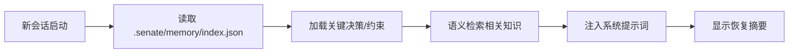

# Project Memory 持久化记忆层

- **技能版本**：v1.1.0　**发布日期**：2026-08-18

> 版权声明：`../../../references/COPYRIGHT.md`　Token 标准：`../../../references/token_standard.md`　编排器：`../../SKILL.md`

---

## 1. 触发规则

### 1.1 触发场景
- 新会话启动需恢复项目上下文（架构决策、技术债、关键约束）
- 跨模型切换需保留决策理由与架构意图
- 团队成员轮换需快速同步项目历史与隐性知识
- 长期项目需追踪演进轨迹与决策演变

### 1.2 触发词
| 关键字 | 映射操作 | 说明 |
|--------|----------|------|
| `memory` / `记忆` | 通用入口 | 读取/写入/搜索项目记忆 |
| `remember` / `记住` | 写入决策/约束 | 记录架构决策、技术选型理由、关键约束 |
| `recall` / `回忆` | 恢复上下文 | 新会话自动加载关键记忆 |
| `decision` / `决策` | 决策日志 | 记录/查询 ADR 风格决策记录 |
| `knowledge` / `知识` | 知识图谱 | 实体关系查询、技术栈映射 |
| `notepad` / `便笺` | 轻量笔记 | 临时工作记忆、待办、观察 |

### 1.3 触发词 → 存储类型映射
```yaml
decision:    {store: "ProjectMemory", type: "ADR", ttl: "permanent"}
constraint:  {store: "ProjectMemory", type: "constraint", ttl: "permanent"}
knowledge:   {store: "KnowledgeGraph", type: "entity", ttl: "permanent"}
notepad:     {store: "Notepad", type: "working", ttl: "session"}
observation: {store: "Notepad", type: "observation", ttl: "7d"}
context:     {store: "ContextSnapshot", type: "snapshot", ttl: "30d"}
```

---

## 2. 流程

### 2.1 记忆写入流程


### 2.2 会话启动自动恢复


### 2.3 记忆类型详解

#### 2.3.1 ProjectMemory (决策/约束/长期)
- **存储**：`.senate/memory/project-memory.jsonl` (追加写入)
- **结构**：`{id, type, title, content, tags, confidence, source, timestamp, links[]}`
- **检索**：向量相似度 + 标签过滤 + 时间范围
- **TTL**：永久（除非显式归档）

#### 2.3.2 KnowledgeGraph (实体/关系/技术栈)
- **存储**：`.senate/memory/knowledge-graph.json` (图结构)
- **节点**：技术、组件、模块、依赖、团队成员
- **边**：依赖、调用、拥有、负责、阻塞
- **查询**：图遍历、路径搜索、影响分析

#### 2.3.3 Notepad (轻量工作记忆)
- **存储**：`.senate/memory/notepad.json` (会话级)
- **类型**：working(工作中)、observation(观察)、todo(待办)
- **TTL**：session/7d/30d 可配
- **特性**：极速读写、无向量化

#### 2.3.4 ContextSnapshot (上下文快照)
- **存储**：`.senate/memory/snapshots/{session-id}.json`
- **内容**：当前任务、活跃文件、决策点、待办、环境状态
- **触发**：会话结束、阶段切换、手动触发
- **TTL**：30d，归档后移至冷存储

---

## 3. 输出规范

### 3.1 记忆条目格式
```json
{
  "id": "mem-20260808-001",
  "type": "decision",
  "title": "选择 PostgreSQL 作为主数据库",
  "content": "基于 ACID 需求、JSONB 支援、团队熟悉度、运维成熟度...",
  "tags": ["architecture", "database", "postgresql"],
  "confidence": "high",
  "source": "architect",
  "timestamp": "2026-08-08T10:00:00Z",
  "links": ["mem-20260807-015", "adr-003"],
  "embedding": [0.12, -0.34, ...]  // 向量嵌入 (可选)
}
```

### 3.2 知识图谱结构
```json
{
  "nodes": {
    "postgresql": {"type": "technology", "category": "database", "props": {"version": "15"}},
    "user-service": {"type": "component", "category": "service", "props": {}},
    "alice": {"type": "person", "role": "backend-lead"}
  },
  "edges": [
    {"from": "user-service", "to": "postgresql", "type": "depends_on"},
    {"from": "alice", "to": "user-service", "type": "owns"}
  ]
}
```

### 3.4 恢复摘要输出
```markdown
## 📋 项目记忆恢复摘要 (Session: 2026-08-08-003)

### 关键决策 (3)
- ✅ **ADR-003**: 选择 PostgreSQL (high confidence)
- ✅ **ADR-007**: 采用微服务架构 (high)
- ⚠️ **ADR-012**: 异步消息队列选型待定 (medium)

### 关键约束 (2)
- 🔒 单表行数 < 100M (分表策略待定)
- 🔒 API 响应 < 200ms (P99)

### 近期观察 (5)
- 📝 UserService 性能瓶颈在 N+1 查询
- 📝 认证服务需支持多租户

### 待办 (3)
- [ ] 完成 ADR-012 选型
- [ ] 优化 UserService 查询
- [ ] 更新 API 文档
```

---

## 4. 边界

### 4.1 适用边界
- ✅ 长期项目（>2 周）需跨会话记忆
- ✅ 团队协作需决策追溯
- ✅ 复杂架构需知识图谱导航

### 4.2 不适用边界
- ❌ 短期/一次性任务（用 notepad 轻量模式）
- ❌ 高机密项目（记忆存储需加密/隔离）
- ❌ 极简项目（记忆维护成本 > 收益）

### 4.3 资源限制
- 向量索引：< 10k 条目内存驻留，超量磁盘
- 知识图谱：< 1k 节点，超量分片
- 会话快照：最近 50 次，超量归档

---

## 5. 明细外置

| 明细文件 | 说明 |
|----------|------|
| `domain/project-memory.md` | ProjectMemory 存储引擎：写入/读取/向量化/索引/检索 |
| `domain/knowledge-graph.md` | 知识图谱：实体/关系/图算法/影响分析/可视化 |
| `domain/notepad.md` | Notepad 轻量存储：类型/TTL/会话隔离/极速读写 |
| `domain/context-snapshot.md` | 上下文快照：捕获/恢复/归档/版本管理 |
| `domain/memory-retrieval.md` | 记忆检索：混合检索(向量+关键词+图)/重排序/上下文注入 |

---

---

## 闭环执行系统

### 1. 任务入口
- 输入：用户要求保存/查询/恢复项目级长期记忆、记录架构决策、建立知识图谱（`project-memory`/`记忆`/`决策记录`）；
- 前置：已明确记忆写入目标（决策/约束/知识）或检索粒度（关键词/向量/图）；读取记忆仓库现状；
- 不适用：一次性会话内的琐碎对话、未达持久化价值的信息、无明确归属的记忆不强制写入。

### 2. 执行状态
| 状态 | 进入条件 | 退出条件 | 处理方式 |
|------|---------|---------|---------|
| 待启动 | 用户触发记忆写入/检索 | 用户确认/系统启动 | 确定记忆类型（decision/constraint/knowledge）与来源 |
| 执行中 | 记忆条目生成/检索发起 | 写入/检索完成 | 按 `domain/notepad.md` 格式构建条目或执行混合检索 |
| 校验中 | 记忆写入/检索完成 | 门禁通过/失败 | 校验元数据完整性（id/type/source/confidence） |
| 阻塞 | 来源冲突/置信度不足 | 补充信息/人工确认 | 暂停并记录待确认信息 |
| 完成 | 写入/检索通过 | 进入交接 | 更新交接断点与记忆索引 |
| 回退 | 记忆条目错误 | 回到稳定版本 | 删除/修正错误条目，保留审计 |

### 3. 执行动作层
- 执行步骤 1：判定记忆类型与价值，构建记忆条目 JSON（§3.1 格式）；
- 执行步骤 2：混合检索（向量+关键词+知识图谱重排序），注入当前上下文；
- 执行步骤 3：更新知识图谱节点/链接与记忆索引；
- 所需工具/脚本：`domain/notepad.md`、`domain/memory-retrieval.md`、`domain/knowledge-graph.md`、`domain/project-memory.md`；
- 输入输出约束：记忆条目写 `ProjectMemory` 持久层；敏感信息按铁律分级（决策/约束可存，密钥只存别名）。

### 4. 验收门禁
- 必须产出物：记忆条目（含元数据）或检索结果（含置信度与来源）；
- 通过条件：条目字段完整 + 类型归属清晰 + 检索结果有依据 + 无敏感明文泄漏；
- 失败条件：id 唯一性冲突、confidence 缺失、检索无来源支撑、图谱链接断裂；
- 审核对象：项目负责人或由记忆消费者（下一个会话/阶段）验收。

### 5. 失败处理
- 失败类型：条目重复、向量检索无关、图谱节点冲突、置信度不足；
- 恢复策略：去重合并、调整检索权重、修正知识图谱关系；
- 回滚方案：删除误写条目或回退图谱变更（保留历史版本）；
- 重试策略：修正检索查询或记忆标签后重试；
- 是否需要人工确认：跨项目记忆共享、删除既有记忆、敏感条目写入需人工确认。

### 6. 产出与交接
- 产出物列表：记忆条目 JSON、知识图谱更新、上下文恢复摘要；
- 保存路径：`ProjectMemory` 持久层、知识图谱存储、交接断点区；
- 交接对象：下一会话/阶段角色、项目负责人；
- 下一步动作：检索结果注入工作上下文，或写入条目供后续会话恢复；
- 归档条件：条目已持久化、图谱一致、审计记录齐全。

### 7. 审计记录
- 执行时间：记忆写入/检索时间；
- 关键参数：记忆 id、type、来源角色、检索查询与结果数；
- 关键决策：价值判定、去重合并、图谱关系变更；
- 结果证据：记忆条目、检索命中记录、图谱快照；
- 失败原因：写入失败/检索失效在审计台账留痕。

---

**文档版本**：v1.1.0　**最后更新**：2026-08-18（繁体转简体 + 新增闭环执行系统章节，技能库本体评审修复）

**知识产权所有**：段波（验证邮箱：duanbo.douglas@163.com）