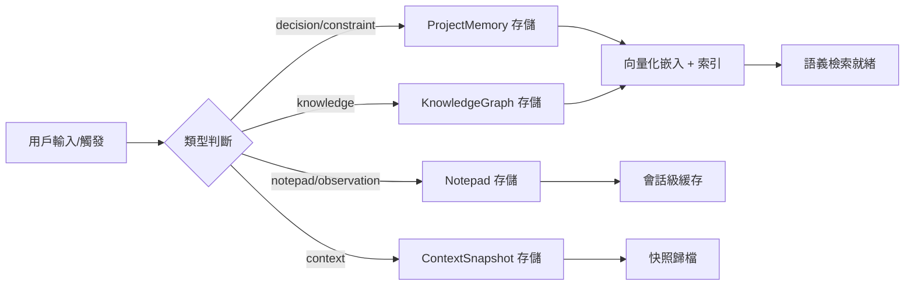
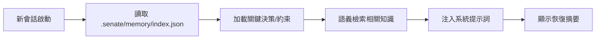

# Project Memory 持久化記憶層

> 版權聲明：`../../references/COPYRIGHT.md`　Token 標準：`../../references/token_standard.md`　編排器：`../SKILL.md`

---

## 1. 觸發規則

### 1.1 觸發場景
- 新會話啟動需恢復項目上下文（架構決策、技術債、關鍵約束）
- 跨模型切換需保留決策理由與架構意圖
- 團隊成員輪換需快速同步項目歷史與隱性知識
- 長期項目需追蹤演進軌跡與決策演變

### 1.2 觸發詞
| 關鍵字 | 映射操作 | 說明 |
|--------|----------|------|
| `memory` / `記憶` | 通用入口 | 讀取/寫入/搜索項目記憶 |
| `remember` / `記住` | 寫入決策/約束 | 記錄架構決策、技術選型理由、關鍵約束 |
| `recall` / `回憶` | 恢復上下文 | 新會話自動加載關鍵記憶 |
| `decision` / `決策` | 決策日誌 | 記錄/查詢 ADR 風格決策記錄 |
| `knowledge` / `知識` | 知識圖譜 | 實體關係查詢、技術棧映射 |
| `notepad` / `便箋` | 輕量筆記 | 臨時工作記憶、待辦、觀察 |

### 1.3 觸發詞 → 存儲類型映射
```yaml
decision:    {store: "ProjectMemory", type: "ADR", ttl: "permanent"}
constraint:  {store: "ProjectMemory", type: "constraint", ttl: "permanent"}
knowledge:   {store: "KnowledgeGraph", type: "entity", ttl: "permanent"}
notepad:     {store: "Notepad", type: "working", ttl: "session"}
observation: {store: "Notepad", type: "observation", ttl: "7d"}
context:     {store: "ContextSnapshot", type: "snapshot", ttl: "30d"}
```

---

## 2. 流程

### 2.1 記憶寫入流程


### 2.2 會話啟動自動恢復


### 2.3 記憶類型詳解

#### 2.3.1 ProjectMemory (決策/約束/長期)
- **存儲**：`.senate/memory/project-memory.jsonl` (追加寫入)
- **結構**：`{id, type, title, content, tags, confidence, source, timestamp, links[]}`
- **檢索**：向量相似度 + 標籤過濾 + 時間範圍
- **TTL**：永久（除非顯式歸檔）

#### 2.3.2 KnowledgeGraph (實體/關係/技術棧)
- **存儲**：`.senate/memory/knowledge-graph.json` (圖結構)
- **節點**：技術、組件、模塊、依賴、團隊成員
- **邊**：依賴、調用、擁有、負責、阻塞
- **查詢**：圖遍歷、路徑搜索、影響分析

#### 2.3.3 Notepad (輕量工作記憶)
- **存儲**：`.senate/memory/notepad.json` (會話級)
- **類型**：working(工作中)、observation(觀察)、todo(待辦)
- **TTL**：session/7d/30d 可配
- **特性**：極速讀寫、無向量化

#### 2.3.4 ContextSnapshot (上下文快照)
- **存儲**：`.senate/memory/snapshots/{session-id}.json`
- **內容**：當前任務、活躍文件、決策點、待辦、環境狀態
- **觸發**：會話結束、階段切換、手動觸發
- **TTL**：30d，歸檔後移至冷存儲

---

## 3. 輸出規範

### 3.1 記憶條目格式
```json
{
  "id": "mem-20260808-001",
  "type": "decision",
  "title": "選擇 PostgreSQL 作為主數據庫",
  "content": "基於 ACID 需求、JSONB 支援、團隊熟悉度、運維成熟度...",
  "tags": ["architecture", "database", "postgresql"],
  "confidence": "high",
  "source": "architect",
  "timestamp": "2026-08-08T10:00:00Z",
  "links": ["mem-20260807-015", "adr-003"],
  "embedding": [0.12, -0.34, ...]  // 向量嵌入 (可選)
}
```

### 3.2 知識圖譜結構
```json
{
  "nodes": {
    "postgresql": {"type": "technology", "category": "database", "props": {"version": "15"}},
    "user-service": {"type": "component", "category": "service", "props": {}},
    "alice": {"type": "person", "role": "backend-lead"}
  },
  "edges": [
    {"from": "user-service", "to": "postgresql", "type": "depends_on"},
    {"from": "alice", "to": "user-service", "type": "owns"}
  ]
}
```

### 3.4 恢復摘要輸出
```markdown
## 📋 項目記憶恢復摘要 (Session: 2026-08-08-003)

### 關鍵決策 (3)
- ✅ **ADR-003**: 選擇 PostgreSQL (high confidence)
- ✅ **ADR-007**: 採用微服務架構 (high)
- ⚠️ **ADR-012**: 異步消息隊列選型待定 (medium)

### 關鍵約束 (2)
- 🔒 單表行數 < 100M (分表策略待定)
- 🔒 API 響應 < 200ms (P99)

### 近期觀察 (5)
- 📝 UserService 性能瓶頸在 N+1 查詢
- 📝 認證服務需支持多租戶

### 待辦 (3)
- [ ] 完成 ADR-012 選型
- [ ] 優化 UserService 查詢
- [ ] 更新 API 文檔
```

---

## 4. 邊界

### 4.1 適用邊界
- ✅ 長期項目（>2 週）需跨會話記憶
- ✅ 團隊協作需決策追溯
- ✅ 複雜架構需知識圖譜導航

### 4.2 不適用邊界
- ❌ 短期/一次性任務（用 notepad 輕量模式）
- ❌ 高機密項目（記憶存儲需加密/隔離）
- ❌ 極簡項目（記憶維護成本 > 收益）

### 4.3 資源限制
- 向量索引：< 10k 條目內存驻留，超量磁盤
- 知識圖譜：< 1k 節點，超量分片
- 會話快照：最近 50 次，超量歸檔

---

## 5. 明細外置

| 明細文件 | 說明 |
|----------|------|
| `domain/project-memory.md` | ProjectMemory 存儲引擎：寫入/讀取/向量化/索引/檢索 |
| `domain/knowledge-graph.md` | 知識圖譜：實體/關係/圖算法/影響分析/可視化 |
| `domain/notepad.md` | Notepad 輕量存儲：類型/TTL/會話隔離/極速讀寫 |
| `domain/context-snapshot.md` | 上下文快照：捕獲/恢復/歸檔/版本管理 |
| `domain/memory-retrieval.md` | 記憶檢索：混合檢索(向量+關鍵詞+圖)/重排序/上下文注入 |

---

**文檔版本**: v1.0.0  **最後更新**: 2026-08-08
**知識產權所有**: 段波（驗證郵箱: duanbo.douglas@163.com）