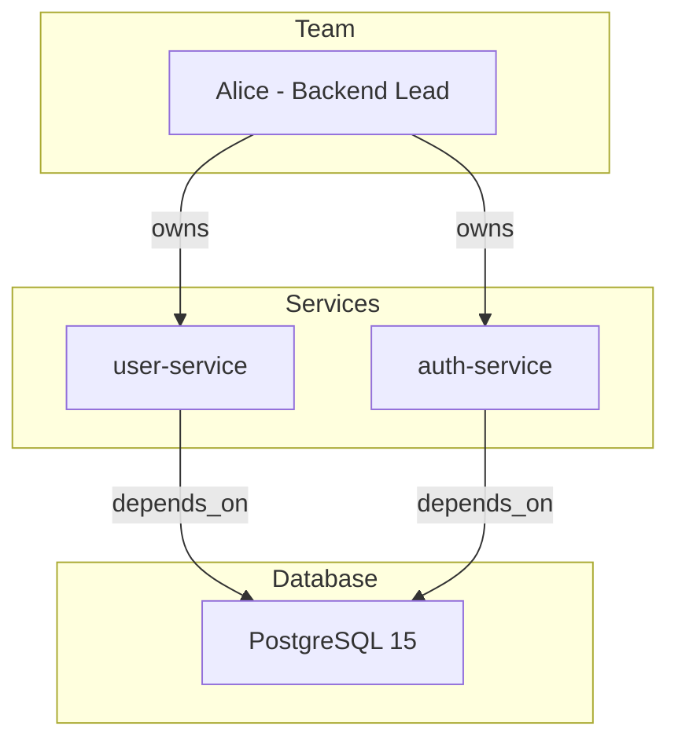

# 知識圖譜：實體/關係/圖算法/影響分析/可視化

> 編排器：`../SKILL.md`　上位：編排器 §5 調度規則

---

## 1. 圖數據模型

### 1.1 節點類型
```python
NODE_TYPES = {
    "technology": {"props": ["version", "category", "license"]},      # PostgreSQL, Redis, React
    "component": {"props": ["repo", "language", "owner"]},            # user-service, api-gateway
    "module": {"props": ["path", "layer"]},                           # auth-module, payment-module
    "person": {"props": ["role", "team", "skills"]},                  # alice, bob
    "decision": {"props": ["adr_id", "status"]},                      # ADR-003, ADR-007
    "constraint": {"props": ["severity", "domain"]},                  # 單表行數限制
    "risk": {"props": ["likelihood", "impact", "mitigation"]},        # 技術債、安全風險
    "document": {"props": ["path", "type"]},                          # SPEC, ADR, README
}
```

### 1.2 邊類型
```python
EDGE_TYPES = {
    "depends_on": {"weight": 1.0, "desc": "A 依賴 B"},              # service -> db
    "calls": {"weight": 0.8, "desc": "A 調用 B"},                    # API -> service
    "contains": {"weight": 1.0, "desc": "A 包含 B"},                 # repo -> module
    "owns": {"weight": 0.9, "desc": "人員負責"},                      # person -> component
    "implements": {"weight": 1.0, "desc": "實現關係"},                # decision -> component
    "constrains": {"weight": 0.7, "desc": "約束關係"},                # constraint -> tech
    "risks": {"weight": 0.6, "desc": "風險關聯"},                     # risk -> component
    "documents": {"weight": 0.5, "desc": "文檔描述"},                 # document -> entity
}
```

### 1.3 存儲格式 (JSON)
```json
{
  "version": "1.0",
  "updated_at": "2026-08-08T10:00:00Z",
  "nodes": {
    "postgresql": {"type": "technology", "category": "database", "props": {"version": "15"}},
    "user-service": {"type": "component", "repo": "backend/user-service", "owner": "alice"},
    "alice": {"type": "person", "role": "backend-lead", "team": "platform"}
  },
  "edges": [
    {"from": "user-service", "to": "postgresql", "type": "depends_on", "weight": 1.0},
    {"from": "alice", "to": "user-service", "type": "owns", "weight": 0.9}
  ]
}
```

---

## 2. 核心操作

### 2.1 圖構建 (自動/手動)

#### 2.1.1 代碼分析自動提取
```python
def build_from_codebase(repo_path: str) -> Graph:
    """掃描代碼庫提取依賴關係"""
    g = Graph()
    
    # 1. 掃描 imports/requirements
    for file in scan_files(repo_path, ["*.py", "*.js", "*.ts", "*.go", "*.java"]):
        imports = extract_imports(file)
        for imp in imports:
            g.add_edge(file.module, imp.module, "depends_on")
    
    # 2. 掃描配置文件
    for config in ["package.json", "requirements.txt", "go.mod", "pom.xml", "Cargo.toml"]:
        deps = parse_dependencies(config)
        for dep in deps:
            g.add_node(dep.name, "technology", category="library")
            g.add_edge(file.module, dep.name, "depends_on")
    
    # 3. 掃描架構文檔
    for adr in scan_files(repo_path, ["**/ADR-*.md", "**/architecture/*.md"]):
        extract_adr_relations(adr, g)
    
    return g
```

#### 2.1.2 手動聲明 (YAML)
```yaml
# .senate/memory/kg-declarations.yaml
nodes:
  - id: "user-service"
    type: "component"
    props: {repo: "backend/user-service", language: "go"}
  - id: "postgresql"
    type: "technology"
    props: {version: "15", category: "database"}

edges:
  - from: "user-service"
    to: "postgresql"
    type: "depends_on"
    weight: 1.0
```

### 2.2 圖存儲
```python
class KnowledgeGraph:
    def __init__(self, path: str):
        self.path = path
        self.nodes: Dict[str, Node] = {}
        self.adj: Dict[str, List[Edge]] = defaultdict(list)
        self.reverse_adj: Dict[str, List[Edge]] = defaultdict(list)
        self.load()
    
    def add_node(self, id: str, type: str, **props):
        self.nodes[id] = Node(id=id, type=type, props=props)
    
    def add_edge(self, from_id: str, to_id: str, type: str, weight: float = 1.0):
        edge = Edge(from_id=from_id, to_id=to_id, type=type, weight=weight)
        self.adj[from_id].append(edge)
        self.reverse_adj[to_id].append(edge)
    
    def save(self):
        data = {"version": "1.0", "nodes": {}, "edges": []}
        for id, node in self.nodes.items():
            data["nodes"][id] = asdict(node)
        for edges in self.adj.values():
            for e in edges:
                data["edges"].append(asdict(e))
        atomic_write(self.path, json.dumps(data, ensure_ascii=False, indent=2))
```

---

## 3. 圖算法

### 3.1 影響分析 (變更影響範圍)
```python
def impact_analysis(graph: KnowledgeGraph, changed_node: str, max_depth: int = 3) -> ImpactReport:
    """計算節點變更的影響範圍"""
    # 反向遍歷：誰依賴我？
    affected = bfs_reverse(graph, changed_node, max_depth)
    
    # 按關係類型分組
    by_type = defaultdict(list)
    for node_id, path in affected:
        edge_type = path[-1].type if path else "unknown"
        by_type[edge_type].append({"node": node_id, "distance": len(path), "path": path})
    
    # 風險評分
    for node_id in affected:
        node = graph.nodes[node_id]
        risk = calculate_risk(node, len(path))
    
    return ImpactReport(
        source=changed_node,
        affected_count=len(affected),
        by_type=by_type,
        high_risk=[n for n, r in risk.items() if r > 0.7]
    )
```

### 3.2 關鍵路徑/關鍵節點
```python
def find_critical_nodes(graph: KnowledgeGraph) -> List[CriticalNode]:
    """PageRank + 入度/出度 + 業務重要性"""
    # 1. PageRank 計算中心性
    pagerank = nx.pagerank(graph.to_networkx())
    
    # 2. 結合業務權重
    for node_id, node in graph.nodes.items():
        business_weight = BUSINESS_WEIGHTS.get(node.type, 1.0)
        criticality = pagerank[node_id] * business_weight * (1 + len(graph.adj[node_id]) * 0.1)
        if criticality > THRESHOLD:
            yield CriticalNode(node_id, criticality, node.type)
```

### 3.3 依賴鏈追蹤
```python
def trace_dependency_chain(graph: KnowledgeGraph, from_node: str, to_node: str) -> List[Path]:
    """查找所有依賴路徑"""
    return list(nx.all_simple_paths(graph.to_networkx(), from_node, to_node, cutoff=5))
```

### 3.4 圈複雜度/架構異味檢測
```python
def detect_architectural_smells(graph: KnowledgeGraph) -> List[Smell]:
    smells = []
    
    # 1. 循環依賴
    for cycle in nx.simple_cycles(graph.to_networkx()):
        smells.append(Smell("circular_dependency", cycle, severity="high"))
    
    # 2. 神類/中心節點過度集中
    for node_id, degree in graph.out_degree():
        if degree > 20:
            smells.append(Smell("god_component", node_id, severity="medium"))
    
    # 3. 孤立組件
    for node_id in graph.nodes:
        if graph.in_degree(node_id) == 0 and graph.out_degree(node_id) == 0:
            smells.append(Smell("isolated_component", node_id, severity="low"))
    
    return smells
```

---

## 4. 查詢介面

### 4.1 自然語言查詢
```python
def query_graph(nl_query: str) -> QueryResult:
    """將自然語言轉為圖查詢"""
    # 意圖識別
    intent = classify_intent(nl_query)  # impact | path | neighbors | critical | smell
    
    # 實體識別
    entities = extract_entities(nl_query, graph.nodes.keys())
    
    # 執行查詢
    if intent == "impact":
        return impact_analysis(graph, entities[0])
    elif intent == "path":
        return trace_dependency_chain(graph, entities[0], entities[1])
    # ...
```

### 4.2 結構化查詢
```bash
# CLI 查詢示例
kg query --impact user-service --depth 2
kg query --path user-service postgresql
kg query --critical --top 10
kg query --smells
kg query --neighbors user-service --type depends_on
```

---

## 5. 可視化

### 5.1 Mermaid 圖表輸出


### 5.2 交互式導出
```python
def export_cytoscape(graph: KnowledgeGraph) -> dict:
    """導出 Cytoscape.js 格式"""
    return {
        "elements": {
            "nodes": [{"data": {"id": k, "label": k, **v.props}} for k, v in graph.nodes.items()],
            "edges": [{"data": {"source": e.from_id, "target": e.to_id, "label": e.type}} for e in graph.edges()]
        },
        "style": [
            {"selector": "node[type='technology']", "style": {"background-color": "#4CAF50"}},
            {"selector": "node[type='component']", "style": {"background-color": "#2196F3"}},
            {"selector": "node[type='person']", "style": {"background-color": "#FF9800"}},
            {"selector": "edge[type='depends_on']", "style": {"line-color": "#999", "width": 2}},
        ]
    }
```

---

## 6. 增量更新

### 6.1 代碼變更觸發
```python
def on_code_change(changed_files: List[str]):
    """Git hook / CI 觸發增量更新"""
    for file in changed_files:
        if file.endswith((".py", ".js", ".ts", ".go", ".java")):
            # 重新分析該文件 imports
            update_module_deps(file)
        elif file in ["package.json", "requirements.txt", "go.mod"]:
            # 依賴變更
            update_tech_deps(file)
        elif "ADR" in file or "architecture" in file:
            # 架構決策變更
            update_adr_relations(file)
```

### 6.2 版本控制
- 圖文件納入 git (`.senate/memory/knowledge-graph.json`)
- 每次提交記錄圖變更摘要
- 支持 `kg diff HEAD~1` 查看架構演進

---

**文檔版本**: v1.0.0  **最後更新**: 2026-08-08