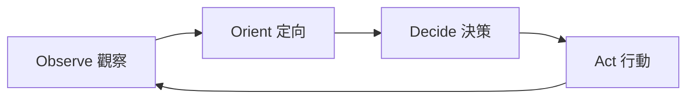

# Self-Improve 自我改進循環

> 版權聲明：`../../references/COPYRIGHT.md`　Token 標準：`../../references/token_standard.md`　編排器：`../SKILL.md`

---

## 1. 觸發規則

### 1.1 觸發場景
- 需要對技能庫/流程/工具進行持續迭代改進
- 發現偏差：執行結果與預期不符、流程效率低下、標準衝突
- 需要沉澱經驗：階段復盤收穫、失敗教訓、可複用資產
- 需要實驗驗證：改進提案的假設驗證與對照評估
- 需要版本化發布：改進內容納入版本管理與交接

### 1.2 觸發詞
| 關鍵字 | 映射操作 | 說明 |
|--------|----------|------|
| `自我改進` / `改進循環` | 診斷 | 啟動改進循環（Observe→Orient→Decide→Act） |
| `技能迭代` / `流程優化` | 提案 | 生成改進提案並評估 |
| `偏差偵測` / `偏差` | 診斷 | 對比預期 vs 實際，定位偏差 |
| `根因分析` / `RCA` | 診斷 | 5-Why / 魚骨圖定位根因 |
| `改進提案` / `提案` | 提案 | 生成可評估的改進方案 |
| `實驗評估` / `對照` | 實驗 | 設計並執行 A/B 評估 |
| `經驗總結` / `復盤` | 沉澱 | 沉澱可複用資產 |
| `閉環復盤` / `收斂` | 收斂 | 確認改進落地並收斂循環 |
| `自省` / `診斷` / `檢視` | 診斷 | PDCA 五步只讀診斷 + 五層根因 |
| `evolve_start` / `哈希鏈` | 診斷 | 防篡改校驗 |
| `ctx_health_check` / `健康` | 診斷 | 上下文健康監控（綠/黃/橙/紅） |

### 1.3 能力矩陣
| 能力 | 產物 | 適用場景 |
|------|------|----------|
| 自我診斷 | 診斷報告 / 偏差清單 / 哈希鏈 | 技能庫自省、防篡改、健康監控 |
| 偏差偵測 | 偏差清單 + 根因 | 執行結果不符、流程低效 |
| 改進提案 | 提案卡（假設/方案/評估） | 任何可改進點 |
| 實驗評估 | 對照實驗報告 | 方案效果未明 |
| 版本化發布 | 版本記錄 + 交接刷新 | 改進落地確認 |
| 經驗沉澱 | 23_複用資產 / 復盤卡片 | 階段末/項目末 |

---

## 2. 流程：OODA 閉環循環

### 2.1 循環總覽


### 2.2 各階段操作

#### 2.2.1 Observe 觀察（偏差偵測）
- 輸入：執行記錄、階段復盤、用戶反饋、門禁報告
- 動作：對比「預期行為 vs 實際行為」，列出偏差
- 產物：`deviation_log`（偏差編號 / 描述 / 影響 / 頻次）

#### 2.2.2 Orient 定向（根因分析）
- 輸入：偏差清單
- 動作：5-Why 逐層問因，魚骨圖分類（人/流程/工具/標準/環境）
- 產物：根因列表，標註可改進點與優先級

#### 2.2.3 Decide 決策（改進提案）
- 輸入：根因列表
- 動作：生成提案卡——問題、根因、改進方案、預期收益、成本、風險
- 產物：提案評估表（優先級排序，高收益低成本優先）

#### 2.2.4 Act 行動（執行 + 驗證 + 發布）
- 輸入：選定提案
- 動作：按 skill-authoring 五步流程改技能 → 實驗對照驗證 → solidify 固化 → 版本化發布 → 交接刷新
- 產物：改進落地記錄 + 版本更新 + 循環收斂標記

### 2.3 改進循環控制
- **範圍**：每次循環聚焦 1~3 個高優先級改進點，避免改動過大；
- **門禁**：改技能必須過 skill-authoring 結構校驗 + solidify 版本門禁；
- **收斂**：改進落地並通過驗證後，該偏差標記 `closed`，循環收斂；
- **回退**：實驗不達標時回滾（走 git revert / solidify 快照恢復），記錄失敗教訓。

---

## 3. 輸出規範

### 3.1 偏差清單格式
```json
{
  "deviations": [
    {
      "id": "DEV-001",
      "description": "技能 A 在觸發詞 X 下未加載",
      "expected": "應加載技能 A",
      "actual": "未加載，無響應",
      "impact": "用戶需求未滿足",
      "frequency": "3 次/週",
      "severity": "high"
    }
  ]
}
```

### 3.2 改進提案卡
```markdown
## 提案 P-001
- **問題**：技能 A 觸發詞缺失導致未加載
- **根因**：description 未含觸發詞 X（五步流程第 1 步遺漏）
- **改進方案**：description 補觸發詞 X，150~250 字符重寫
- **預期收益**：觸發準確率提升
- **成本**：低（改 1 行）
- **風險**：極低
- **評估方式**：三觸發詞測試回歸
- **優先級**：P1（高收益低成本）
```

### 3.3 循環收斂記錄
```markdown
## 循環 C-2026-03
- **偏差**：DEV-001, DEV-002
- **提案**：P-001（已執行）, P-002（緩議）
- **驗證**：三觸發詞測試通過
- **發布**：v21.3.4
- **收斂**：closed（DEV-001/002 已閉環）
```

---

## 4. 邊界

### 4.1 適用邊界
- ✅ 技能庫 SKILL.md / domain / references 的迭代改進
- ✅ 流程與標準的持續優化（效率、準確率、成本）
- ✅ 工具腳本的行為改進（solidify / deploy / package）
- ✅ 階段復盤的收穫沉澱與閉環

### 4.2 不適用邊界
- ❌ 業務應用功能的開發（本體是技能庫，非業務代碼）
- ❌ 無偏差/無改進點的例行操作（不需要啟動循環）
- ❌ 超出技能庫範圍的外部系統改動（走安全審計授權流程）

### 4.3 資源限制
- 每次循環 ≤ 3 個改進點
- 實驗評估樣本：≥ 3 次觸發測試
- 循環週期：隨階段復盤（階段末）或用戶明確要求

---

## 5. 明細外置

| 明細文件 | 說明 |
|----------|------|
| `domain/self-diagnosis.md` | 自我診斷：PDCA 五步、五層根因、哈希鏈防篡改、上下文健康監控 |
| `domain/deviation-detection.md` | 偏差偵測：預期vs實際對比、偏差分類、嚴重度評估 |
| `domain/root-cause-analysis.md` | 根因分析：5-Why、魚骨圖、優先級排序 |
| `domain/improvement-proposal.md` | 改進提案：提案卡生成、評估矩陣、風險評審 |
| `domain/experiment-evaluation.md` | 實驗評估：A/B 對照設計、指標、回歸驗證 |
| `domain/versioned-release.md` | 版本化發布：版本記錄、solidify 固化、交接刷新 |
| `domain/lesson-harvesting.md` | 經驗沉澱：復盤卡片、可複用資產、失敗教訓 |

---

**文檔版本**: v1.0.0  **最後更新**: 2026-08-09
**知識產權所有**: 段波（驗證郵箱: duanbo.douglas@163.com）