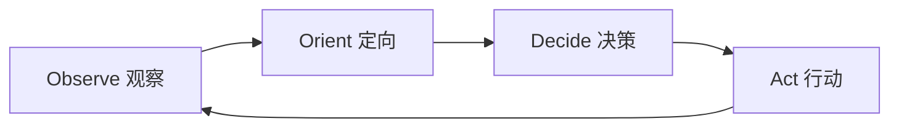

# Self-Improve 自我改进循环

- **技能版本**：v1.1.0　**发布日期**：2026-08-18

> 版权声明：`../../../references/COPYRIGHT.md`　Token 标准：`../../../references/token_standard.md`　编排器：`../../SKILL.md`

---

## 1. 触发规则

### 1.1 触发场景
- 需要对技能库/流程/工具进行持续迭代改进
- 发现偏差：执行结果与预期不符、流程效率低下、标准冲突
- 需要沉淀经验：阶段复盘收获、失败教训、可复用资产
- 需要实验验证：改进提案的假设验证与对照评估
- 需要版本化发布：改进内容纳入版本管理与交接

### 1.2 触发词
| 关键字 | 映射操作 | 说明 |
|--------|----------|------|
| `自我改进` / `改进循环` | 诊断 | 启动改进循环（Observe→Orient→Decide→Act） |
| `技能迭代` / `流程优化` | 提案 | 生成改进提案并评估 |
| `偏差侦测` / `偏差` | 诊断 | 对比预期 vs 实际，定位偏差 |
| `根因分析` / `RCA` | 诊断 | 5-Why / 鱼骨图定位根因 |
| `改进提案` / `提案` | 提案 | 生成可评估的改进方案 |
| `实验评估` / `对照` | 实验 | 设计并执行 A/B 评估 |
| `经验总结` / `复盘` | 沉淀 | 沉淀可复用资产 |
| `闭环复盘` / `收敛` | 收敛 | 确认改进落地并收敛循环 |
| `自省` / `诊断` / `检视` | 诊断 | PDCA 五步只读诊断 + 五层根因 |
| `evolve_start` / `哈希链` | 诊断 | 防篡改校验 |
| `ctx_health_check` / `健康` | 诊断 | 上下文健康监控（绿/黄/橙/红） |

### 1.3 能力矩阵
| 能力 | 产物 | 适用场景 |
|------|------|----------|
| 自我诊断 | 诊断报告 / 偏差清单 / 哈希链 | 技能库自省、防篡改、健康监控 |
| 偏差侦测 | 偏差清单 + 根因 | 执行结果不符、流程低效 |
| 改进提案 | 提案卡（假设/方案/评估） | 任何可改进点 |
| 实验评估 | 对照实验报告 | 方案效果未明 |
| 版本化发布 | 版本记录 + 交接刷新 | 改进落地确认 |
| 经验沉淀 | 23_复用资产 / 复盘卡片 | 阶段末/项目末 |

---

## 2. 流程：OODA 闭环循环

### 2.1 循环总览


### 2.2 各阶段操作

#### 2.2.1 Observe 观察（偏差侦测）
- 输入：执行记录、阶段复盘、用户反馈、门禁报告
- 动作：对比「预期行为 vs 实际行为」，列出偏差
- 产物：`deviation_log`（偏差编号 / 描述 / 影响 / 频次）

#### 2.2.2 Orient 定向（根因分析）
- 输入：偏差清单
- 动作：5-Why 逐层问因，鱼骨图分类（人/流程/工具/标准/环境）
- 产物：根因列表，标注可改进点与优先级

#### 2.2.3 Decide 决策（改进提案）
- 输入：根因列表
- 动作：生成提案卡——问题、根因、改进方案、预期收益、成本、风险
- 产物：提案评估表（优先级排序，高收益低成本优先）

#### 2.2.4 Act 行动（执行 + 验证 + 发布）
- 输入：选定提案
- 动作：按 skill-authoring 五步流程改技能 → 实验对照验证 → solidify 固化 → 版本化发布 → 交接刷新
- 产物：改进落地记录 + 版本更新 + 循环收敛标记

### 2.3 改进循环控制
- **范围**：每次循环聚焦 1~3 个高优先级改进点，避免改动过大；
- **门禁**：改技能必须过 skill-authoring 结构校验 + solidify 版本门禁；
- **收敛**：改进落地并通过验证后，该偏差标记 `closed`，循环收敛；
- **回退**：实验不达标时回滚（走 git revert / solidify 快照恢复），记录失败教训。

---

## 3. 输出规范

### 3.1 偏差清单格式
```json
{
  "deviations": [
    {
      "id": "DEV-001",
      "description": "技能 A 在触发词 X 下未加载",
      "expected": "应加载技能 A",
      "actual": "未加载，无响应",
      "impact": "用户需求未满足",
      "frequency": "3 次/周",
      "severity": "high"
    }
  ]
}
```

### 3.2 改进提案卡
```markdown
## 提案 P-001
- **问题**：技能 A 触发词缺失导致未加载
- **根因**：description 未含触发词 X（五步流程第 1 步遗漏）
- **改进方案**：description 补触发词 X，150~250 字符重写
- **预期收益**：触发准确率提升
- **成本**：低（改 1 行）
- **风险**：极低
- **评估方式**：三触发词测试回归
- **优先级**：P1（高收益低成本）
```

### 3.3 循环收敛记录
```markdown
## 循环 C-2026-03
- **偏差**：DEV-001, DEV-002
- **提案**：P-001（已执行）, P-002（缓议）
- **验证**：三触发词测试通过
- **发布**：v21.3.4
- **收敛**：closed（DEV-001/002 已闭环）
```

---

## 4. 边界

### 4.1 适用边界
- ✅ 技能库 SKILL.md / domain / references 的迭代改进
- ✅ 流程与标准的持续优化（效率、准确率、成本）
- ✅ 工具脚本的行为改进（solidify / deploy / package）
- ✅ 阶段复盘的收获沉淀与闭环

### 4.2 不适用边界
- ❌ 业务应用功能的开发（本体是技能库，非业务代码）
- ❌ 无偏差/无改进点的例行操作（不需要启动循环）
- ❌ 超出技能库范围的外部系统改动（走安全审计授权流程）

### 4.3 资源限制
- 每次循环 ≤ 3 个改进点
- 实验评估样本：≥ 3 次触发测试
- 循环周期：随阶段复盘（阶段末）或用户明确要求

---

## 5. 明细外置

| 明细文件 | 说明 |
|----------|------|
| `domain/self-diagnosis.md` | 自我诊断：PDCA 五步、五层根因、哈希链防篡改、上下文健康监控 |
| `domain/deviation-detection.md` | 偏差侦测：预期vs实际对比、偏差分类、严重度评估 |
| `domain/root-cause-analysis.md` | 根因分析：5-Why、鱼骨图、优先级排序 |
| `domain/improvement-proposal.md` | 改进提案：提案卡生成、评估矩阵、风险评审 |
| `domain/experiment-evaluation.md` | 实验评估：A/B 对照设计、指标、回归验证 |
| `domain/versioned-release.md` | 版本化发布：版本记录、solidify 固化、交接刷新 |
| `domain/lesson-harvesting.md` | 经验沉淀：复盘卡片、可复用资产、失败教训 |

---

---

## 闭环执行系统

### 1. 任务入口
- 输入：用户要求自我改进/技能迭代/复盘/自省/持续改进（`self-improve`/`改进提案`/`复盘`/`诊断`）；
- 前置：已识别待诊断对象（技能库/流程/工具/标准）与偏差信号，确认改进范围不越界（maintenance_scope）；
- 不适用：仅讨论改进理念、无具体偏差对象、或属于业务项目任务（应走对应角色包）时不直接执行。

### 2. 执行状态
| 状态 | 进入条件 | 退出条件 | 处理方式 |
|------|---------|---------|---------|
| 待启动 | 用户触发自我改进 | 用户确认/系统启动 | 声明改进范围，识别偏差/待改进信号 |
| 执行中 | 自省诊断/偏差侦测 | 提案/根因产出 | 按 OODA 闭环：观察→判断→决策→行动 |
| 校验中 | 改进提案生成 | 门禁通过/失败 | 校验实验设计、影响评估、安全边界 |
| 阻塞 | 偏差数据不足 | 补充信息/人工 | 暂停并记录数据缺口 |
| 完成 | 提案获批/实验通过 | 进入发布 | 版本化发布（`domain/versioned-release.md`），更新断点 |
| 回退 | 实验失败/门禁未过 | 回到稳定版本 | 撤销变更，保留审计与新偏差学习 |

### 3. 执行动作层
- 执行步骤 1：自省诊断（`domain/self-diagnosis.md`，PDCA/哈希链/上下文健康），发现偏差；
- 执行步骤 2：偏差侦测（`domain/deviation-detection.md`）+ 根因分析（`domain/root-cause-analysis.md`）；
- 执行步骤 3：形成改进提案（`domain/improvement-proposal.md`）→ 实验评估（`domain/experiment-evaluation.md`）→ 版本化发布（`domain/versioned-release.md`）→ 经验沉淀（`domain/lesson-harvesting.md`）；
- 所需工具/脚本：`domain/*.md` 各环节明细、`tools/check_*` 校验门禁、`tools/solidify.sh`；
- 输入输出约束：改进对象仅限声明范围内；涉技能库本体须用户显式授权（authoring.md §2）；产出走版本化发布，禁止直接改源码。

### 4. 验收门禁
- 必须产出物：偏差清单、根因分析、改进提案、实验评估、版本化发布记录或复盘卡片；
- 通过条件：偏差有根因支撑 + 提案含实验设计 + 影响评估通过 + 门禁校验通过；
- 失败条件：偏差无证据、根因分析缺失、未设计实验、越界改源码、门禁未过；
- 审核对象：技能库维护者/总控角色。

### 5. 失败处理
- 失败类型：偏差数据缺失、实验失败、越界范围、发布门禁未过；
- 恢复策略：补偏差数据、调整实验参数、收缩范围后重试；
- 回滚方案：版本化发布前保留旧版本可回退；
- 重试策略：满足前置条件后重试，禁止绕过门禁；
- 是否需要人工确认：维护本体技能库、合并跨包提案需人工确认。

### 6. 产出与交接
- 产出物列表：偏差清单、提案卡、实验报告、发布记录、复盘卡片（`domain/lesson-harvesting.md`）；
- 保存路径：`domain/*` 产出模板、台账、版本记录与交接断点；
- 交接对象：技能库维护者、受影响角色包、总控角色；
- 下一步动作：发布通过 → 固化部署；实验失败 → 复盘沉淀为教训；
- 归档条件：版本已发布、断点更新、审计齐全。

### 7. 审计记录
- 执行时间：改进循环开始与结束时间；
- 关键参数：改进对象、偏差 id、提案 id、发布版本；
- 关键决策：范围声明、根因判定、实验结论、是否发布；
- 结果证据：提案、实验数据、版本记录、复盘卡片；
- 失败原因：失败实验与偏差在台账或断点留痕。

---

**文档版本**：v1.1.0　**最后更新**：2026-08-18（繁体转简体 + 新增闭环执行系统章节，技能库本体评审修复）

**知识产权所有**：段波（验证邮箱：duanbo.douglas@163.com）