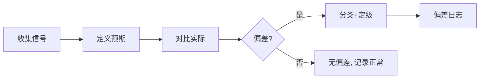

# 偏差侦测：预期 vs 实际对比 / 偏差分类 / 严重度评估

> 编排器：`../SKILL.md`

---

## 1. 偏差侦测架构

### 1.1 侦测维度
| 维度 | 对比项 | 偏差来源 |
|------|--------|----------|
| 行为偏差 | 预期行为 vs 实际行为 | 技能未加载、未按流程执行 |
| 产出偏差 | 预期产出 vs 实际产出 | 缺失文件、格式不符、内容错误 |
| 流程偏差 | 规范步骤 vs 实际步骤 | 跳步、错序、绕过门禁 |
| 成本偏差 | 预算 vs 实际 | token 超支、强模型滥用 |
| 时间偏差 | 计划 vs 实际 | 阶段延迟、任务超时 |
| 质量偏差 | 标准 vs 实际 | 描述超字数、CSV 格式错、版本不一致 |

### 1.2 侦测流程


### 1.3 信号来源
- 执行记录（会话、action 日志）
- 阶段复盘输出（22_阶段复盘.csv）
- 用户反馈（明确抱怨 / 纠正）
- 门禁报告（版本一致性、结构校验）
- 指标监控（token 用量、时长、错误率）

---

## 2. 偏差模型

### 2.1 资料结构
```python
@dataclass
class Deviation:
    id: str                    # 偏差编号 DEV-001
    dimension: str             # 行为/产出/流程/成本/时间/质量
    description: str           # 偏差描述
    expected: str              # 预期行为
    actual: str                # 实际行为
    impact: str                # 影响
    frequency: str             # 频次
    severity: str              # high / medium / low
    source: str                # 信号来源
    status: str                # open / analyzing / resolved / closed
    
    def to_csv_row(self) -> List[str]:
        return [self.id, self.dimension, self.description, self.expected,
                self.actual, self.impact, self.frequency, self.severity,
                self.source, self.status]
```

### 2.2 严重度评估
| 严重度 | 判定标准 | 响应 |
|--------|----------|------|
| high | 用户需求未满足 / 产出错误 / 流程绕过门禁 | 立即进入循环 |
| medium | 效率低 / 成本超支 / 格式问题 | 阶段末处理 |
| low | 提示性 / 可优化项 | 记录待议 |

### 2.3 严重度计算
```python
def assess_severity(deviation: Deviation) -> str:
    """严重度评分：影响面 × 频次 × 影响深度"""
    impact_score = {"需求未满足": 3, "产出错误": 3, "效率低": 2, 
                    "成本超支": 2, "格式问题": 1, "提示性": 1}
    freq_score = {"每天": 3, "每周": 2, "偶发": 1}
    depth_score = {"阻塞": 3, "部分": 2, "轻微": 1}
    
    score = impact_score.get(deviation.impact, 1) * freq_score.get(deviation.frequency, 1) * depth_score.get(deviation.depth, 1)
    
    if score >= 9:
        return "high"
    elif score >= 4:
        return "medium"
    return "low"
```

---

## 3. 预期 vs 实际对比

### 3.1 技能加载对比
```python
class LoadingDeviationDetector:
    """侦测技能未按预期加载"""
    
    def __init__(self, trigger_tests: Dict[str, str]):
        self.trigger_tests = trigger_tests  # {触发词: 预期技能}
    
    def run(self, actual_loading: Dict[str, List[str]]) -> List[Deviation]:
        """执行触发词对比"""
        deviations = []
        
        for trigger, expected_skill in self.trigger_tests.items():
            loaded = actual_loading.get(trigger, [])
            
            if expected_skill not in loaded:
                deviations.append(Deviation(
                    id=f"DEV-{len(deviations)+1:03d}",
                    dimension="行为",
                    description=f"触发词「{trigger}」未加载预期技能 {expected_skill}",
                    expected=f"加载 {expected_skill}",
                    actual=f"加载了 {', '.join(loaded) if loaded else '无'}",
                    impact="用户需求未满足",
                    frequency="待统计",
                    severity="high"
                ))
            elif len(loaded) > 1:
                deviations.append(Deviation(
                    id=f"DEV-{len(deviations)+1:03d}",
                    dimension="行为",
                    description=f"触发词「{trigger}」多技能竞合",
                    expected=f"仅加载 {expected_skill}",
                    actual=f"加载了 {', '.join(loaded)}",
                    impact="技能选择不确定",
                    frequency="待统计",
                    severity="medium"
                ))
        
        return deviations
```

### 3.2 产出对比
```python
class OutputDeviationDetector:
    """侦测产出缺失/错误"""
    
    EXPECTED_OUTPUTS = {
        "role-project-init": ["00_阶段配置.csv", "01_项目章程.md", "02_干系人登记.csv"],
        "role-architecture": ["03_架构设计.md", "04_ADR决策.md", "05_架构评审.csv"],
        "role-governance": ["13_安全审计台账.csv", "21_模型选型.csv"],
    }
    
    def check(self, project_ledger: Dict[str, List[str]]) -> List[Deviation]:
        """检查产出物完整性"""
        deviations = []
        for role, expected_files in self.EXPECTED_OUTPUTS.items():
            actual_files = project_ledger.get(role, [])
            missing = [f for f in expected_files if f not in actual_files]
            if missing:
                deviations.append(Deviation(
                    id=f"DEV-{len(deviations)+1:03d}",
                    dimension="产出",
                    description=f"{role} 缺少产出物",
                    expected=f"存在 {', '.join(missing)}",
                    actual=f"缺失 {', '.join(missing)}",
                    impact="阶段门禁无法通过",
                    frequency="每项目",
                    severity="high"
                ))
        return deviations
```

---

## 4. 偏差日志

### 4.1 日志维护
```python
class DeviationLog:
    """偏差日志：CSV 存储"""
    
    HEADER = ["id", "dimension", "description", "expected", "actual", 
              "impact", "frequency", "severity", "source", "status"]
    
    def __init__(self, path: str):
        self.path = path
    
    def append(self, deviation: Deviation):
        """追加偏差记录"""
        with open(self.path, "a", encoding="utf-8-sig", newline="") as f:
            writer = csv.writer(f)
            writer.writerow(deviation.to_csv_row())
    
    def update_status(self, dev_id: str, status: str):
        """更新偏差状态"""
        rows = self._read_all()
        for row in rows:
            if row[0] == dev_id:
                row[9] = status
        self._write_all(rows)
    
    def open_deviations(self) -> List[Deviation]:
        """获取未关闭偏差"""
        rows = self._read_all()
        return [self._from_row(r) for r in rows if r[9] != "closed"]
```

### 4.2 日志范例
```csv
id,dimension,description,expected,actual,impact,frequency,severity,source,status
DEV-001,行为,触发词「启用测试」未加载 role-testing,加载 role-testing,无,需求未满足,3次/周,high,用户反馈,open
DEV-002,质量,role-development SKILL.md description 超长,150~250字,312字,选择不确定,2次/月,medium,结构校验,analyzing
```

---

## 5. 回馈闭环

### 5.1 用户反馈接入
```python
class FeedbackIngestion:
    """用户反馈 → 偏差"""
    
    FEEDBACK_PATTERNS = {
        "未加载": ("行为", "技能加载失败"),
        "太慢": ("时间", "执行效率低"),
        "太贵": ("成本", "token 消耗高"),
        "错了": ("产出", "产出错误"),
        "绕过": ("流程", "流程跳步"),
    }
    
    def ingest(self, feedback: str) -> Optional[Deviation]:
        """解析用户反馈生成偏差"""
        for keyword, (dimension, desc) in self.FEEDBACK_PATTERNS.items():
            if keyword in feedback:
                return Deviation(
                    id=f"DEV-{uuid4().hex[:6]}",
                    dimension=dimension,
                    description=f"{desc}: {feedback}",
                    expected="符合技能规范",
                    actual="用户反馈不达标",
                    impact=desc,
                    frequency="用户反馈",
                    severity="medium",
                    source="用户反馈"
                )
        return None
```

### 5.2 定期扫描
- 阶段末：随 `retrospect_harvest` 扫描全部 open 偏差；
- 版本发布：发布前确认影响本次版本的偏差已 `resolved`；
- 项目末：未 close 偏差归入项目总结，进入下一项目改进池。

---

## 6. 最佳实践

1. **偏差必记**：任何「预期 vs 实际」不符都先记日志，再判断轻重；
2. **三触发词回归**：改技能后必须跑三触发词测试侦测加载偏差；
3. **数字说话**：频次与影响尽量量化，避免「偶尔」「有时」模糊描述；
4. **不重复记录**：同一根因的多个偏差合并，避免循环内重复处理；
5. **区分噪音**：一次性的用户误操作不算偏差，连续/复发才算。

---

**文档版本**: v1.0.0  **最后更新**: 2026-08-09