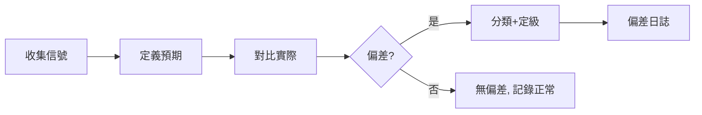

# 偏差偵測：預期 vs 實際對比 / 偏差分類 / 嚴重度評估

> 編排器：`../SKILL.md`

---

## 1. 偏差偵測架構

### 1.1 偵測維度
| 維度 | 對比項 | 偏差來源 |
|------|--------|----------|
| 行為偏差 | 預期行為 vs 實際行為 | 技能未加載、未按流程執行 |
| 產出偏差 | 預期產出 vs 實際產出 | 缺失文件、格式不符、內容錯誤 |
| 流程偏差 | 規範步驟 vs 實際步驟 | 跳步、錯序、繞過門禁 |
| 成本偏差 | 預算 vs 實際 | token 超支、強模型濫用 |
| 時間偏差 | 計劃 vs 實際 | 階段延遲、任務超時 |
| 質量偏差 | 標準 vs 實際 | 描述超字數、CSV 格式錯、版本不一致 |

### 1.2 偵測流程


### 1.3 信號來源
- 執行記錄（會話、action 日誌）
- 階段復盤輸出（22_階段复盘.csv）
- 用戶反饋（明確抱怨 / 糾正）
- 門禁報告（版本一致性、結構校驗）
- 指標監控（token 用量、時長、錯誤率）

---

## 2. 偏差模型

### 2.1 資料結構
```python
@dataclass
class Deviation:
    id: str                    # 偏差編號 DEV-001
    dimension: str             # 行為/產出/流程/成本/時間/質量
    description: str           # 偏差描述
    expected: str              # 預期行為
    actual: str                # 實際行為
    impact: str                # 影響
    frequency: str             # 頻次
    severity: str              # high / medium / low
    source: str                # 信號來源
    status: str                # open / analyzing / resolved / closed
    
    def to_csv_row(self) -> List[str]:
        return [self.id, self.dimension, self.description, self.expected,
                self.actual, self.impact, self.frequency, self.severity,
                self.source, self.status]
```

### 2.2 嚴重度評估
| 嚴重度 | 判定標準 | 響應 |
|--------|----------|------|
| high | 用戶需求未滿足 / 產出錯誤 / 流程繞過門禁 | 立即進入循環 |
| medium | 效率低 / 成本超支 / 格式問題 | 階段末處理 |
| low | 提示性 / 可優化項 | 記錄待議 |

### 2.3 嚴重度計算
```python
def assess_severity(deviation: Deviation) -> str:
    """嚴重度評分：影響面 × 頻次 × 影響深度"""
    impact_score = {"需求未滿足": 3, "產出錯誤": 3, "效率低": 2, 
                    "成本超支": 2, "格式問題": 1, "提示性": 1}
    freq_score = {"每天": 3, "每週": 2, "偶發": 1}
    depth_score = {"阻塞": 3, "部分": 2, "輕微": 1}
    
    score = impact_score.get(deviation.impact, 1) * freq_score.get(deviation.frequency, 1) * depth_score.get(deviation.depth, 1)
    
    if score >= 9:
        return "high"
    elif score >= 4:
        return "medium"
    return "low"
```

---

## 3. 預期 vs 實際對比

### 3.1 技能加載對比
```python
class LoadingDeviationDetector:
    """偵測技能未按預期加載"""
    
    def __init__(self, trigger_tests: Dict[str, str]):
        self.trigger_tests = trigger_tests  # {觸發詞: 預期技能}
    
    def run(self, actual_loading: Dict[str, List[str]]) -> List[Deviation]:
        """執行觸發詞對比"""
        deviations = []
        
        for trigger, expected_skill in self.trigger_tests.items():
            loaded = actual_loading.get(trigger, [])
            
            if expected_skill not in loaded:
                deviations.append(Deviation(
                    id=f"DEV-{len(deviations)+1:03d}",
                    dimension="行為",
                    description=f"觸發詞「{trigger}」未加載預期技能 {expected_skill}",
                    expected=f"加載 {expected_skill}",
                    actual=f"加載了 {', '.join(loaded) if loaded else '無'}",
                    impact="用戶需求未滿足",
                    frequency="待統計",
                    severity="high"
                ))
            elif len(loaded) > 1:
                deviations.append(Deviation(
                    id=f"DEV-{len(deviations)+1:03d}",
                    dimension="行為",
                    description=f"觸發詞「{trigger}」多技能競合",
                    expected=f"僅加載 {expected_skill}",
                    actual=f"加載了 {', '.join(loaded)}",
                    impact="技能選擇不確定",
                    frequency="待統計",
                    severity="medium"
                ))
        
        return deviations
```

### 3.2 產出對比
```python
class OutputDeviationDetector:
    """偵測產出缺失/錯誤"""
    
    EXPECTED_OUTPUTS = {
        "role-project-init": ["00_阶段配置.csv", "01_项目章程.md", "02_干系人登记.csv"],
        "role-architecture": ["03_架构设计.md", "04_ADR决策.md", "05_架构评审.csv"],
        "role-governance": ["13_安全审计台账.csv", "21_模型选型.csv"],
    }
    
    def check(self, project_ledger: Dict[str, List[str]]) -> List[Deviation]:
        """檢查產出物完整性"""
        deviations = []
        for role, expected_files in self.EXPECTED_OUTPUTS.items():
            actual_files = project_ledger.get(role, [])
            missing = [f for f in expected_files if f not in actual_files]
            if missing:
                deviations.append(Deviation(
                    id=f"DEV-{len(deviations)+1:03d}",
                    dimension="產出",
                    description=f"{role} 缺少產出物",
                    expected=f"存在 {', '.join(missing)}",
                    actual=f"缺失 {', '.join(missing)}",
                    impact="階段門禁無法通過",
                    frequency="每項目",
                    severity="high"
                ))
        return deviations
```

---

## 4. 偏差日誌

### 4.1 日誌維護
```python
class DeviationLog:
    """偏差日誌：CSV 存儲"""
    
    HEADER = ["id", "dimension", "description", "expected", "actual", 
              "impact", "frequency", "severity", "source", "status"]
    
    def __init__(self, path: str):
        self.path = path
    
    def append(self, deviation: Deviation):
        """追加偏差記錄"""
        with open(self.path, "a", encoding="utf-8-sig", newline="") as f:
            writer = csv.writer(f)
            writer.writerow(deviation.to_csv_row())
    
    def update_status(self, dev_id: str, status: str):
        """更新偏差狀態"""
        rows = self._read_all()
        for row in rows:
            if row[0] == dev_id:
                row[9] = status
        self._write_all(rows)
    
    def open_deviations(self) -> List[Deviation]:
        """獲取未關閉偏差"""
        rows = self._read_all()
        return [self._from_row(r) for r in rows if r[9] != "closed"]
```

### 4.2 日誌範例
```csv
id,dimension,description,expected,actual,impact,frequency,severity,source,status
DEV-001,行為,觸發詞「啟用測試」未加載 role-testing,加載 role-testing,無,需求未滿足,3次/週,high,用戶反饋,open
DEV-002,質量,role-development SKILL.md description 超長,150~250字,312字,選擇不確定,2次/月,medium,結構校驗,analyzing
```

---

## 5. 回饋閉環

### 5.1 用戶反饋接入
```python
class FeedbackIngestion:
    """用戶反饋 → 偏差"""
    
    FEEDBACK_PATTERNS = {
        "未加載": ("行為", "技能加載失敗"),
        "太慢": ("時間", "執行效率低"),
        "太貴": ("成本", "token 消耗高"),
        "錯了": ("產出", "產出錯誤"),
        "繞過": ("流程", "流程跳步"),
    }
    
    def ingest(self, feedback: str) -> Optional[Deviation]:
        """解析用戶反饋生成偏差"""
        for keyword, (dimension, desc) in self.FEEDBACK_PATTERNS.items():
            if keyword in feedback:
                return Deviation(
                    id=f"DEV-{uuid4().hex[:6]}",
                    dimension=dimension,
                    description=f"{desc}: {feedback}",
                    expected="符合技能規範",
                    actual="用戶反饋不達標",
                    impact=desc,
                    frequency="用戶反饋",
                    severity="medium",
                    source="用戶反饋"
                )
        return None
```

### 5.2 定期掃描
- 階段末：隨 `retrospect_harvest` 掃描全部 open 偏差；
- 版本發布：發布前確認影響本次版本的偏差已 `resolved`；
- 項目末：未 close 偏差歸入項目總結，進入下一項目改進池。

---

## 6. 最佳實踐

1. **偏差必記**：任何「預期 vs 實際」不符都先記日誌，再判斷輕重；
2. **三觸發詞回歸**：改技能後必須跑三觸發詞測試偵測加載偏差；
3. **數字說話**：頻次與影響盡量量化，避免「偶爾」「有時」模糊描述；
4. **不重複記錄**：同一根因的多個偏差合併，避免循環內重複處理；
5. **區分噪音**：一次性的用戶誤操作不算偏差，連續/復發才算。

---

**文檔版本**: v1.0.0  **最後更新**: 2026-08-09