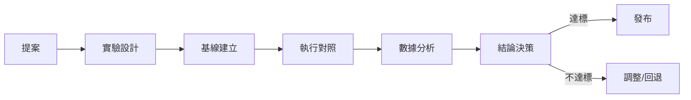

# 實驗評估：A/B 對照設計 / 指標 / 回歸驗證

> 編排器：`../SKILL.md`

---

## 1. 實驗評估架構

### 1.1 評估流程


### 1.2 評估原則
- **先基線後改動**：改動前必須有基線數據，否則無法證明改進；
- **單變量**：一次實驗只改一個變量，多變量需分組；
- **可量化**：指標必須可數值化，避免主觀判斷；
- **對照組**：有對照才能歸因，禁止「感覺變好了」。

---

## 2. 實驗設計

### 2.1 實驗類型
| 類型 | 適用 | 方法 |
|------|------|------|
| A/B 對照 | 改前 vs 改後 | 同一套輸入，分別跑舊/新技能 |
| 三觸發詞回歸 | 技能加載正確性 | 三組觸發詞，驗證加載預期技能 |
| 前後對比 | 效率/成本指標 | 同任務，改前改後測 token/時長 |
| 多方案對比 | 多個候選方案 | 同輸入，對比多方案產出質量 |

### 2.2 實驗參數
```python
@dataclass
class Experiment:
    id: str                    # EXP-001
    proposal_id: str           # 關聯提案
    hypothesis: str            # 假設
    variable: str              # 變量
    control: ExperimentGroup   # 對照組
    treatment: ExperimentGroup # 實驗組
    metrics: List[Metric]      # 指標
    min_samples: int = 3       # 最小樣本數
    threshold: float = 0.8     # 通過閾值
    
@dataclass
class ExperimentGroup:
    name: str                  # 對照組 / 實驗組
    version: str               # 技能版本
    runs: List[RunResult]      # 多次執行結果
```

---

## 3. 指標體系

### 3.1 指標類型
| 指標 | 單位 | 方向 | 說明 |
|------|------|------|------|
| 加載正確率 | % | ↑ | 觸發詞加載預期技能比例 |
| 產出完整率 | % | ↑ | 產出物齊全比例 |
| 執行時長 | s | ↓ | 完成任務耗時 |
| Token 消耗 | token | ↓ | 任務 token 用量 |
| 結構校驗通過率 | % | ↑ | 一次通過校驗比例 |
| 偏差復發數 | 個/週 | ↓ | 相關偏差復發頻次 |
| 用戶滿意度 | 分 | ↑ | 用戶反饋評分 |

### 3.2 指標計算
```python
class MetricCalculator:
    """指標計算"""
    
    def loading_accuracy(self, runs: List[RunResult]) -> float:
        """加載正確率：正確加載次數 / 總次數"""
        correct = sum(1 for r in runs if r.loaded_correctly)
        return correct / len(runs) if runs else 0.0
    
    def avg_token(self, runs: List[RunResult]) -> float:
        """平均 token 消耗"""
        return sum(r.tokens for r in runs) / len(runs) if runs else 0.0
    
    def avg_duration(self, runs: List[RunResult]) -> float:
        """平均執行時長（秒）"""
        return sum(r.duration for r in runs) / len(runs) if runs else 0.0
    
    def improvement(self, control: float, treatment: float, higher_is_better: bool) -> float:
        """改進率"""
        if control == 0:
            return 0.0
        delta = (treatment - control) / control
        return delta if higher_is_better else -delta
```

---

## 4. A/B 對照執行

### 4.1 三觸發詞回歸測試
```python
class TriggerRegressionTest:
    """三觸發詞回歸測試：技能改動後的標準驗證"""
    
    def run(self, skill: str, triggers: List[str], expected_load: str) -> TestReport:
        """對每個觸發詞驗證加載"""
        results = []
        for trigger in triggers:
            result = self._simulate_load(skill, trigger)
            results.append(TriggerResult(
                trigger=trigger,
                loaded=result,
                correct=(expected_load in result)
            ))
        
        accuracy = sum(1 for r in results if r.correct) / len(results)
        return TestReport(
            test="trigger_regression",
            skill=skill,
            results=results,
            accuracy=accuracy,
            passed=accuracy >= 0.8  # 閾值 80%
        )
```

### 4.2 前後對比實驗
```python
class BeforeAfterExperiment:
    """改前 vs 改後對比"""
    
    def run(self, experiment: Experiment) -> ExperimentResult:
        """執行前後對比"""
        # 1. 對照組（改前版本）
        for i in range(experiment.min_samples):
            result = self._run_task(experiment.control.version, experiment.task)
            experiment.control.runs.append(result)
        
        # 2. 實驗組（改後版本）
        for i in range(experiment.min_samples):
            result = self._run_task(experiment.treatment.version, experiment.task)
            experiment.treatment.runs.append(result)
        
        # 3. 分析
        metrics = {}
        for metric in experiment.metrics:
            control_val = metric.calc(experiment.control.runs)
            treatment_val = metric.calc(experiment.treatment.runs)
            improvement = self._improvement(control_val, treatment_val, metric.higher_is_better)
            metrics[metric.name] = MetricResult(
                control=control_val, treatment=treatment_val, improvement=improvement
            )
        
        # 4. 決策
        avg_improvement = sum(m.improvement for m in metrics.values()) / len(metrics)
        passed = avg_improvement >= experiment.threshold
        
        return ExperimentResult(
            experiment=experiment,
            metrics=metrics,
            passed=passed,
            recommendation="發布" if passed else "調整或回退"
        )
```

---

## 5. 數據分析與決策

### 5.1 統計檢驗
```python
class SignificanceTest:
    """顯著性檢驗（簡化）"""
    
    def compare(self, control: List[float], treatment: List[float]) -> Significance:
        """對比兩組數據是否顯著不同"""
        if len(control) < 3 or len(treatment) < 3:
            return Significance(significant=False, note="樣本不足，需至少 3 次")
        
        mean_c = statistics.mean(control)
        mean_t = statistics.mean(treatment)
        stdev_c = statistics.stdev(control) if len(control) > 1 else 0
        stdev_t = statistics.stdev(treatment) if len(treatment) > 1 else 0
        
        # 簡化 Z 檢驗
        se = math.sqrt(stdev_c**2/len(control) + stdev_t**2/len(treatment))
        if se == 0:
            return Significance(significant=(mean_t != mean_c), note="無方差")
        z = (mean_t - mean_c) / se
        significant = abs(z) > 1.96  # 95% 置信
        return Significance(significant=significant, z_score=z, note="Z 檢驗")
```

### 5.2 決策規則
| 條件 | 決策 |
|------|------|
| 指標顯著提升且無 new 偏差 | 發布（approve） |
| 指標持平但無副作用 | 發布（低優先，觀察） |
| 指標下降或引入新偏差 | 回退（rollback） |
| 樣本不足 | 補測，暫不決策 |
| 指標提升但引入風險 | 緩議，風險評審 |

### 5.3 實驗報告
```markdown
## 實驗報告 EXP-001
- **提案**：P-001 補結構校驗觸發詞覆蓋率
- **假設**：補校驗後觸發詞漏填率下降
- **方法**：三觸發詞回歸，改前/改後各 3 次
- **結果**：
  | 指標 | 改前 | 改後 | 改進 |
  |------|------|------|------|
  | 加載正確率 | 66.7% | 100% | +50% |
  | 校驗通過率 | 33.3% | 100% | +200% |
- **檢驗**：Z=2.31 > 1.96，顯著
- **結論**：發布 ✅
- **建議**：同步更新 SKILL_INDEX / references
```

---

## 6. 回歸驗證

### 6.1 回歸範圍
| 類型 | 驗證內容 |
|------|----------|
| 功能回歸 | 改動技能的核心功能仍正常 |
| 引用回歸 | 相對引用無失效（打包驗證） |
| 版本回歸 | 版本一致性門禁通過 |
| 觸發回歸 | 三觸發詞加載正確 |
| 部署回歸 | 四目錄部署成功 |

### 6.2 回歸執行
```python
class RegressionSuite:
    """回歸驗證套件"""
    
    def run_all(self, changes: List[str]) -> RegressionReport:
        """執行全部回歸"""
        results = []
        
        # 1. 結構校驗
        results.append(self._check_structure(changes))
        
        # 2. 版本一致性
        results.append(self._check_version_consistency())
        
        # 3. 三觸發詞
        results.append(self._check_triggers(changes))
        
        # 4. 打包部署
        results.append(self._check_package_deploy())
        
        passed = all(r.passed for r in results)
        return RegressionReport(results=results, passed=passed)
```

---

## 7. 最佳實踐

1. **基線不可省**：無基線的「改進」不可信，禁止跳過基線採樣；
2. **樣本≥3**：每個組至少 3 次執行，避免單次偶然；
3. **控制變量**：改技能期間不混入其他改動，避免歸因混淆；
4. **結果留痕**：實驗報告入 22_階段复盘 / 偏差日誌，供後續複查；
5. **失敗也沉澱**：不達標實驗的教訓入 lesson-harvesting，避免重蹈。

---

**文檔版本**: v1.0.0  **最後更新**: 2026-08-09