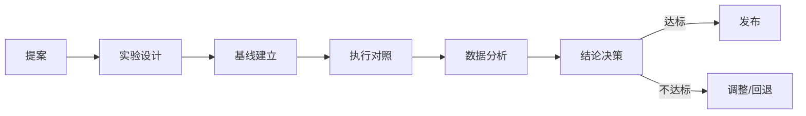

# 实验评估：A/B 对照设计 / 指标 / 回归验证

> 编排器：`../SKILL.md`

---

## 1. 实验评估架构

### 1.1 评估流程


### 1.2 评估原则
- **先基线后改动**：改动前必须有基线数据，否则无法证明改进；
- **单变量**：一次实验只改一个变量，多变量需分组；
- **可量化**：指标必须可数值化，避免主观判断；
- **对照组**：有对照才能归因，禁止「感觉变好了」。

---

## 2. 实验设计

### 2.1 实验类型
| 类型 | 适用 | 方法 |
|------|------|------|
| A/B 对照 | 改前 vs 改后 | 同一套输入，分别跑旧/新技能 |
| 三触发词回归 | 技能加载正确性 | 三组触发词，验证加载预期技能 |
| 前后对比 | 效率/成本指标 | 同任务，改前改后测 token/时长 |
| 多方案对比 | 多个候选方案 | 同输入，对比多方案产出质量 |

### 2.2 实验参数
```python
@dataclass
class Experiment:
    id: str                    # EXP-001
    proposal_id: str           # 关联提案
    hypothesis: str            # 假设
    variable: str              # 变量
    control: ExperimentGroup   # 对照组
    treatment: ExperimentGroup # 实验组
    metrics: List[Metric]      # 指标
    min_samples: int = 3       # 最小样本数
    threshold: float = 0.8     # 通过阈值
    
@dataclass
class ExperimentGroup:
    name: str                  # 对照组 / 实验组
    version: str               # 技能版本
    runs: List[RunResult]      # 多次执行结果
```

---

## 3. 指标体系

### 3.1 指标类型
| 指标 | 单位 | 方向 | 说明 |
|------|------|------|------|
| 加载正确率 | % | ↑ | 触发词加载预期技能比例 |
| 产出完整率 | % | ↑ | 产出物齐全比例 |
| 执行时长 | s | ↓ | 完成任务耗时 |
| Token 消耗 | token | ↓ | 任务 token 用量 |
| 结构校验通过率 | % | ↑ | 一次通过校验比例 |
| 偏差复发数 | 个/周 | ↓ | 相关偏差复发频次 |
| 用户满意度 | 分 | ↑ | 用户反馈评分 |

### 3.2 指标计算
```python
class MetricCalculator:
    """指标计算"""
    
    def loading_accuracy(self, runs: List[RunResult]) -> float:
        """加载正确率：正确加载次数 / 总次数"""
        correct = sum(1 for r in runs if r.loaded_correctly)
        return correct / len(runs) if runs else 0.0
    
    def avg_token(self, runs: List[RunResult]) -> float:
        """平均 token 消耗"""
        return sum(r.tokens for r in runs) / len(runs) if runs else 0.0
    
    def avg_duration(self, runs: List[RunResult]) -> float:
        """平均执行时长（秒）"""
        return sum(r.duration for r in runs) / len(runs) if runs else 0.0
    
    def improvement(self, control: float, treatment: float, higher_is_better: bool) -> float:
        """改进率"""
        if control == 0:
            return 0.0
        delta = (treatment - control) / control
        return delta if higher_is_better else -delta
```

---

## 4. A/B 对照执行

### 4.1 三触发词回归测试
```python
class TriggerRegressionTest:
    """三触发词回归测试：技能改动后的标准验证"""
    
    def run(self, skill: str, triggers: List[str], expected_load: str) -> TestReport:
        """对每个触发词验证加载"""
        results = []
        for trigger in triggers:
            result = self._simulate_load(skill, trigger)
            results.append(TriggerResult(
                trigger=trigger,
                loaded=result,
                correct=(expected_load in result)
            ))
        
        accuracy = sum(1 for r in results if r.correct) / len(results)
        return TestReport(
            test="trigger_regression",
            skill=skill,
            results=results,
            accuracy=accuracy,
            passed=accuracy >= 0.8  # 阈值 80%
        )
```

### 4.2 前后对比实验
```python
class BeforeAfterExperiment:
    """改前 vs 改后对比"""
    
    def run(self, experiment: Experiment) -> ExperimentResult:
        """执行前后对比"""
        # 1. 对照组（改前版本）
        for i in range(experiment.min_samples):
            result = self._run_task(experiment.control.version, experiment.task)
            experiment.control.runs.append(result)
        
        # 2. 实验组（改后版本）
        for i in range(experiment.min_samples):
            result = self._run_task(experiment.treatment.version, experiment.task)
            experiment.treatment.runs.append(result)
        
        # 3. 分析
        metrics = {}
        for metric in experiment.metrics:
            control_val = metric.calc(experiment.control.runs)
            treatment_val = metric.calc(experiment.treatment.runs)
            improvement = self._improvement(control_val, treatment_val, metric.higher_is_better)
            metrics[metric.name] = MetricResult(
                control=control_val, treatment=treatment_val, improvement=improvement
            )
        
        # 4. 决策
        avg_improvement = sum(m.improvement for m in metrics.values()) / len(metrics)
        passed = avg_improvement >= experiment.threshold
        
        return ExperimentResult(
            experiment=experiment,
            metrics=metrics,
            passed=passed,
            recommendation="发布" if passed else "调整或回退"
        )
```

---

## 5. 数据分析与决策

### 5.1 统计检验
```python
class SignificanceTest:
    """显著性检验（简化）"""
    
    def compare(self, control: List[float], treatment: List[float]) -> Significance:
        """对比两组数据是否显著不同"""
        if len(control) < 3 or len(treatment) < 3:
            return Significance(significant=False, note="样本不足，需至少 3 次")
        
        mean_c = statistics.mean(control)
        mean_t = statistics.mean(treatment)
        stdev_c = statistics.stdev(control) if len(control) > 1 else 0
        stdev_t = statistics.stdev(treatment) if len(treatment) > 1 else 0
        
        # 简化 Z 检验
        se = math.sqrt(stdev_c**2/len(control) + stdev_t**2/len(treatment))
        if se == 0:
            return Significance(significant=(mean_t != mean_c), note="无方差")
        z = (mean_t - mean_c) / se
        significant = abs(z) > 1.96  # 95% 置信
        return Significance(significant=significant, z_score=z, note="Z 检验")
```

### 5.2 决策规则
| 条件 | 决策 |
|------|------|
| 指标显著提升且无 new 偏差 | 发布（approve） |
| 指标持平但无副作用 | 发布（低优先，观察） |
| 指标下降或引入新偏差 | 回退（rollback） |
| 样本不足 | 补测，暂不决策 |
| 指标提升但引入风险 | 缓议，风险评审 |

### 5.3 实验报告
```markdown
## 实验报告 EXP-001
- **提案**：P-001 补结构校验触发词覆盖率
- **假设**：补校验后触发词漏填率下降
- **方法**：三触发词回归，改前/改后各 3 次
- **结果**：
  | 指标 | 改前 | 改后 | 改进 |
  |------|------|------|------|
  | 加载正确率 | 66.7% | 100% | +50% |
  | 校验通过率 | 33.3% | 100% | +200% |
- **检验**：Z=2.31 > 1.96，显著
- **结论**：发布 ✅
- **建议**：同步更新 SKILL_INDEX / references
```

---

## 6. 回归验证

### 6.1 回归范围
| 类型 | 验证内容 |
|------|----------|
| 功能回归 | 改动技能的核心功能仍正常 |
| 引用回归 | 相对引用无失效（打包验证） |
| 版本回归 | 版本一致性门禁通过 |
| 触发回归 | 三触发词加载正确 |
| 部署回归 | 四目录部署成功 |

### 6.2 回归执行
```python
class RegressionSuite:
    """回归验证套件"""
    
    def run_all(self, changes: List[str]) -> RegressionReport:
        """执行全部回归"""
        results = []
        
        # 1. 结构校验
        results.append(self._check_structure(changes))
        
        # 2. 版本一致性
        results.append(self._check_version_consistency())
        
        # 3. 三触发词
        results.append(self._check_triggers(changes))
        
        # 4. 打包部署
        results.append(self._check_package_deploy())
        
        passed = all(r.passed for r in results)
        return RegressionReport(results=results, passed=passed)
```

---

## 7. 最佳实践

1. **基线不可省**：无基线的「改进」不可信，禁止跳过基线采样；
2. **样本≥3**：每个组至少 3 次执行，避免单次偶然；
3. **控制变量**：改技能期间不混入其他改动，避免归因混淆；
4. **结果留痕**：实验报告入 22_阶段复盘 / 偏差日志，供后续复查；
5. **失败也沉淀**：不达标实验的教训入 lesson-harvesting，避免重蹈。

---

**文档版本**: v1.0.0  **最后更新**: 2026-08-09