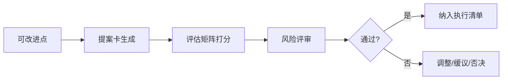
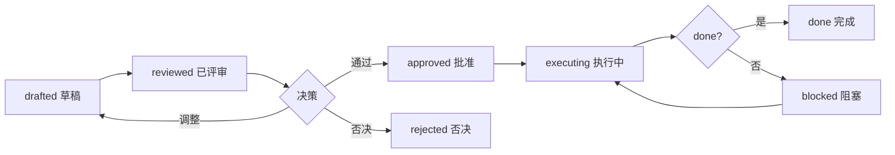

# 改进提案：提案卡生成 / 评估矩阵 / 风险评审

> 编排器：`../SKILL.md`

---

## 1. 改进提案架构

### 1.1 提案流程


### 1.2 提案原则
- **一卡一事**：每个提案卡只解决一个可改进点；
- **可衡量**：预期收益必须可量化/可验证；
- **最小改动**：优先最小范围改动（单文件/单规则）；
- **可回退**：提案必须有回退方案；
- **有评估**：无评估方式的提案不进入执行。

---

## 2. 提案卡模型

### 2.1 资料结构
```python
@dataclass
class ImprovementProposal:
    id: str                     # P-001
    title: str                  # 提案标题
    problem: str                # 问题描述
    root_cause: str             # 根因（引用 RCA）
    deviation_ids: List[str]    # 关联偏差
    solution: str               # 改进方案
    expected_benefit: str       # 预期收益（可衡量）
    cost: str                   # 成本
    risk: str                   # 风险
    evaluation: str             # 评估方式
    fallback: str               # 回退方案
    priority: str               # P0/P1/P2/P3
    status: str                 # drafted / reviewed / approved / executing / done / rejected
    reviewer: str               # 评审人
    
    def to_markdown(self) -> str:
        return f"""
## 提案 {self.id} {self.title}
- **问题**：{self.problem}
- **根因**：{self.root_cause}
- **关联偏差**：{', '.join(self.deviation_ids)}
- **改进方案**：{self.solution}
- **预期收益**：{self.expected_benefit}
- **成本**：{self.cost}
- **风险**：{self.risk}
- **评估方式**：{self.evaluation}
- **回退方案**：{self.fallback}
- **优先级**：{self.priority}
"""
```

### 2.2 提案卡范例
```markdown
## 提案 P-001 补结构校验触发词覆盖率
- **问题**：skill-authoring 第 3 步校验不查触发词，导致技能漏触发词
- **根因**：authoring.md 校验清单无「触发词覆盖」项（DEV-001 根因）
- **关联偏差**：DEV-001, DEV-003
- **改进方案**：authoring.md §2 结构校验补「description 含触发词」检查项
- **预期收益**：技能加载准确率提升（可对比触发测试通过率）
- **成本**：低（改 1 个文件 1 行）
- **风险**：低（不影响既有技能）
- **评估方式**：三触发词回归测试 + 下一阶段偏差复发数对比
- **回退方案**：git revert 还原 authoring.md
- **优先级**：P1
```

---

## 3. 评估矩阵

### 3.1 评估维度
| 维度 | 权重 | 评分标准 |
|------|------|----------|
| 收益 | 0.35 | 高=3 / 中=2 / 低=1 |
| 成本 | 0.20 | 低=3 / 中=2 / 高=1 |
| 风险 | 0.20 | 低=3 / 中=2 / 高=1 |
| 时效 | 0.15 | 急=3 / 中=2 / 缓=1 |
| 影响面 | 0.10 | 广=3 / 中=2 / 窄=1 |

### 3.2 评分实现
```python
class ProposalEvaluator:
    """提案评估矩阵"""
    
    WEIGHTS = {"benefit": 0.35, "cost": 0.20, "risk": 0.20, "urgency": 0.15, "scope": 0.10}
    
    def score(self, proposal: ImprovementProposal) -> float:
        """计算综合得分"""
        benefit = self._score_level(proposal.expected_benefit)
        cost = self._score_level(proposal.cost, inverse=True)
        risk = self._score_level(proposal.risk, inverse=True)
        urgency = self._score_level(proposal.urgency)
        scope = self._score_level(proposal.scope)
        
        return (benefit * self.WEIGHTS["benefit"] +
                cost * self.WEIGHTS["cost"] +
                risk * self.WEIGHTS["risk"] +
                urgency * self.WEIGHTS["urgency"] +
                scope * self.WEIGHTS["scope"])
    
    def _score_level(self, level: str, inverse: bool = False) -> int:
        score = {"高": 3, "中": 2, "低": 1}.get(level, 2)
        return 4 - score if inverse else score
    
    def compare(self, proposals: List[ImprovementProposal]) -> List[ProposalRanking]:
        """提案排序"""
        ranked = sorted(proposals, key=self.score, reverse=True)
        return [ProposalRanking(p, self.score(p)) for p in ranked]
```

### 3.3 评估结果
```csv
id,title,benefit,cost,risk,urgency,scope,score,decision
P-001,补触发词覆盖校验,高,低,低,急,广,2.85,approve
P-002,脚本路径自定位,高,中,中,中,广,2.35,approve
P-003,全库格式化重写,低,高,高,缓,窄,1.15,reject
```

---

## 4. 风险评审

### 4.1 风险类型
| 风险 | 描述 | 缓解 |
|------|------|------|
| 兼容风险 | 改动影响既有技能/流程 | 最小改动 + 回归测试 |
| 版本风险 | 版本不一致破坏门禁 | 同步版本号 + 一致性校验 |
| 引用风险 | 相对引用失效 | 改动后全量打包验证 |
| 范围风险 | 改动超出技能库 | 明确改动范围，禁止越界 |
| 依赖风险 | 依赖其他未完成改进 | 标注前置依赖 |

### 4.2 风险评审流程
```python
class RiskReview:
    """风险评审"""
    
    def review(self, proposal: ImprovementProposal) -> ReviewResult:
        """执行风险评审"""
        risks = []
        
        # 1. 范围检查
        if self._out_of_scope(proposal.solution):
            risks.append(Risk(level="high", type="范围", 
                            note="改动超出技能库范围，需重新界定"))
        
        # 2. 版本一致性
        if self._touches_version(proposal) and not self._has_version_sync(proposal):
            risks.append(Risk(level="medium", type="版本",
                            note="改动涉及版本文件但未同步版本号"))
        
        # 3. 引用完整性
        if self._touches_shared(proposal):
            risks.append(Risk(level="medium", type="引用",
                            note="改动 shared/ 需同步副本并打包验证"))
        
        # 4. 回退可行性
        if not proposal.fallback:
            risks.append(Risk(level="high", type="回退",
                            note="无回退方案，禁止执行"))
        
        blocked = any(r.level == "high" for r in risks)
        return ReviewResult(passed=not blocked, risks=risks,
                           recommendations=[r.note for r in risks])
```

---

## 5. 提案生命周期

### 5.1 状态机


### 5.2 状态转换规则
| 转换 | 条件 | 负责人 |
|------|------|--------|
| drafted → reviewed | 提案卡完整 | 提议者 |
| reviewed → approved | 评估得分 ≥ 2.0 且无 high 风险 | 评审人 |
| reviewed → rejected | 得分 < 2.0 或范围越界 | 评审人 |
| approved → executing | 纳入执行清单 | 执行者 |
| executing → done | 改动完成 + 验证通过 | 执行者 |
| executing → blocked | 前置依赖未满足 | 执行者 |

### 5.3 提案执行模板
```python
def execute_proposal(proposal: ImprovementProposal) -> ExecutionRecord:
    """执行提案"""
    if proposal.status != "approved":
        return ExecutionRecord(proposal, success=False, error="提案未批准")
    
    # 1. 执行改动（按 skill-authoring / 工具改进）
    changes = self._apply(proposal)
    
    # 2. 验证
    verification = self._verify(proposal, changes)
    
    # 3. 固化
    if verification.passed:
        solidify(proposal.id)
        proposal.status = "done"
    else:
        rollback(proposal)
        proposal.status = "blocked"
    
    return ExecutionRecord(proposal, success=verification.passed, changes=changes)
```

---

## 6. 最佳实践

1. **收益可衡量**：写「触发通过率提升」而不是「更好用」；
2. **最小改动**：一次改 1 个文件能解决就不动 3 个；
3. **先评审后执行**：未过风险评审的提案禁止直接改技能；
4. **失败留痕**：被否决/回退的提案记录原因，避免重复提；
5. **批量合并**：同根因的多个偏差合并为一个提案处理。

---

**文档版本**: v1.0.0  **最后更新**: 2026-08-09