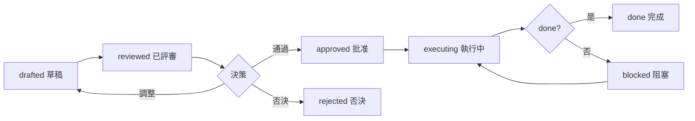

# 改進提案：提案卡生成 / 評估矩陣 / 風險評審

> 編排器：`../SKILL.md`

---

## 1. 改進提案架構

### 1.1 提案流程


### 1.2 提案原則
- **一卡一事**：每個提案卡只解決一個可改進點；
- **可衡量**：預期收益必須可量化/可驗證；
- **最小改動**：優先最小範圍改動（單文件/單規則）；
- **可回退**：提案必須有回退方案；
- **有評估**：無評估方式的提案不進入執行。

---

## 2. 提案卡模型

### 2.1 資料結構
```python
@dataclass
class ImprovementProposal:
    id: str                     # P-001
    title: str                  # 提案標題
    problem: str                # 問題描述
    root_cause: str             # 根因（引用 RCA）
    deviation_ids: List[str]    # 關聯偏差
    solution: str               # 改進方案
    expected_benefit: str       # 預期收益（可衡量）
    cost: str                   # 成本
    risk: str                   # 風險
    evaluation: str             # 評估方式
    fallback: str               # 回退方案
    priority: str               # P0/P1/P2/P3
    status: str                 # drafted / reviewed / approved / executing / done / rejected
    reviewer: str               # 評審人
    
    def to_markdown(self) -> str:
        return f"""
## 提案 {self.id} {self.title}
- **問題**：{self.problem}
- **根因**：{self.root_cause}
- **關聯偏差**：{', '.join(self.deviation_ids)}
- **改進方案**：{self.solution}
- **預期收益**：{self.expected_benefit}
- **成本**：{self.cost}
- **風險**：{self.risk}
- **評估方式**：{self.evaluation}
- **回退方案**：{self.fallback}
- **優先級**：{self.priority}
"""
```

### 2.2 提案卡範例
```markdown
## 提案 P-001 補結構校驗觸發詞覆蓋率
- **問題**：skill-authoring 第 3 步校驗不查觸發詞，導致技能漏觸發詞
- **根因**：authoring.md 校驗清單無「觸發詞覆蓋」項（DEV-001 根因）
- **關聯偏差**：DEV-001, DEV-003
- **改進方案**：authoring.md §2 結構校驗補「description 含觸發詞」檢查項
- **預期收益**：技能加載準確率提升（可對比觸發測試通過率）
- **成本**：低（改 1 個文件 1 行）
- **風險**：低（不影響既有技能）
- **評估方式**：三觸發詞回歸測試 + 下一階段偏差復發數對比
- **回退方案**：git revert 還原 authoring.md
- **優先級**：P1
```

---

## 3. 評估矩陣

### 3.1 評估維度
| 維度 | 權重 | 評分標準 |
|------|------|----------|
| 收益 | 0.35 | 高=3 / 中=2 / 低=1 |
| 成本 | 0.20 | 低=3 / 中=2 / 高=1 |
| 風險 | 0.20 | 低=3 / 中=2 / 高=1 |
| 時效 | 0.15 | 急=3 / 中=2 / 緩=1 |
| 影響面 | 0.10 | 廣=3 / 中=2 / 窄=1 |

### 3.2 評分實現
```python
class ProposalEvaluator:
    """提案評估矩陣"""
    
    WEIGHTS = {"benefit": 0.35, "cost": 0.20, "risk": 0.20, "urgency": 0.15, "scope": 0.10}
    
    def score(self, proposal: ImprovementProposal) -> float:
        """計算綜合得分"""
        benefit = self._score_level(proposal.expected_benefit)
        cost = self._score_level(proposal.cost, inverse=True)
        risk = self._score_level(proposal.risk, inverse=True)
        urgency = self._score_level(proposal.urgency)
        scope = self._score_level(proposal.scope)
        
        return (benefit * self.WEIGHTS["benefit"] +
                cost * self.WEIGHTS["cost"] +
                risk * self.WEIGHTS["risk"] +
                urgency * self.WEIGHTS["urgency"] +
                scope * self.WEIGHTS["scope"])
    
    def _score_level(self, level: str, inverse: bool = False) -> int:
        score = {"高": 3, "中": 2, "低": 1}.get(level, 2)
        return 4 - score if inverse else score
    
    def compare(self, proposals: List[ImprovementProposal]) -> List[ProposalRanking]:
        """提案排序"""
        ranked = sorted(proposals, key=self.score, reverse=True)
        return [ProposalRanking(p, self.score(p)) for p in ranked]
```

### 3.3 評估結果
```csv
id,title,benefit,cost,risk,urgency,scope,score,decision
P-001,補觸發詞覆蓋校驗,高,低,低,急,廣,2.85,approve
P-002,腳本路徑自定位,高,中,中,中,廣,2.35,approve
P-003,全庫格式化重寫,低,高,高,緩,窄,1.15,reject
```

---

## 4. 風險評審

### 4.1 風險類型
| 風險 | 描述 | 緩解 |
|------|------|------|
| 兼容風險 | 改動影響既有技能/流程 | 最小改動 + 回歸測試 |
| 版本風險 | 版本不一致破壞門禁 | 同步版本號 + 一致性校驗 |
| 引用風險 | 相對引用失效 | 改動後全量打包驗證 |
| 範圍風險 | 改動超出技能庫 | 明確改動範圍，禁止越界 |
| 依賴風險 | 依賴其他未完成改進 | 標註前置依賴 |

### 4.2 風險評審流程
```python
class RiskReview:
    """風險評審"""
    
    def review(self, proposal: ImprovementProposal) -> ReviewResult:
        """執行風險評審"""
        risks = []
        
        # 1. 範圍檢查
        if self._out_of_scope(proposal.solution):
            risks.append(Risk(level="high", type="範圍", 
                            note="改動超出技能庫範圍，需重新界定"))
        
        # 2. 版本一致性
        if self._touches_version(proposal) and not self._has_version_sync(proposal):
            risks.append(Risk(level="medium", type="版本",
                            note="改動涉及版本文件但未同步版本號"))
        
        # 3. 引用完整性
        if self._touches_shared(proposal):
            risks.append(Risk(level="medium", type="引用",
                            note="改動 shared/ 需同步副本並打包驗證"))
        
        # 4. 回退可行性
        if not proposal.fallback:
            risks.append(Risk(level="high", type="回退",
                            note="無回退方案，禁止執行"))
        
        blocked = any(r.level == "high" for r in risks)
        return ReviewResult(passed=not blocked, risks=risks,
                           recommendations=[r.note for r in risks])
```

---

## 5. 提案生命周期

### 5.1 狀態機


### 5.2 狀態轉換規則
| 轉換 | 條件 | 負責人 |
|------|------|--------|
| drafted → reviewed | 提案卡完整 | 提議者 |
| reviewed → approved | 評估得分 ≥ 2.0 且無 high 風險 | 評審人 |
| reviewed → rejected | 得分 < 2.0 或範圍越界 | 評審人 |
| approved → executing | 納入執行清單 | 執行者 |
| executing → done | 改動完成 + 驗證通過 | 執行者 |
| executing → blocked | 前置依賴未滿足 | 執行者 |

### 5.3 提案執行模板
```python
def execute_proposal(proposal: ImprovementProposal) -> ExecutionRecord:
    """執行提案"""
    if proposal.status != "approved":
        return ExecutionRecord(proposal, success=False, error="提案未批准")
    
    # 1. 執行改動（按 skill-authoring / 工具改進）
    changes = self._apply(proposal)
    
    # 2. 驗證
    verification = self._verify(proposal, changes)
    
    # 3. 固化
    if verification.passed:
        solidify(proposal.id)
        proposal.status = "done"
    else:
        rollback(proposal)
        proposal.status = "blocked"
    
    return ExecutionRecord(proposal, success=verification.passed, changes=changes)
```

---

## 6. 最佳實踐

1. **收益可衡量**：寫「觸發通過率提升」而不是「更好用」；
2. **最小改動**：一次改 1 個文件能解決就不動 3 個；
3. **先評審後執行**：未過風險評審的提案禁止直接改技能；
4. **失敗留痕**：被否決/回退的提案記錄原因，避免重複提；
5. **批量合併**：同根因的多個偏差合併為一個提案處理。

---

**文檔版本**: v1.0.0  **最後更新**: 2026-08-09