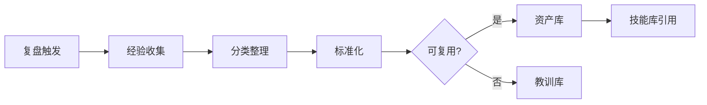
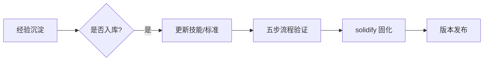

# 经验沉淀：复盘卡片 / 可复用资产 / 失败教训

> 编排器：`../SKILL.md`

---

## 1. 经验沉淀架构

### 1.1 沉淀流程


### 1.2 沉淀时机
- 阶段末：随 `retrospect_harvest`（22_阶段复盘 + 23_复用资产）
- 循环收敛：改进循环闭环时沉淀
- 项目末：项目总结沉淀
- 失败后：回退/失败时立即沉淀教训

---

## 2. 复盘卡片

### 2.1 卡片结构
```markdown
## 复盘卡片 R-<编号>
- **主题**：<一句话主题>
- **场景**：<触发场景>
- **做法**：<实际做法>
- **结果**：<结果/指标>
- **对比**：<与预期对比>
- **根因**：<成功/失败原因>
- **教训/收获**：<可迁移的经验>
- **可复用点**：<可复用于何处>
- **建议**：<后续行动>
```

### 2.2 复盘卡片范例
```markdown
## 复盘卡片 R-003
- **主题**：技能触发词覆盖不足导致漏加载
- **场景**：新增技能后用户用触发词调用无响应
- **做法**：直接按模板写 description 未验证触发词
- **结果**：3 次漏加载，用户反馈 2 次
- **对比**：预期 100% 加载，实际 66.7%
- **根因**：authoring.md 校验清单无触发词覆盖检查
- **教训/收获**：模板填写 ≠ 校验，结构校验必须含触发词检查
- **可复用点**：所有新增技能的 description 校验
- **建议**：authoring.md §2 补「description 含触发词」检查项
```

---

## 3. 可复用资产

### 3.1 资产分类
| 类别 | 内容 | 存放 |
|------|------|------|
| 流程资产 | 验证过的流程、检查清单 | 23_复用资产.csv |
| 模板资产 | 可复用模板、卡片格式 | 23_复用资产.csv / docs/ |
| 脚本资产 | 可复用脚本、工具 | tools/ |
| 模式资产 | 成功模式、最佳实践 | skill domain/*.md |
| 标准资产 | 提炼的标准、规范 | references/*.md |

### 3.2 资产登记
```python
@dataclass
class ReusableAsset:
    id: str                  # A-001
    name: str                # 资产名称
    category: str            # 流程/模板/脚本/模式/标准
    source: str              # 来源（复盘卡片/项目）
    description: str         # 描述
    usage: str               # 使用方法
    reuse_count: int         # 复用次数
    location: str            # 存放位置
    
    def to_csv_row(self) -> List[str]:
        return [self.id, self.name, self.category, self.source,
                self.description, self.usage, str(self.reuse_count), self.location]
```

### 3.3 资产复用
```python
class AssetLibrary:
    """资产库管理"""
    
    def register(self, asset: ReusableAsset):
        """登记资产到 23_复用资产.csv"""
        self._append_csv(asset)
    
    def search(self, keyword: str) -> List[ReusableAsset]:
        """按关键字检索资产"""
        assets = self._read_all()
        return [a for a in assets if keyword in a.name or keyword in a.description]
    
    def reuse(self, asset_id: str):
        """复用资产并计数"""
        assets = self._read_all()
        for a in assets:
            if a.id == asset_id:
                a.reuse_count += 1
        self._write_all(assets)
```

---

## 4. 失败教训库

### 4.1 教训结构
```markdown
## 教训 L-<编号>
- **失败**：<失败的尝试>
- **结果**：<失败结果>
- **原因**：<根本原因>
- **代价**：<损失/成本>
- **避坑**：<如何避免>
- **检测**：<早期发现信号>
```

### 4.2 教训范例
```markdown
## 教训 L-002
- **失败**：修改 shared/references 后未同步副本直接发布
- **结果**：角色包与 shared 版本不一致，部署后部分包引用失效
- **原因**：未遵守「shared 副本同步」规则
- **代价**：返工 1 次 + 版本回退
- **避坑**：改 shared/ 后立即 cp 同步并 diff 验证
- **检测**：打包前 check_version_consistency + 引用完整性检查
```

---

## 5. 经验 → 技能库反向注入

### 5.1 注入流程


### 5.2 注入决策
| 条件 | 决策 |
|------|------|
| 复发≥2 次且有根因 | 入技能库（流程/标准/校验） |
| 单次但代价高 | 入教训库 + 检查点 |
| 仅一次性 | 不注入，记录即可 |
| 用户明确要求 | 优先注入 |

### 5.3 注入点
| 经验类型 | 注入位置 |
|----------|----------|
| 触发词漏填 | authoring.md 校验规则 |
| 路径硬编码 | iron_rules / token_standard |
| 版本不一致 | check_version_consistency 规则 |
| 模型浪费 | model_selection.md 路由规则 |
| 校验缺失 | skill-authoring 五步流程 |

---

## 6. 复盘收敛（retrospect_harvest 对接）

### 6.1 阶段末复盘
| 步骤 | 内容 | 产物 |
|------|------|------|
| 1 | 收集本阶段执行记录 | 执行摘要 |
| 2 | 对比预期 vs 实际 | 偏差清单 |
| 3 | 沉淀成功模式 | 23_复用资产 新增 |
| 4 | 沉淀失败教训 | 教训库新增 |
| 5 | 注入技能库 | 提案/直接修改 |
| 6 | 固化发布 | solidify + commit |

### 6.2 复盘输出
```csv
id,type,title,summary,action,priority
R-001,success,三触发词测试有效,回归测试提升加载准确率,入校验流程,P1
L-001,failure,跳过结构校验,未校验直接发布导致返工,校验前禁止发布,P0
A-001,asset,触发词覆盖检查清单,新增技能必查触发词,入authoring.md,P1
```

---

## 7. 最佳实践

1. **即时沉淀**：失败/收获当时记录，禁止拖延（遗忘曲线）；
2. **具体可迁移**：教训要写「如何避免」，而非单纯描述失败；
3. **分库管理**：成功→资产库，失败→教训库，不混放；
4. **定期复查**：每阶段复查资产复用率，淘汰无用资产；
5. **双向流动**：经验可注入技能库，技能库改动也回流复盘。

---

**文档版本**: v1.0.0  **最后更新**: 2026-08-09