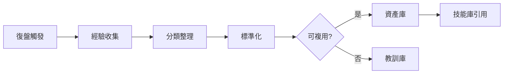
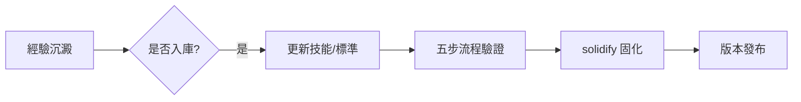

# 經驗沉澱：復盤卡片 / 可複用資產 / 失敗教訓

> 編排器：`../SKILL.md`

---

## 1. 經驗沉澱架構

### 1.1 沉澱流程


### 1.2 沉澱時機
- 階段末：隨 `retrospect_harvest`（22_階段复盘 + 23_复用资产）
- 循環收斂：改進循環閉環時沉澱
- 項目末：項目總結沉澱
- 失敗後：回退/失敗時立即沉澱教訓

---

## 2. 復盤卡片

### 2.1 卡片結構
```markdown
## 復盤卡片 R-<編號>
- **主題**：<一句話主題>
- **場景**：<觸發場景>
- **做法**：<實際做法>
- **結果**：<結果/指標>
- **對比**：<與預期對比>
- **根因**：<成功/失敗原因>
- **教訓/收穫**：<可遷移的經驗>
- **可複用點**：<可複用於何處>
- **建議**：<後續行動>
```

### 2.2 復盤卡片範例
```markdown
## 復盤卡片 R-003
- **主題**：技能觸發詞覆蓋不足導致漏加載
- **場景**：新增技能後用戶用觸發詞調用無響應
- **做法**：直接按模板寫 description 未驗證觸發詞
- **結果**：3 次漏加載，用戶反饋 2 次
- **對比**：預期 100% 加載，實際 66.7%
- **根因**：authoring.md 校驗清單無觸發詞覆蓋檢查
- **教訓/收穫**：模板填寫 ≠ 校驗，結構校驗必須含觸發詞檢查
- **可複用點**：所有新增技能的 description 校驗
- **建議**：authoring.md §2 補「description 含觸發詞」檢查項
```

---

## 3. 可複用資產

### 3.1 資產分類
| 類別 | 內容 | 存放 |
|------|------|------|
| 流程資產 | 驗證過的流程、檢查清單 | 23_复用资产.csv |
| 模板資產 | 可複用模板、卡片格式 | 23_复用资产.csv / docs/ |
| 腳本資產 | 可複用腳本、工具 | tools/ |
| 模式資產 | 成功模式、最佳實踐 | skill domain/*.md |
| 標準資產 | 提煉的標準、規範 | references/*.md |

### 3.2 資產登記
```python
@dataclass
class ReusableAsset:
    id: str                  # A-001
    name: str                # 資產名稱
    category: str            # 流程/模板/腳本/模式/標準
    source: str              # 來源（復盤卡片/項目）
    description: str         # 描述
    usage: str               # 使用方法
    reuse_count: int         # 複用次數
    location: str            # 存放位置
    
    def to_csv_row(self) -> List[str]:
        return [self.id, self.name, self.category, self.source,
                self.description, self.usage, str(self.reuse_count), self.location]
```

### 3.3 資產複用
```python
class AssetLibrary:
    """資產庫管理"""
    
    def register(self, asset: ReusableAsset):
        """登記資產到 23_复用资产.csv"""
        self._append_csv(asset)
    
    def search(self, keyword: str) -> List[ReusableAsset]:
        """按關鍵字檢索資產"""
        assets = self._read_all()
        return [a for a in assets if keyword in a.name or keyword in a.description]
    
    def reuse(self, asset_id: str):
        """複用資產並計數"""
        assets = self._read_all()
        for a in assets:
            if a.id == asset_id:
                a.reuse_count += 1
        self._write_all(assets)
```

---

## 4. 失敗教訓庫

### 4.1 教訓結構
```markdown
## 教訓 L-<編號>
- **失敗**：<失敗的嘗試>
- **結果**：<失敗結果>
- **原因**：<根本原因>
- **代價**：<損失/成本>
- **避坑**：<如何避免>
- **檢測**：<早期發現信號>
```

### 4.2 教訓範例
```markdown
## 教訓 L-002
- **失敗**：修改 shared/references 後未同步副本直接發布
- **結果**：角色包與 shared 版本不一致，部署後部分包引用失效
- **原因**：未遵守「shared 副本同步」規則
- **代價**：返工 1 次 + 版本回退
- **避坑**：改 shared/ 後立即 cp 同步並 diff 驗證
- **檢測**：打包前 check_version_consistency + 引用完整性檢查
```

---

## 5. 經驗 → 技能庫反向注入

### 5.1 注入流程


### 5.2 注入決策
| 條件 | 決策 |
|------|------|
| 復發≥2 次且有根因 | 入技能庫（流程/標準/校驗） |
| 單次但代價高 | 入教訓庫 + 檢查點 |
| 僅一次性 | 不注入，記錄即可 |
| 用戶明確要求 | 優先注入 |

### 5.3 注入點
| 經驗類型 | 注入位置 |
|----------|----------|
| 觸發詞漏填 | authoring.md 校驗規則 |
| 路徑硬編碼 | iron_rules / token_standard |
| 版本不一致 | check_version_consistency 規則 |
| 模型浪費 | model_selection.md 路由規則 |
| 校驗缺失 | skill-authoring 五步流程 |

---

## 6. 復盤收斂（retrospect_harvest 對接）

### 6.1 階段末復盤
| 步驟 | 內容 | 產物 |
|------|------|------|
| 1 | 收集本階段執行記錄 | 執行摘要 |
| 2 | 對比預期 vs 實際 | 偏差清單 |
| 3 | 沉澱成功模式 | 23_复用资产 新增 |
| 4 | 沉澱失敗教訓 | 教訓庫新增 |
| 5 | 注入技能庫 | 提案/直接修改 |
| 6 | 固化發布 | solidify + commit |

### 6.2 復盤輸出
```csv
id,type,title,summary,action,priority
R-001,success,三觸發詞測試有效,回歸測試提升加載準確率,入校驗流程,P1
L-001,failure,跳過結構校驗,未校驗直接發布導致返工,校驗前禁止發布,P0
A-001,asset,觸發詞覆蓋檢查清單,新增技能必查觸發詞,入authoring.md,P1
```

---

## 7. 最佳實踐

1. **即時沉澱**：失敗/收穫當時記錄，禁止拖延（遺忘曲線）；
2. **具體可遷移**：教訓要寫「如何避免」，而非單純描述失敗；
3. **分庫管理**：成功→資產庫，失敗→教訓庫，不混放；
4. **定期複查**：每階段複查資產複用率，淘汰無用資產；
5. **雙向流動**：經驗可注入技能庫，技能庫改動也回流復盤。

---

**文檔版本**: v1.0.0  **最後更新**: 2026-08-09