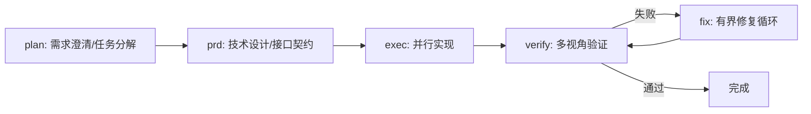

# Team Orchestration 并行编排层

> 版权声明：`../../references/COPYRIGHT.md`　Token 标准：`../../references/token_standard.md`　编排器：`../SKILL.md`

---

## 1. 触发规则

### 1.1 触发场景
- 用户明确要求「并行编排」「团队流水线」「多角色并行」
- 任务可拆解为多个独立并行通道（如：前端/后端/测试/文档同步推进）
- 需要 Ralph 风格持久循环、Ultrawork 高吞吐并行、UltraQA 多轮验证
- 复杂多阶段任务，受益于 Planner→Architect→Executor→Verifier 分层流水线

### 1.2 触发词（精确匹配优先）
| 关键词 | 映射模式 | 说明 |
|--------|----------|------|
| `team` | 团队流水线 | 5 阶段：plan→prd→exec→verify→fix(循环) |
| `ultrawork` / `ulw` | 高吞吐并行 | 依赖图拆解 + 工作窃取队列并行 |
| `ralph` / `ralph-loop` | 持久循环 | 顺序执行 + 验证门禁 + 自动重试 |
| `ultraqa` | 多轮 QA | test→verify→fix 循环至通过 |

### 1.3 触发词 → 模式映射
```yaml
team:        { pipeline: [plan, prd, exec, verify, fix], max_parallel: 6 }
ultrawork:   { mode: "work-stealing", max_parallel: 8 }
ralph:       { mode: "sequential-loop", max_retries: 3 }
ultraqa:     { mode: "validation-loop", max_cycles: 5 }
```

---

## 2. 流程

### 2.1 团队流水线


**各阶段职责**：
- **plan**：Analyst(Opus) 澄清需求 → Planner(Opus) 产出任务分解 + 依赖图
- **prd**：Architect(Opus) 产出技术设计/接口契约/数据模型
- **exec**：按依赖图拓扑序调度，Executor(Haiku/Sonnet/Opus) 并行实现
- **verify**：并行多视角：Architect(功能完整性) + SecurityReviewer(漏洞) + CodeReviewer(质量)
- **fix**：失败项进入有界修复循环（最多 3 轮），修复后回 verify

### 2.2 Ultrawork 高吞吐并行
1. **依赖图构建**：Planner 产出 DAG（节点=任务，边=依赖）
2. **工作窃取队列**：Chase-Lev 双端队列，空闲 Worker 偷取就绪任务
3. **模型路由**：简单任务→Haiku，标准→Sonnet，复杂→Opus
4. **状态同步**：MVCC 版本控制，任务完成原子提交
5. **完成收敛**：所有叶子任务完成触发下游

### 2.3 Ralph 持久循环
1. 顺序执行任务列表
2. 每步后自动验证（lint/typecheck/test）
3. 失败 → 分析根因 → 修复 → 重跑验证
4. 同一错误 3 次 → 报告根本问题 → 请求人工介入
5. 进度持久化到 `.senate/state/ralph-state.json`，支持断点续跑

### 2.4 UltraQA 多轮验证
```text
Cycle 1: build → lint → unit test → integration test
Cycle 2: fix failures → re-run
Cycle 3: security scan → performance benchmark
Cycle 4: multi-perspective review (Arch/Sec/Code)
Cycle 5: final regression → sign-off
```
- 同一错误 3 轮未解 → 标记为根本问题，停止循环
- 所有验证器通过 → 产出 QA 签署报告

---

## 3. 输出规范

| 产出 | 格式 | 存放位置 |
|------|------|----------|
| 任务依赖图 | JSON (DAG) | `.senate/plans/{mode}-dag.json` |
| 执行计划 | Markdown | `.senate/plans/{mode}-impl.md` |
| 进度状态 | JSON (MVCC) | `.senate/state/{mode}-state.json` |
| QA 报告 | CSV (UTF-8 BOM) | `台账/{mode}_qa_report_{timestamp}.csv` |
| 验证签署 | Markdown | `.senate/validations/{mode}-signoff.md` |

**CSV 列规范**（token_standard §3）：
```
phase,validator,status,evidence,confidence,scope-risk,not-tested
exec,executor,pass,"build ok; tests 42/42",high,narrow,"e2e未跑"
verify,security,pass,"bandit 0 issues",high,narrow,"渗透测试未跑"
```

---

## 4. 边界

### 4.1 适用边界
- ✅ 可拆解为独立并行任务的复杂多阶段工作
- ✅ 需要多角色协作（Arch/Dev/Test/Sec/Doc）的项目
- ✅ 明确验收标准、可自动化验证的交付物

### 4.2 不适用边界
- ❌ 单文件/单函数微调（直接委派 Executor 更轻量）
- ❌ 探索性/脑暴任务（用 `plan` 或对话模式）
- ❌ 无明确验收标准、需人工主观判断的工作
- ❌ 实时性要求极高、不允许任何失败重试的场景

### 4.3 资源约束
- 最大并行度：`team=6`、`ultrawork=8`、`ralph=1`、`ultraqa=3`
- 状态文件保留：最近 10 次运行，超量自动清理
- 超时保护：单任务 30 分钟，流水线 4 小时，超时自动熔断

---

## 5. 明细外置

| 明细文件 | 说明 |
|----------|------|
| `domain/team-pipeline.md` | 5 阶段流水线详细协议、角色映射、产出模板 |
| `domain/ultrawork.md` | 工作窃取队列实现、MVCC 状态同步、模型路由表 |
| `domain/ralph-loop.md` | 持久循环状态机、重试策略、根因分析模板 |
| `domain/ultraqa.md` | QA 循环参数、验证器清单、签署协议 |
| `domain/dependency-graph.md` | DAG 构建算法、拓扑排序、关键路径识别 |

---

**文档版本**：v1.0.0　**最后更新**：2026-08-08
**知识产权所有**：段波（验证邮箱：duanbo.douglas@163.com）