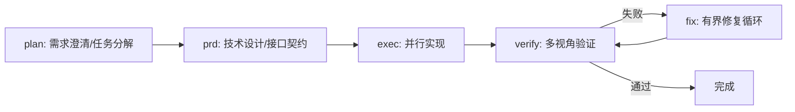

# Team Orchestration 并行编排层

- **技能版本**：v1.2.0　**发布日期**：2026-08-18

> 版权声明：`../../../references/COPYRIGHT.md`　Token 标准：`../../../references/token_standard.md`　编排器：`../../SKILL.md`

---

## 1. 触发规则

### 1.1 触发场景
- 用户明确要求「并行编排」「团队流水线」「多角色并行」
- 任务可拆解为多个独立并行通道（如：前端/后端/测试/文档同步推进）
- 需要 Ralph 风格持久循环、Ultrawork 高吞吐并行、UltraQA 多轮验证
- 复杂多阶段任务，受益于 Planner→Architect→Executor→Verifier 分层流水线

### 1.2 触发词（精确匹配优先）
| 关键词 | 映射模式 | 说明 |
|--------|----------|------|
| `team` | 团队流水线 | 5 阶段：plan→prd→exec→verify→fix(循环) |
| `ultrawork` / `ulw` | 高吞吐并行 | 依赖图拆解 + 工作窃取队列并行 |
| `ralph` / `ralph-loop` | 持久循环 | 顺序执行 + 验证门禁 + 自动重试 |
| `ultraqa` | 多轮 QA | test→verify→fix 循环至通过 |

### 1.3 触发词 → 模式映射
```yaml
team:        { pipeline: [plan, prd, exec, verify, fix], max_parallel: 6 }
ultrawork:   { mode: "work-stealing", max_parallel: 8 }
ralph:       { mode: "sequential-loop", max_retries: 3 }
ultraqa:     { mode: "validation-loop", max_cycles: 5 }
```

---

## 2. 流程

### 2.1 团队流水线


**各阶段职责**（模型档位按 `../../../references/model_selection.md` §4.2 决策表）：
- **plan**：Analyst(S3/强模型) 澄清需求 → Planner(S3/强模型) 产出任务分解 + 依赖图
- **prd**：Architect(S3/强模型) 产出技术设计/接口契约/数据模型
- **exec**：按依赖图拓扑序调度，Executor(S0~S2，免费→平衡) 并行实现
- **verify**：并行多视角：Architect(功能完整性) + SecurityReviewer(漏洞) + CodeReviewer(质量)，评审视角用 S2/S3
- **fix**：失败项进入有界修复循环（最多 3 轮），修复后回 verify

### 2.2 Ultrawork 高吞吐并行
1. **依赖图构建**：Planner 产出 DAG（节点=任务，边=依赖）
2. **工作窃取队列**：Chase-Lev 双端队列，空闲 Worker 偷取就绪任务
3. **模型路由**：按任务复杂度档位路由——S0/S1→免费/低价，S2→平衡，S3→强模型（`../../../references/model_selection.md` §4）
4. **状态同步**：MVCC 版本控制，任务完成原子提交
5. **完成收敛**：所有叶子任务完成触发下游

### 2.3 Ralph 持久循环
1. 顺序执行任务列表
2. 每步后自动验证（lint/typecheck/test）
3. 失败 → 分析根因 → 修复 → 重跑验证
4. 同一错误 3 次 → 报告根本问题 → 请求人工介入
5. 进度持久化到 `.senate/state/ralph-state.json`，支持断点续跑

### 2.4 UltraQA 多轮验证
```text
Cycle 1: build → lint → unit test → integration test
Cycle 2: fix failures → re-run
Cycle 3: security scan → performance benchmark
Cycle 4: multi-perspective review (Arch/Sec/Code)
Cycle 5: final regression → sign-off
```
- 同一错误 3 轮未解 → 标记为根本问题，停止循环
- 所有验证器通过 → 产出 QA 签署报告

---

## 3. 输出规范

| 产出 | 格式 | 存放位置 |
|------|------|----------|
| 任务依赖图 | JSON (DAG) | `.senate/plans/{mode}-dag.json` |
| 执行计划 | Markdown | `.senate/plans/{mode}-impl.md` |
| 进度状态 | JSON (MVCC) | `.senate/state/{mode}-state.json` |
| QA 报告 | CSV (UTF-8 BOM) | `台账/{mode}_qa_report_{timestamp}.csv` |
| 验证签署 | Markdown | `.senate/validations/{mode}-signoff.md` |

**CSV 列规范**（token_standard §3）：
```
phase,validator,status,evidence,confidence,scope-risk,not-tested
exec,executor,pass,"build ok; tests 42/42",high,narrow,"e2e未跑"
verify,security,pass,"bandit 0 issues",high,narrow,"渗透测试未跑"
```

---

## 4. 边界

### 4.1 适用边界
- ✅ 可拆解为独立并行任务的复杂多阶段工作
- ✅ 需要多角色协作（Arch/Dev/Test/Sec/Doc）的项目
- ✅ 明确验收标准、可自动化验证的交付物

### 4.2 不适用边界
- ❌ 单文件/单函数微调（直接委派 Executor 更轻量）
- ❌ 探索性/脑暴任务（用 `plan` 或对话模式）
- ❌ 无明确验收标准、需人工主观判断的工作
- ❌ 实时性要求极高、不允许任何失败重试的场景

### 4.3 资源约束
- 最大并行度：`team=6`、`ultrawork=8`、`ralph=1`、`ultraqa=3`
- 状态文件保留：最近 10 次运行，超量自动清理
- 超时保护：单任务 30 分钟，流水线 4 小时，超时自动熔断

---

## 5. 明细外置

| 明细文件 | 说明 |
|----------|------|
| `domain/team-pipeline.md` | 5 阶段流水线详细协议、角色映射、产出模板 |
| `domain/ultrawork.md` | 工作窃取队列实现、MVCC 状态同步、模型路由表 |
| `domain/ralph-loop.md` | 持久循环状态机、重试策略、根因分析模板 |
| `domain/ultraqa.md` | QA 循环参数、验证器清单、签署协议 |
| `domain/dependency-graph.md` | DAG 构建算法、拓扑排序、关键路径识别 |
| `domain/priority-arbitration.md` | **多角色并行优先级仲裁**：方案冲突时按 P0~P6 裁决（需求基线/总控→安全→架构→测试→开发→部署→文档），一票否决与领域速查表 |

---

## 6. 冲突仲裁规则（并行方案冲突必读）

多角色并行产出方案冲突时，**禁止无限协商**，按 `domain/priority-arbitration.md` 裁决：

- **优先级总排序（高→低）**：P0 需求分析师/总控保障 → P1 安全评审 → P2 架构师 → P3 测试 → P4 开发 → P5 部署 → P6 文档；
- **一票否决**：需求基线合规 / 安全高危（严重漏洞/数据泄露/合规违规）→ 立即裁决，不可协商绕过；
- **反向否决例外**：任何角色不得以「已实现」反向修改需求基线（需求基线权威铁律）；
- **裁决留痕**：仲裁结果写 `《冲突仲裁记录_<对象>.csv》` 入范围变更台账；仲裁未决 → 门禁/流转暂停；同一对象 2 次仲裁仍反复 → 升级用户决策。

---

## 7. 闭环执行系统

### 1. 任务入口
- 输入：用户要求并行编排/团队流水线/多角色并行执行，或任务可拆解为多个独立并行通道（team/ultrawork/ralph/ultraqa）；
- 前置：已 Read 当前项目 `交接文档.md` 断点区，明确任务物与验收标准；方案/任务已具备依赖图或可拆解结构；
- 不适用：单文件/单函数微调、探索性脑暴任务、实时性要求极高不可重试场景。

### 2. 执行状态
| 状态 | 进入条件 | 退出条件 | 处理方式 |
|------|---------|---------|---------|
| 待启动 | 用户指令命中触发词，任务实 | 用户确认/系统启动 | 选定模式（team/ultrawork/ralph/ultraqa）+ 构建依赖图 |
| 执行中 | 流水线启动 | 各通道任务完成/失败 | 按依赖图拓扑序调度 Worker，状态写 `.senate/state/` |
| 校验中 | 关键通道完成 | 门禁通过/失败 | 并行 verify + 输出 QA 报告 |
| 阻塞 | 依赖缺失/信息不足 | 补充信息/人工介入 | 暂停推进，记录阻塞原因至台账 |
| 完成 | 门禁通过 | 进入交接 | 产出签署报告，更新断点 |
| 回退 | 执行失败/门禁未过 | 回到最近稳定状态 | 超时熔断/3 轮修复未解升级，保留审计 |

### 3. 执行动作层
- 执行步骤 1：读断点 + 识别并行模式与依赖图；
- 执行步骤 2：按依赖图调度（plan→prd→exec→verify→fix 循环）；
- 执行步骤 3：冲突按 §6 优先级仲裁 P0~P6 裁决并留痕；
- 所需工具/脚本：`../../../references/model_selection.md` §4（模型路由）、team-orchestration 各 domain 协议、`tools/solidify.sh`；
- 输入输出约束：任务依赖图 JSON + 进度 MVCC 状态文件存 `.senate/state/`；QA 报告 CSV（UTF-8 BOM，token_standard §3）。

### 4. 验收门禁
- 必须产出物：任务依赖图、执行计划、进度状态、QA 报告、验证签署；
- 通过条件：所有验证器通过 + 方案冲突已按 P0~P6 裁决留痕 + 用户确认；
- 失败条件：依赖图有环、覆盖率<100%、未记录仲裁、超时熔断、文件未落 `.senate/`；
- 审核对象：总控角色与项目负责人。

### 5. 失败处理
- 失败类型：依赖不满足、Worker 超时、模型档位不足、仲裁未决、门禁未过；
- 恢复策略：断点续跑（`.senate/state/ralph-state.json`）、标记根本问题升级用户；
- 回滚方案：恢复到最近一次通过验证的依赖图基线；
- 重试策略：仅在前置条件满足时重试，同一错误 3 轮未解 → 停止并升级；
- 是否需要人工确认：仲裁未决升级、重大安全/需求基线冲突必须人工确认。

### 6. 产出与交接
- 产出物列表：DAG 依赖图、执行计划、QA 报告 CSV、验证签署；
- 保存路径：`.senate/plans/`、`.senate/state/`、`.senate/validations/`、`台账/`；
- 交接对象：下一阶段角色、总控角色或项目负责人；
- 下一步动作：验证通过 → 进入对应角色收尾或归档；
- 归档条件：签署通过、断点更新、审计记录齐全。

### 7. 审计记录
- 执行时间：每轮流水线开始与结束时间；
- 关键参数：模式、依赖图节点数、最大并行度、模型档位；
- 关键决策：模式选择、仲裁裁决（P0~P6）、熔断触发；
- 结果证据：DAG 文件、QA 报告、签署记录、`.senate/` 状态；
- 失败原因：在 `台账/13_安全审计台账.csv` 或交接文档断点区留痕。

---

**文档版本**：v1.2.0　**最后更新**：2026-08-18（新增闭环执行系统 §7，技能库本体评审修复）
**知识产权所有**：段波（验证邮箱：duanbo.douglas@163.com）