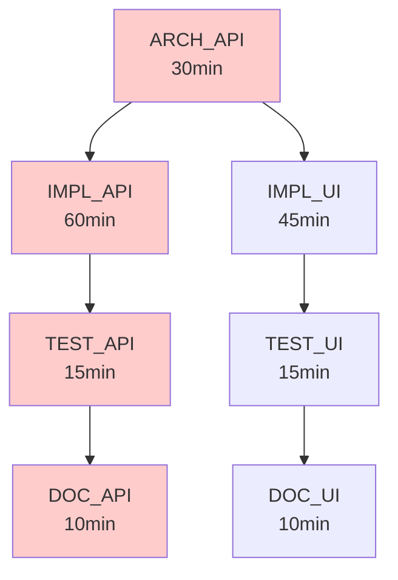

# 依赖图构建与关键路径

> 编排器：`../SKILL.md`　上位：编排器 §5 调度规则

---

## 1. DAG 构建算法

### 1.1 任务节点定义
```python
@dataclass
class TaskNode:
    id: str                    # 唯一标识，如 T1, T2
    name: str                  # 可读名称
    role: str                  # architect/executor/test-engineer/...
    deps: List[str]            # 上游依赖 task_id 列表
    estimated_duration: int    # 预估分钟数
    model_hint: str = "auto"   # s0/s1/s2/s3/auto（model_selection 档位）
    priority: int = 0          # 数值越大越优先
    metadata: Dict = field(default_factory=dict)
```

### 1.2 从 PRD 自动构建 DAG
```python
def build_dag_from_prd(prd: PRDDocument) -> TaskGraph:
    """Architect 产出 PRD → Planner 解析为 DAG"""
    nodes = []
    edges = []
    
    # 1. 接口契约 → Architect 任务
    for contract in prd.contracts:
        nodes.append(TaskNode(
            id=f"ARCH_{contract.id}",
            name=f"设计 {contract.name}",
            role="architect",
            deps=[],
            estimated_duration=30
        ))
    
    # 2. 实现任务 → Executor
    for impl in prd.implementations:
        dep_ids = [f"ARCH_{c.id}" for c in impl.depends_on_contracts]
        nodes.append(TaskNode(
            id=f"IMPL_{impl.id}",
            name=f"实现 {impl.name}",
            role="executor",
            deps=dep_ids,
            estimated_duration=impl.estimate_minutes,
            model_hint=impl.complexity  # s0/s1/s2/s3
        ))
    
    # 3. 测试任务 → TestEngineer
    for test in prd.tests:
        dep_ids = [f"IMPL_{i.id}" for i in test.covers]
        nodes.append(TaskNode(
            id=f"TEST_{test.id}",
            name=f"测试 {test.name}",
            role="test-engineer",
            deps=dep_ids,
            estimated_duration=15
        ))
    
    # 4. 文档任务 → Writer
    for doc in prd.docs:
        dep_ids = [f"IMPL_{i.id}" for i in doc.describes]
        nodes.append(TaskNode(
            id=f"DOC_{doc.id}",
            name=f"文档 {doc.name}",
            role="writer",
            deps=dep_ids,
            estimated_duration=10,
            model_hint="s0"
        ))
    
    return TaskGraph(nodes=nodes)
```

### 1.3 合法性检查
```python
def validate_dag(graph: TaskGraph) -> List[str]:
    errors = []
    # 1. 无环检查
    if has_cycle(graph):
        errors.append("DAG 存在环，请检查依赖关系")
    # 2. 孤立节点
    isolated = [n for n in graph.nodes if not n.deps and not n.children]
    if isolated:
        errors.append(f"孤立任务: {[n.id for n in isolated]}")
    # 3. 缺失依赖
    all_ids = {n.id for n in graph.nodes}
    for n in graph.nodes:
        for dep in n.deps:
            if dep not in all_ids:
                errors.append(f"任务 {n.id} 依赖不存在的 {dep}")
    return errors
```

---

## 2. 拓扑排序与关键路径

### 2.1 Kahn 拓扑排序
```python
def topological_sort(graph: TaskGraph) -> List[TaskNode]:
    in_degree = {n.id: len(n.deps) for n in graph.nodes}
    queue = deque([n for n in graph.nodes if in_degree[n.id] == 0])
    result = []
    
    while queue:
        node = queue.popleft()
        result.append(node)
        for child in node.children:
            in_degree[child.id] -= 1
            if in_degree[child.id] == 0:
                queue.append(child)
    
    if len(result) != len(graph.nodes):
        raise ValueError("DAG 有环，无法拓扑排序")
    return result
```

### 2.2 关键路径计算
```python
def critical_path(graph: TaskGraph) -> List[TaskNode]:
    """返回最长路径上的任务序列（决定最短完工时间）"""
    # 前向遍历：计算最早开始时间
    for node in topological_sort(graph):
        node.earliest_start = max(
            [graph.nodes[dep].earliest_finish for dep in node.deps],
            default=0
        )
        node.earliest_finish = node.earliest_start + node.estimated_duration
    
    # 反向遍历：计算最晚开始时间
    project_duration = max(n.earliest_finish for n in graph.nodes)
    for node in reversed(topological_sort(graph)):
        node.latest_finish = min(
            [graph.nodes[child].latest_start for child in node.children],
            default=project_duration
        )
        node.latest_start = node.latest_finish - node.estimated_duration
    
    # 浮动时间 = 0 的节点在关键路径上
    return [n for n in graph.nodes if n.latest_start == n.earliest_start]
```

### 2.3 关键路径示例
```
DAG:
  ARCH_API(30) → IMPL_API(60) → TEST_API(15) → DOC_API(10)
                 ↘ IMPL_UI(45) → TEST_UI(15) → DOC_UI(10)

关键路径: ARCH_API → IMPL_API → TEST_API → DOC_API
总时长: 115 分钟
浮动: IMPL_UI/TEST_UI/DOC_UI 有 15 分钟浮动
```

---

## 3. 并行度优化

### 3.1 层级划分
```python
def compute_levels(graph: TaskGraph) -> Dict[str, int]:
    """将节点按层级分组，同层可并行"""
    levels = {}
    for node in topological_sort(graph):
        level = max([levels[dep] for dep in node.deps], default=-1) + 1
        levels[node.id] = level
    return levels

# 结果示例:
# Level 0: [ARCH_API]
# Level 1: [IMPL_API, IMPL_UI]
# Level 2: [TEST_API, TEST_UI]
# Level 3: [DOC_API, DOC_UI]
```

### 3.2 资源感知调度
```python
def schedule_with_resources(graph, max_parallel=6, model_quota={"s0": 4, "s1": 2, "s2": 1}):
    levels = compute_levels(graph)
    running = []
    completed = set()
    time = 0
    
    while len(completed) < len(graph.nodes):
        # 释放完成任务
        for task in list(running):
            if task.finish_time <= time:
                model_quota[task.model] += 1
                running.remove(task)
                completed.add(task.id)
        
        # 启动就绪任务
        for node_id, level in levels.items():
            if node_id in completed or any(r.id == node_id for r in running):
                continue
            if all(dep in completed for dep in graph.nodes[node_id].deps):
                node = graph.nodes[node_id]
                if model_quota[node.model_hint] > 0 and len(running) < max_parallel:
                    start_task(node, time)
                    model_quota[node.model_hint] -= 1
                    running.append(TaskRun(node, time))
        
        time += 1
    
    return makespan
```

---

## 4. 增量更新

当 PRD 变更时，增量更新 DAG：

```python
def incremental_update(old_graph, new_prd):
    # 1. 识别变更的合约/实现
    changed = diff_contracts(old_graph, new_prd)
    
    # 2. 计算受影响的下游
    affected = set()
    for node_id in changed:
        affected.update(descendants(old_graph, node_id))
    
    # 3. 重新生成受影响子图
    subgraph = old_graph.subgraph(affected)
    new_subgraph = build_dag_from_prd(new_prd).subgraph(affected)
    
    # 4. 合并保留未变更部分
    return old_graph.replace_subgraph(affected, new_subgraph)
```

---

## 5. 可视化输出

### 5.1 Mermaid 图表


### 5.2 JSON 输出 (给调度器)
```json
{
  "version": "1.0",
  "critical_path": ["ARCH_API", "IMPL_API", "TEST_API", "DOC_API"],
  "project_duration": 115,
  "levels": {
    "0": ["ARCH_API"],
    "1": ["IMPL_API", "IMPL_UI"],
    "2": ["TEST_API", "TEST_UI"],
    "3": ["DOC_API", "DOC_UI"]
  },
  "model_quota": {"s0": 4, "s1": 2, "s2": 1}
}
```

---

**文档版本**: v1.0.0  **最后更新**: 2026-08-08