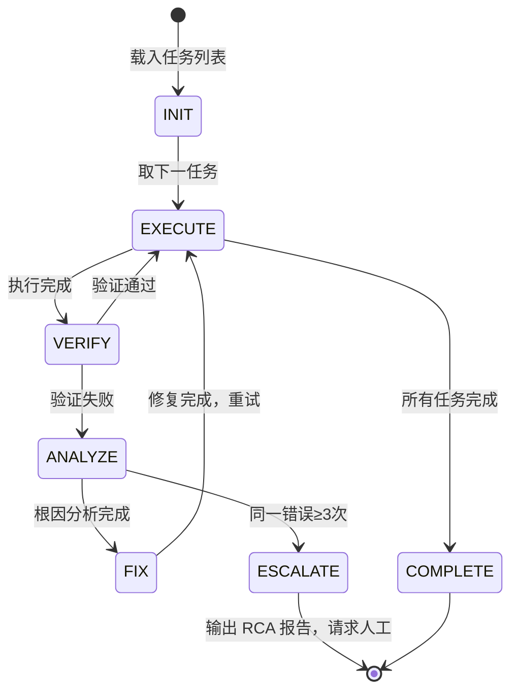

# Ralph 循环持久执行

> 编排器：`../SKILL.md`　上位：编排器 §5 调度规则

---

## 1. 状态机



---

## 2. 核心数据结构

### 2.1 状态文件 (`.senate/state/ralph-state.json`)
```json
{
  "version": "1.0",
  "pipeline_id": "ralph-20260808-001",
  "status": "running",
  "tasks": [
    {"id": "T1", "name": "API设计", "status": "done", "retries": 0},
    {"id": "T2", "name": "前端页面", "status": "running", "retries": 1, "last_error": "TypeError: x undefined"},
    {"id": "T3", "name": "后端服务", "status": "pending", "retries": 0}
  ],
  "current_task": "T2",
  "error_history": {
    "TypeError: x undefined": {"count": 1, "first_seen": "2026-08-08T10:15:00Z", "tasks": ["T2"]}
  },
  "created_at": "2026-08-08T10:00:00Z",
  "updated_at": "2026-08-08T10:20:00Z"
}
```

### 2.2 执行上下文
```python
@dataclass
class RalphContext:
    pipeline_id: str
    tasks: List[Task]
    current_index: int
    error_history: Dict[str, ErrorInfo]
    max_retries: int = 3
    checkpoint_interval: int = 1  # 每任务检查点
```

---

## 3. 执行循环算法

```python
def ralph_loop(ctx: RalphContext):
    while ctx.current_index < len(ctx.tasks):
        task = ctx.tasks[ctx.current_index]
        ctx.save_checkpoint()
        
        result = execute_task(task)
        
        if result.success:
            task.status = "done"
            ctx.current_index += 1
            ctx.error_history.clear()  # 成功重置该任务错误计数
        else:
            handle_failure(ctx, task, result.error)
        
        ctx.save_checkpoint()
    
    return "completed"

def handle_failure(ctx, task, error):
    error_key = f"{type(error).__name__}: {str(error)[:100]}"
    info = ctx.error_history.setdefault(error_key, {"count": 0, "tasks": []})
    info["count"] += 1
    info["tasks"].append(task.id)
    info["last_seen"] = now()
    
    if info["count"] >= ctx.max_retries:
        escalate(ctx, error_key, info)
    else:
        # 根因分析 → 修复 → 重试
        root_cause = analyze_root_cause(task, error)
        fix = generate_fix(root_cause)
        apply_fix(fix)
        task.retries += 1
        # 不增加 current_index，重试同一任务
```

---

## 4. 根因分析模板

```markdown
# 根因分析报告 (RCA)

## 任务信息
- Task ID: T2
- Task Name: 前端页面
- 尝试次数: 2/3

## 错误信息
```
TypeError: Cannot read property 'map' of undefined
  at UserList.tsx:42
  at render()
```

## 分析步骤
1. **错误定位**: UserList.tsx 第 42 行，`users.map` 调用
2. **数据流追踪**: `users` 来自 `useUserStore()` hook
3. **初始化检查**: store 初始状态 `users: []` 但异步加载时可能为 `undefined`
4. **根因**: 组件未处理 loading 状态，直接渲染 `users.map`

## 修复方案
```tsx
// 修复前
{users.map(u => <UserCard key={u.id} user={u} />)}

// 修复后
{users?.map(u => <UserCard key={u.id} user={u} />) ?? <Skeleton />}
```

## 验证
- [ ] 单元测试覆盖 loading/empty/error 状态
- [ ] 类型检查通过
- [ ] 手动验证页面渲染无报错
```

---

## 5. 升级处理

当同一错误达到 `max_retries` (默认 3) 时：

```python
def escalate(ctx, error_key, info):
    rca_report = generate_rca_report(error_key, info)
    save_rca(rca_report)
    
    # 输出给用户
    output = f"""
    ⚠️ Ralph 循环升级
    错误: {error_key}
    重试次数: {info['count']}/{ctx.max_retries}
    受影响任务: {', '.join(info['tasks'])}
    
    已生成 RCA 报告: .senate/rca/{error_key}.md
    请人工介入修复根本问题后，可用 `/ralph resume` 继续
    """
    ctx.status = "escalated"
    ctx.save_checkpoint()
    raise RalphEscalated(rca_report)
```

---

## 6. 断点续跑

```bash
# 从中断点继续
/ralph resume --pipeline ralph-20260808-001

# 重新开始（保留错误历史）
/ralph restart --pipeline ralph-20260808-001 --keep-history
```

- 读取 `.senate/state/ralph-state.json`
- 从 `current_index` 继续
- 错误历史保留，避免重复相同分析

---

**文档版本**: v1.0.0  **最后更新**: 2026-08-08