# Ralph 循環持久執行

> 編排器：`../SKILL.md`　上位：編排器 §5 調度規則

---

## 1. 狀態機

```mermaid
stateDiagram-v2
    [*] --> INIT: 載入任務列表
    INIT --> EXECUTE: 取下一任務
    EXECUTE --> VERIFY: 執行完成
    VERIFY --> EXECUTE: 驗證通過
    VERIFY --> ANALYZE: 驗證失敗
    ANALYZE --> FIX: 根因分析完成
    FIX --> EXECUTE: 修復完成，重試
    ANALYZE --> ESCALATE: 同一錯誤≥3次
    ESCALATE --> [*]: 輸出 RCA 報告，請求人工
    EXECUTE --> COMPLETE: 所有任務完成
    COMPLETE --> [*]
```



---

## 2. 核心數據結構

### 2.1 狀態文件 (`.senate/state/ralph-state.json`)
```json
{
  "version": "1.0",
  "pipeline_id": "ralph-20260808-001",
  "status": "running",
  "tasks": [
    {"id": "T1", "name": "API設計", "status": "done", "retries": 0},
    {"id": "T2", "name": "前端頁面", "status": "running", "retries": 1, "last_error": "TypeError: x undefined"},
    {"id": "T3", "name": "後端服務", "status": "pending", "retries": 0}
  ],
  "current_task": "T2",
  "error_history": {
    "TypeError: x undefined": {"count": 1, "first_seen": "2026-08-08T10:15:00Z", "tasks": ["T2"]}
  },
  "created_at": "2026-08-08T10:00:00Z",
  "updated_at": "2026-08-08T10:20:00Z"
}
```

### 2.2 執行上下文
```python
@dataclass
class RalphContext:
    pipeline_id: str
    tasks: List[Task]
    current_index: int
    error_history: Dict[str, ErrorInfo]
    max_retries: int = 3
    checkpoint_interval: int = 1  # 每任務檢查點
```

---

## 3. 執行循環算法

```python
def ralph_loop(ctx: RalphContext):
    while ctx.current_index < len(ctx.tasks):
        task = ctx.tasks[ctx.current_index]
        ctx.save_checkpoint()
        
        result = execute_task(task)
        
        if result.success:
            task.status = "done"
            ctx.current_index += 1
            ctx.error_history.clear()  # 成功重置該任務錯誤計數
        else:
            handle_failure(ctx, task, result.error)
        
        ctx.save_checkpoint()
    
    return "completed"

def handle_failure(ctx, task, error):
    error_key = f"{type(error).__name__}: {str(error)[:100]}"
    info = ctx.error_history.setdefault(error_key, {"count": 0, "tasks": []})
    info["count"] += 1
    info["tasks"].append(task.id)
    info["last_seen"] = now()
    
    if info["count"] >= ctx.max_retries:
        escalate(ctx, error_key, info)
    else:
        # 根因分析 → 修復 → 重試
        root_cause = analyze_root_cause(task, error)
        fix = generate_fix(root_cause)
        apply_fix(fix)
        task.retries += 1
        # 不增加 current_index，重試同一任務
```

---

## 4. 根因分析模板

```markdown
# 根因分析報告 (RCA)

## 任務信息
- Task ID: T2
- Task Name: 前端頁面
- 嘗試次數: 2/3

## 錯誤信息
```
TypeError: Cannot read property 'map' of undefined
  at UserList.tsx:42
  at render()
```

## 分析步驟
1. **錯誤定位**: UserList.tsx 第 42 行，`users.map` 調用
2. **數據流追蹤**: `users` 來自 `useUserStore()` hook
3. **初始化檢查**: store 初始狀態 `users: []` 但異步加載時可能為 `undefined`
4. **根因**: 組件未處理 loading 狀態，直接渲染 `users.map`

## 修復方案
```tsx
// 修復前
{users.map(u => <UserCard key={u.id} user={u} />)}

// 修復後
{users?.map(u => <UserCard key={u.id} user={u} />) ?? <Skeleton />}
```

## 驗證
- [ ] 單元測試覆蓋 loading/empty/error 狀態
- [ ] 類型檢查通過
- [ ] 手動驗證頁面渲染無報錯
```

---

## 5. 升級處理

當同一錯誤達到 `max_retries` (默認 3) 時：

```python
def escalate(ctx, error_key, info):
    rca_report = generate_rca_report(error_key, info)
    save_rca(rca_report)
    
    # 輸出給用戶
    output = f"""
    ⚠️ Ralph 循環升級
    錯誤: {error_key}
    重試次數: {info['count']}/{ctx.max_retries}
    受影響任務: {', '.join(info['tasks'])}
    
    已生成 RCA 報告: .senate/rca/{error_key}.md
    請人工介入修復根本問題後，可用 `/ralph resume` 繼續
    """
    ctx.status = "escalated"
    ctx.save_checkpoint()
    raise RalphEscalated(rca_report)
```

---

## 6. 斷點續跑

```bash
# 從中斷點繼續
/ralph resume --pipeline ralph-20260808-001

# 重新開始（保留錯誤歷史）
/ralph restart --pipeline ralph-20260808-001 --keep-history
```

- 讀取 `.senate/state/ralph-state.json`
- 從 `current_index` 繼續
- 錯誤歷史保留，避免重複相同分析

---

**文檔版本**: v1.0.0  **最後更新**: 2026-08-08