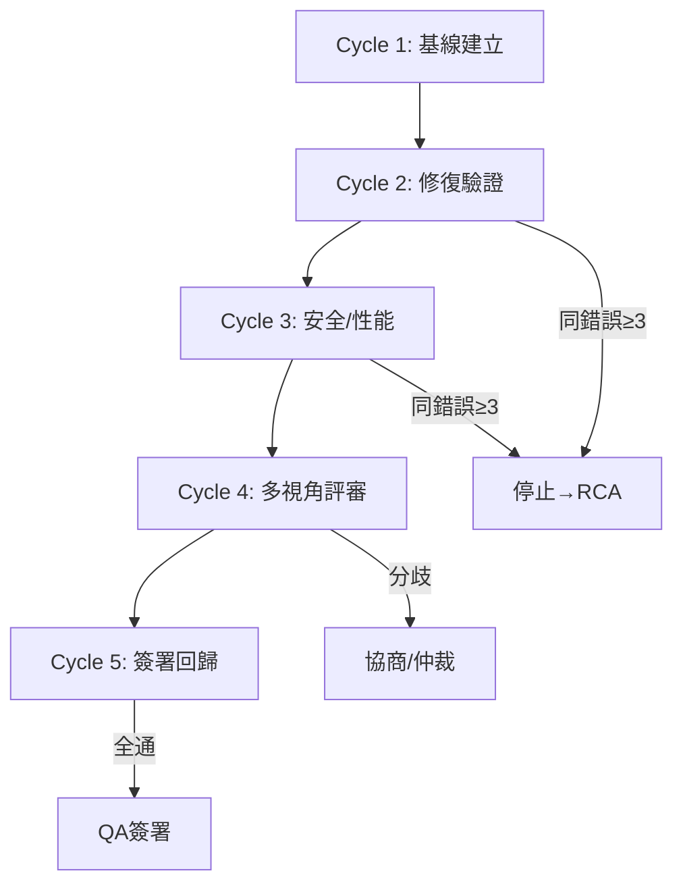

# UltraQA 多輪驗證循環

> 編排器：`../SKILL.md`　上位：編排器 §5 調度規則

---

## 1. QA 循環參數

| 參數 | 默認值 | 說明 |
|------|--------|------|
| `max_cycles` | 5 | 最大驗證輪次 |
| `same_error_threshold` | 3 | 同一錯誤重複次數達標 → 停止循環 |
| `validator_quorum` | 3/3 | 三視角全通才算通過 |
| `timeout_per_cycle` | 15min | 單輪超時保護 |
| `regression_suite` | full | 每輪跑全量回歸 |

---

## 2. 五輪驗證流程



### 2.1 Cycle 1: 基線建立
- 編譯構建
- 靜態分析
- 單元測試
- 集成測試
- 產出：基線測試報告 + 失敗清單

### 2.2 Cycle 2: 修復驗證
- 針對 Cycle 1 失敗項修復
- 重跑失敗測試
- 檢查是否引入新失敗
- 產出：修復驗證報告

### 2.3 Cycle 3: 安全/性能
- 安全掃描
- 性能基準
- 依賴漏洞檢查
- 產出：安全/性能報告

### 2.4 Cycle 4: 多視角評審
| 驗證器 | 檔位 | 聚焦 | 產出 |
|--------|------|------|------|
| Architect | S2(強模型) | 功能完整性、架構一致性 | PASS/FAIL + 證據 |
| SecurityReviewer | S2(強模型) | 威脅建模、漏洞、數據流 | PASS/FAIL + CVE 清單 |
| CodeReviewer | S2/S1 | 代碼質量、測試覆蓋、風格 | PASS/FAIL + 難點標註 |

**決策規則**：三視角全 PASS → 進入 Cycle 5；任一 FAIL → 進入 fix 循環 → 回 Cycle 1

### 2.5 Cycle 5: 簽署回歸
- 全量回歸測試
- 建構產物驗證
- 部署煙測
- 三視角簽署 → QA 簽署報告

---

## 3. 驗證器清單

### 3.1 Architect (功能完整性)
```yaml
checks:
  - 需求覆蓋率: 100% (每個需求點有對應測試)
  - 接口契約一致性: OpenAPI/Swagger 與實現一致
  - 數據模型完整性: 無孤兒實體、外鍵完整
  - 邊界條件: 空值、極值、併發、權限
evidence: "需求追溯矩陣 + 測試覆蓋率報告"
```

### 3.2 SecurityReviewer (安全)
```yaml
checks:
  - 靜態掃描: bandit/semgrep 0 high/critical
  - 依賴漏洞: npm audit / cargo audit 0 high
  - 輸入驗證: 所有入口點有驗證/清洗
  - 認證授權: RBAC/ABAC 正確、無越權
  - 敏感數據: 無明文密鑰、PII 加密
  - 威脅建模: STRIDE 覆蓋核心流程
evidence: "掃描報告 + 威脅模型文檔"
```

### 3.3 CodeReviewer (質量)
```yaml
checks:
  - 風格一致性: lint 0 error
  - 複雜度: 圈複雜度 < 15、函數 < 50 行
  - 測試覆蓋率: 行覆蓋 ≥ 80%、分支 ≥ 70%
  - 文檔: 公共 API 有 docstring
  - 重複代碼: < 3% (sonarqube)
evidence: "lint/report + coverage.xml + 代碼審查清單"
```

---

## 4. 簽署協議

### 4.1 簽署格式
```markdown
# UltraQA 簽署報告

Pipeline: ultraqa-20260808-001
Cycle: 5/5
Timestamp: 2026-08-08T14:30:00Z

## 驗證器簽署
| 驗證器 | 狀態 | 信心度 | 風險範圍 | 未測項 |
|--------|------|--------|----------|--------|
| Architect | ✅ PASS | high | narrow | E2E 跨服務 |
| SecurityReviewer | ✅ PASS | high | narrow | 滲透測試 |
| CodeReviewer | ✅ PASS | medium | moderate | 性能基準 |

## 總體結論
- 狀態: ✅ SIGNED-OFF
- 信心度: high
- 風險: moderate (僅文檔/性能基準待補)
- 部署建議: 可發布，建議 1 週內補齊未測項

## 簽署人
- Architect: S2 (強模型)
- SecurityReviewer: S2 (強模型)  
- CodeReviewer: S1/S2
```

### 4.2 分歧處理
- 任一驗證器 FAIL → 自動進入 fix 循環
- 三視角意見分歧（如 2 PASS 1 FAIL）：
  1. 自動協商：失敗方給具體證據，其他方反駁
  2. 輪次 ≤ 2 → 仍分歧 → Architect (S2/強模型) 仲裁
  3. 仲裁結果為最終決策

---

## 5. 停止條件

| 條件 | 動作 |
|------|------|
| 所有驗證器 PASS | 產出簽署報告 → 完成 |
| 同一錯誤重複 ≥ 3 輪 | 停止 → 生成 RCA → 請求人工 |
| 單輪超時 > 15min | 熔斷 → 標記超時任務 → 繼續下一輪 |
| 連續 2 輪無進展 (失敗數不減) | 升級 → 請求人工介入 |

---

## 6. CSV 報表規範

每輪結束產出 `台账/ultraqa_cycle{N}_{timestamp}.csv` (UTF-8 BOM)：

```csv
cycle,validator,check,status,evidence,confidence,scope-risk,not-tested
1,Architect,需求覆蓋率,PASS,"追溯矩陣 42/42",high,narrow,
1,SecurityReviewer,靜態掃描,FAIL,"bandit 2 high",high,narrow,滲透測試
1,CodeReviewer,測試覆蓋率,PASS,"行85% 分支72%",high,narrow,
2,SecurityReviewer,靜態掃描修復,PASS,"bandit 0 high",high,narrow,
...
5,Architect,最終簽署,PASS,"全功能驗證",high,narrow,E2E跨服務
5,SecurityReviewer,最終簽署,PASS,"0 high/critical",high,narrow,滲透測試
5,CodeReviewer,最終簽署,PASS,"lint 0 err cov 85%",medium,moderate,性能基準
```

---

**文檔版本**: v1.0.0  **最後更新**: 2026-08-08