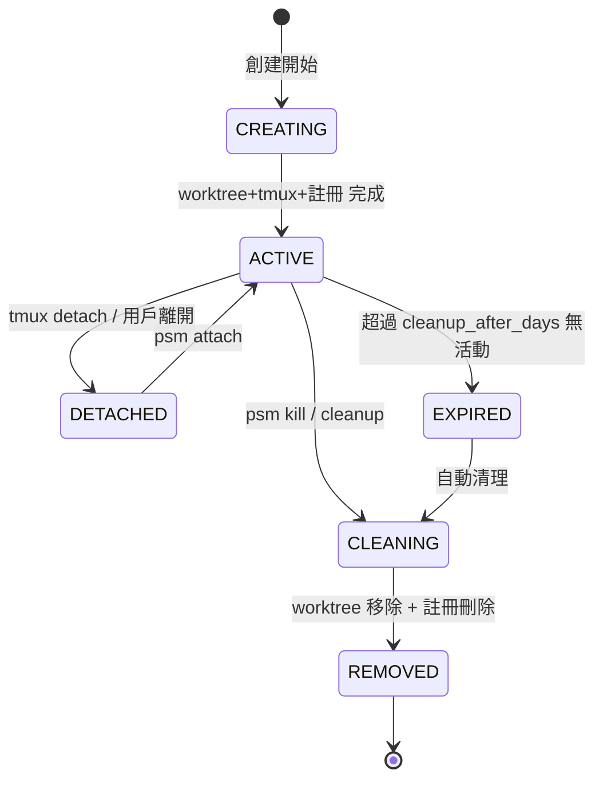

# 會話註冊表：結構、CRUD、狀態機、併發安全

> 編排器：`../SKILL.md`　上位：PSM 協議 §2.2

---

## 1. 數據結構

### 1.1 註冊表文件：`~/.psm/sessions.json`
```json
{
  "version": 1,
  "sessions": {
    "omc:pr-123": {
      "id": "omc:pr-123",
      "type": "review",
      "project": "omc",
      "ref": "pr-123",
      "branch": "feature/webhooks",
      "base": "main",
      "created_at": "2026-08-08T10:00:00Z",
      "updated_at": "2026-08-08T10:30:00Z",
      "tmux_session": "psm:omc:pr-123",
      "worktree_path": "/home/user/.psm/worktrees/omc/pr-123",
      "source_repo": "/home/user/Workspace/opencode-senate",
      "github": {
        "pr_number": 123,
        "pr_title": "Add webhooks",
        "pr_author": "user",
        "pr_url": "https://github.com/..."
      },
      "state": "active",
      "last_accessed": "2026-08-08T10:30:00Z"
    }
  },
  "stats": {
    "total_created": 42,
    "total_cleaned": 38,
    "last_cleanup": "2026-08-07T00:00:00Z"
  }
}
```

### 1.2 會話狀態機


### 1.3 狀態定義
| 狀態 | 含義 | 允許操作 |
|------|------|----------|
| `creating` | 正在創建 worktree/tmux/註冊 | 無 (內部) |
| `active` | 正常運行，tmux 會話存在 | attach, kill, status |
| `detached` | tmux 已分離但 worktree 存在 | attach, kill, status |
| `cleaning` | 正在清理中 | 無 (內部) |
| `removed` | 已完全清理 | 無 |
| `expired` | 超過 TTL 無活動 | cleanup, kill |

---

## 2. CRUD 操作

### 2.1 創建
```bash
create_session() {
    local id="$1" type="$2" project="$3" ref="$4" branch="$5" base="$6"
    local worktree_path="$7" source_repo="$8" tmux_session="$9"
    local github_info="${10}"  # JSON
    
    local session_json=$(jq -n \
        --arg id "$id" --arg type "$type" --arg project "$project" \
        --arg ref "$ref" --arg branch "$branch" --arg base "$base" \
        --arg worktree "$worktree_path" --arg source "$source_repo" \
        --arg tmux "$tmux_session" --arg github "$github_info" \
        --arg now "$(date -Iseconds)" \
        '{
            id: $id,
            type: $type,
            project: $project,
            ref: $ref,
            branch: $branch,
            base: $base,
            created_at: $now,
            updated_at: $now,
            worktree_path: $worktree,
            source_repo: $source,
            tmux_session: $tmux,
            github: ($github | fromjson),
            state: "active",
            last_accessed: $now
        }')
    
    # 原子寫入 (文件鎖)
    with_lock sessions.json "jq --argjson s \"$session_json\" '.sessions[$s.id] = $s | .stats.total_created += 1' sessions.json > sessions.json.tmp && mv sessions.json.tmp sessions.json"
}
```

### 2.2 讀取
```bash
get_session() {
    local id="$1"
    jq -r ".sessions[\"$id\"] // empty" sessions.json
}

list_sessions() {
    local project="${1:-}"
    if [[ -n "$project" ]]; then
        jq -r ".sessions | to_entries[] | select(.value.project == \"$project\") | .value" sessions.json
    else
        jq -r ".sessions | to_entries[] | .value" sessions.json
    fi
}

get_session_field() {
    local id="$1" field="$2"
    jq -r ".sessions[\"$id\"] | .$field // empty" sessions.json
}
```

### 2.3 更新
```bash
update_session() {
    local id="$1"
    shift
    # 支援任意字段更新
    local jq_filter=".sessions[\"$id\"]"
    for arg in "$@"; do
        key="${arg%%=*}"
        value="${arg#*=}"
        jq_filter+=" | .$key = \"$value\""
    done
    jq_filter+=" | .updated_at = \"$(date -Iseconds)\""
    
    with_lock sessions.json "jq '$jq_filter' sessions.json > sessions.json.tmp && mv sessions.json.tmp sessions.json"
}

touch_session() {
    local id="$1"
    update_session "$id" "last_accessed=$(date -Iseconds)"
}
```

### 2.4 刪除/清理
```bash
remove_session() {
    local id="$1"
    with_lock sessions.json "jq 'del(.sessions[\"$id\"]) | .stats.total_cleaned += 1' sessions.json > sessions.json.tmp && mv sessions.json.tmp sessions.json"
}

mark_cleaning() {
    local id="$1"
    update_session "$id" "state=cleaning"
}

mark_removed() {
    local id="$1"
    # 實際上由 remove_session 處理
    remove_session "$id"
}
```

---

## 3. 併發安全：文件鎖

```bash
# 全局鎖文件
SESSION_LOCK_FILE="$HOME/.psm/sessions.lock"

with_lock() {
    local lock_file="$1"
    local cmd="$2"
    
    exec 200>"$lock_file"
    if ! flock -x -w 10 200; then
        echo "ERROR: Cannot acquire lock on $lock_file after 10s" >&2
        return 1
    fi
    
    eval "$cmd"
    local ret=$?
    
    flock -u 200
    exec 200>&-
    return $ret
}
```

### 3.1 使用示例
```bash
# 安全讀取
session=$(with_lock "$SESSION_LOCK_FILE" "get_session \"$id\"")

# 安全更新
with_lock "$SESSION_LOCK_FILE" "update_session \"$id\" \"state=active\" \"last_accessed=$(date -Iseconds)\""
```

---

## 4. 自動清理策略

### 4.1 清理觸發
- 手動：`psm cleanup`
- 定時：cron 每天 02:00 執行
- 會話創建時：檢查是否需要清理

### 4.2 清理邏輯
```bash
auto_cleanup() {
    local config=$(cat ~/.psm/projects.json | jq '.defaults')
    local cleanup_days=$(echo "$config" | jq -r '.cleanup_after_days // 14')
    local auto_cleanup=$(echo "$config" | jq -r '.auto_cleanup_merged // true')
    local cutoff=$(date -d "-$cleanup_days days" -Iseconds)
    
    # 1. 遍歷所有 sessions
    for id in $(jq -r '.sessions | keys[]' sessions.json); do
        session=$(get_session "$id")
        state=$(echo "$session" | jq -r '.state')
        last_accessed=$(echo "$session" | jq -r '.last_accessed')
        type=$(echo "$session" | jq -r '.type')
        ref=$(echo "$session" | jq -r '.ref')
        project=$(echo "$session" | jq -r '.project')
        
        should_clean=false
        reason=""
        
        # 規則 1: TTL 過期
        if [[ "$last_accessed" < "$(date -d "-$cleanup_days days" -Iseconds)" ]]; then
            should_clean=true
            reason="TTL expired ($cleanup_days days)"
        fi
        
        # 規則 2: PR merged / issue closed
        if [[ "$auto_cleanup" == "true" && "$type" == "review" ]]; then
            if check_pr_merged "$project" "$ref"; then
                should_clean=true
                reason="PR merged"
            fi
        elif [[ "$auto_cleanup" == "true" && "$type" == "fix" ]]; then
            if check_issue_closed "$project" "$ref"; then
                should_clean=true
                reason="Issue closed"
            fi
        fi
        
        if [[ "$should_clean" == "true" ]]; then
            echo "Cleaning $id: $reason"
            psm kill "$id"
        fi
    done
    
    # 更新統計
    with_lock sessions.json "jq '.stats.last_cleanup = \"$(date -Iseconds)\"' sessions.json > sessions.json.tmp && mv sessions.json.tmp sessions.json"
}
```

---

## 5. 統計與監控

### 5.1 統計字段
```json
"stats": {
    "total_created": 42,
    "total_cleaned": 38,
    "last_cleanup": "2026-08-07T00:00:00Z",
    "active_count": 4,
    "detached_count": 1
}
```

### 5.2 實時統計更新
```bash
recalc_stats() {
    local active=0 detached=0
    for id in $(jq -r '.sessions | keys[]' sessions.json); do
        state=$(get_session_field "$id" "state")
        case "$state" in
            active) ((active++)) ;;
            detached) ((detached++)) ;;
        esac
    done
    with_lock sessions.json "jq --argjson a $active --argjson d $detached '.stats.active_count = \$a | .stats.detached_count = \$d' sessions.json > sessions.json.tmp && mv sessions.json.tmp sessions.json"
}
```

---

**文檔版本**: v1.0.0  **最後更新**: 2026-08-08