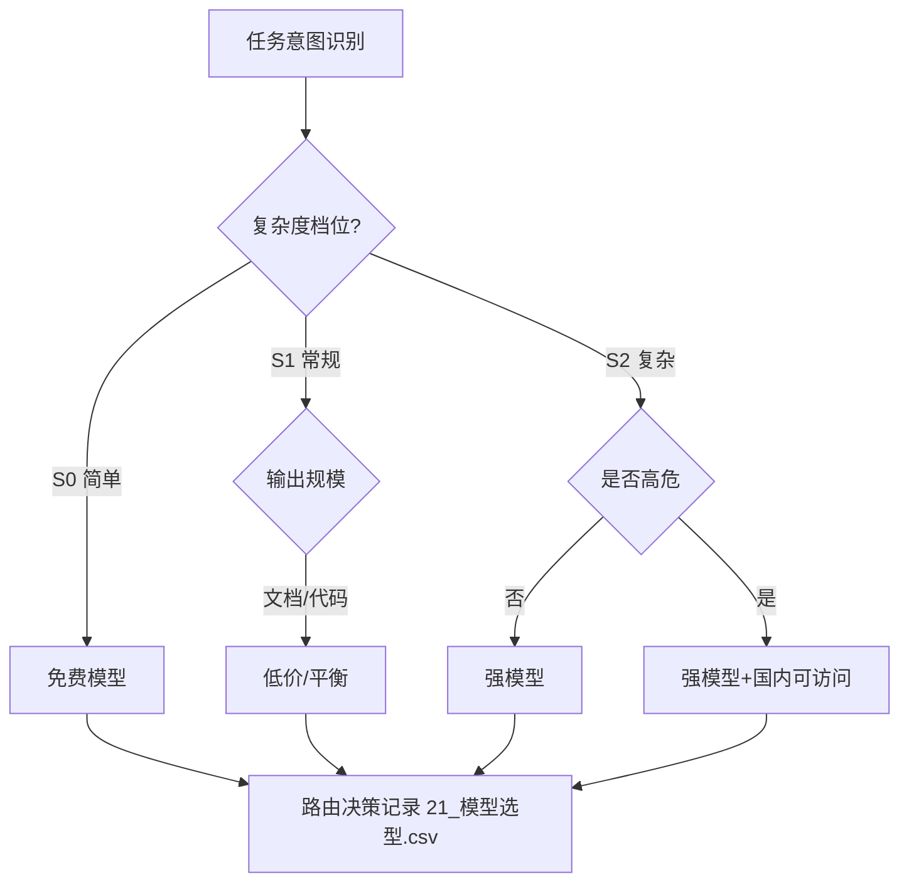

# model_selection.md — 大模型选型标准（单源共享）

> 各阶段开始时的模型选择依据。被 dev-project-team-skill（§5 调度）引用。
> 配套台账：`台账/21_模型选型.csv`。
> 目标：**低成本 + 可稳定访问 + 能力匹配**，提高复用率、降低 token 消耗。

## 1. 选型优先级（四级）

| 优先级 | 规则 | 说明 |
|--------|------|------|
| P1 | 免费模型 | 同能力下优先免费 |
| P2 | 价格便宜 | 免费不可用/能力不足时选最低价 |
| P3 | 国内可稳定访问 | 免费/低价均不可行时选国内可稳定访问的优质模型 |
| 排他 | 排除国外不可访问 | 被墙/不可达模型一律排除（硬条件） |

## 2. 评估维度

| 维度 | 说明 |
|------|------|
| 可访问性 | 中国大陆网络可达、可稳定调用（硬条件） |
| 成本 | 免费 > 低价 > 按量；结合用量估算总成本 |
| 能力匹配 | 按任务类型分级匹配（简单/常规/复杂） |
| 稳定性 | API 可用性、限流、上下文窗口 |
| 数据合规 | 敏感数据不得发送境外不可信服务 |

## 3. 任务类型与档位

| 任务级别 | 特征 | 推荐档位 |
|----------|------|---------|
| 简单 | 重命名/格式化/小段翻译 | 免费/低价小模型 |
| 常规 | 编写文档/生成代码/台账更新 | 中档平衡模型 |
| 复杂 | 架构评审/需求分析/高危编码 | 强模型（国内可访问最佳） |

## 4. 模型路由（v21.3.3 新增）

### 4.1 路由维度
模型选择不再是单一决策，而是按**任务分类**逐条路由，四条维度联合判定：

| 维度 | 取值 | 判定依据 |
|------|------|----------|
| 任务类型 | 导航 / 查询 / 分析 / 生成 / 评审 / 重写 | 触发词 + 任务意图 |
| 复杂度档位 | S0 简单 / S1 常规 / S2 复杂 / S3 高危 | 输入规模 + 输出规模 + 风险等级 |
| 成本档位 | 免费 / 低价 / 平衡 / 强模型 | 可用模型池 + 用量预算 |
| 能力要求 | 长上下文 / 强推理 / 代码优先 / 通用 | 任务对上下文窗口与推理深度需求 |

### 4.2 路由决策表（task → 档位 → 成本）

| 任务分类 | 典型触发词 | 复杂度档位 | 成本档 | 说明 |
|----------|-----------|-----------|--------|------|
| 导航 | goto / 跳转 / 定义 / 引用 | S0 | 免费 | LSP/AST 查询为主，不消耗生成模型 |
| 查询 | 查台账 / 查配置 / 检索 | S0 | 免费 | 只读检索，禁止高成本模型 |
| 格式化 | 格式化 / 重命名 / 小段翻译 | S0 | 免费/低价 | 机械操作 |
| 文档编写 | 写文档 / SRS / 计划 | S1 | 低价/平衡 | 中等输出量 |
| 常规编码 | 生成代码 / 修复 bug | S1 | 低价/平衡 | 单文件级修改 |
| 复杂分析 | 架构评审 / 需求分析 / 影响分析 | S2 | 强模型 | 多文件 + 深度推理 |
| 高危编码 | 安全相关 / 核心算法 / 支付 | S3 | 强模型（国内最佳） | 高风险，宁可成本高不换能力 |
| 批量处理 | 全库扫描 / 批量转换 / 迁移 | S1 | 平衡 | 长耗时任务，选稳定不选最快 |

### 4.3 路由判定流程（Router）

### 4.4 路由与多技能协作
- 单角色任务 → 直接路由到该角色包对应模型档位；
- 多角色联合（编排器）→ 按**各子任务独立路由**，允许子任务用不同档位模型，避免一刀切；
- 路由结果写入 `21_模型选型.csv`，每阶段末复核一次（低成本模型能力不足则升档，强模型无必要则不浪费）。

### 4.5 路由变更
- 模型不可访问 / 能力不足 / 成本超预算 → 走 `register_change` 变更并更新台账；
- 路由结果与计划不符时，先复核触发词是否误判任务类型，再考虑换模型。

## 5. 台账写入（21_模型选型.csv）

字段建议：`阶段 / 任务类型 / 复杂度档位 / 候选模型 / 成本档 / 可访问性 / 决策 / 理由`。每阶段开始由 `select_model` action 填写，经用户确认后应用；路由决策按 4.3 逐任务判定。

## 6. 规则

1. 每个阶段开始必须执行选型（编排器 §5 调度规则 7），多角色任务按子任务路由（4.4）；
2. 选型决策写入 `21_模型选型.csv`，变更走 `register_change`；
3. 敏感数据默认选国内可稳定访问模型，境外不可信服务禁止；
4. 优先免费、次低价，避免为简单任务调用强模型造成 token 浪费；
5. S0 档任务禁止使用强模型（导航/查询/格式化），S3 档任务禁止为省成本降档；
6. 批量任务优先选稳定模型，不追求单次速度。

---

**文档版本**：v21.3.3　**最后更新**：2026-08-09（新增 §4 模型路由：任务分类×复杂度×成本×能力四维路由决策表 + Router 流程）